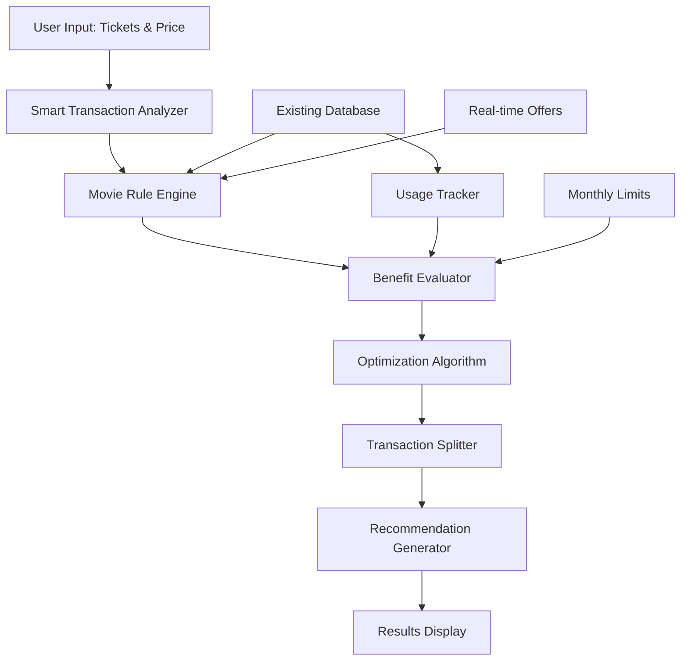

# Movie Ticket Rule Engine - Implementation Guide & Architecture

## Executive Summary

This document provides a comprehensive implementation roadmap for the Movie Ticket Rule Engine, synthesizing insights from both rule engine specifications. The system will intelligently optimize movie ticket purchases across multiple platforms and credit cards to maximize user savings.

## 1. Understanding the Rule Engine Requirements

### 1.1 Key Insights from Analysis

After analyzing both documents, here are the core requirements:

**From Document 1 (July 4th)**: 
- Extensible architecture using existing database schema
- JSON-based configuration for flexibility
- Web-safe Dart implementation
- Focus on reusing current tables

**From Document 2 (July 3rd)**:
- Complex rule evaluation with conditions-actions pattern
- Comprehensive benefit tracking and analytics
- Performance optimization with caching
- A/B testing capabilities

### 1.2 Unified Architecture Vision



## 2. Database Architecture (Enhanced Schema)

### 2.1 Strategic Schema Enhancements

Based on your requirements, I recommend adding a few generic columns that will benefit ALL future benefit categories:

```sql
-- Enhanced card_benefits table with generic columns
ALTER TABLE card_benefits ADD COLUMN IF NOT EXISTS 
  usage_period VARCHAR(20) DEFAULT 'monthly'; -- monthly, weekly, yearly, daily

ALTER TABLE card_benefits ADD COLUMN IF NOT EXISTS 
  priority_score INTEGER DEFAULT 1; -- Higher = better for equal savings scenarios

ALTER TABLE card_benefits ADD COLUMN IF NOT EXISTS 
  efficiency_threshold DECIMAL(10,2); -- Don't use high-value benefits for low amounts

ALTER TABLE card_benefits ADD COLUMN IF NOT EXISTS 
  last_usage_update TIMESTAMP DEFAULT NOW(); -- For weekly caching optimization

-- Create weekly milestone cache table (generic for all categories)
CREATE TABLE IF NOT EXISTS weekly_milestone_cache (
  id SERIAL PRIMARY KEY,
  user_id INTEGER NOT NULL,
  card_id INTEGER NOT NULL,
  benefit_category VARCHAR(50) NOT NULL,
  week_start_date DATE NOT NULL,
  total_spending DECIMAL(12,2) DEFAULT 0,
  milestone_progress DECIMAL(5,2) DEFAULT 0, -- Percentage towards milestone
  last_updated TIMESTAMP DEFAULT NOW(),
  UNIQUE(user_id, card_id, benefit_category, week_start_date)
);

-- Index for fast milestone lookups
CREATE INDEX idx_milestone_cache_lookup 
ON weekly_milestone_cache(user_id, card_id, benefit_category, week_start_date);
```

### 2.2 Key Schema Benefits
- **Generic Design**: New columns work for fuel, dining, travel, etc.
- **Efficiency Threshold**: Prevents ICICI Emerald (₹750 BOGO) on ₹280 tickets
- **Priority Score**: Platform selection when savings are equal
- **Weekly Caching**: Optimized milestone tracking

### 2.3 Enhanced JSON Configuration Schema

```sql
-- Simplified movie benefit configuration (no showtime/movietype needed)
{
  "offer_type": "BOGO",                    -- BOGO|PERCENT_DISCOUNT|CASHBACK|MILESTONE
  "partner_filter": ["BookMyShow"],        -- Platform restrictions (null = any platform)
  "discount_percent": 50,                  -- For percentage offers
  "max_discount_amount": 300,              -- Per-transaction cap
  "free_ticket_count": 1,                  -- For BOGO offers
  "txn_ticket_limit": 4,                   -- Max tickets per transaction
  "month_ticket_limit": 8,                 -- Monthly usage limit
  "milestone_currency": 10000,             -- Spending required for milestone
  "milestone_reward": 2,                   -- Free tickets from milestone
  "valid_dow": ["FRI", "SAT", "SUN"],      -- Day of week restrictions (optional)
  "start_date": "2025-07-01",              -- Offer validity
  "end_date": "2025-12-31",
  "min_transaction_amount": 200,           -- Minimum spend requirement
  "efficiency_ratio": 0.6                  -- Don't use if ticket_price/max_discount < this
}
```

### 2.4 Benefit Efficiency Logic

```sql
-- Example: ICICI Emerald vs Sapphire selection logic
-- Emerald: max_discount_amount = 750, efficiency_threshold = 450 (60% of 750)
-- Sapphire: max_discount_amount = 300, efficiency_threshold = 180 (60% of 300)
-- 
-- For ₹280 tickets:
-- - Emerald efficiency = 280/750 = 37% < 60% threshold → DON'T USE
-- - Sapphire efficiency = 280/300 = 93% > 60% threshold → USE THIS
```

### 2.3 Usage Tracking Enhancement

```sql
-- Add usage tracking view (materialized for performance)
CREATE MATERIALIZED VIEW movie_benefit_usage AS
SELECT 
  user_id,
  card_id,
  benefit_id,
  DATE_TRUNC('month', transaction_date) as usage_month,
  COUNT(*) as usage_count,
  SUM(discount_amount) as total_discount,
  SUM(tickets_used) as total_tickets
FROM transactions
WHERE category = 'ENTERTAINMENT'
GROUP BY user_id, card_id, benefit_id, DATE_TRUNC('month', transaction_date);

-- Create index for fast lookups
CREATE INDEX idx_movie_usage_lookup 
ON movie_benefit_usage(user_id, benefit_id, usage_month);
```

## 3. Core Implementation Architecture

### 3.1 Main Rule Engine Class

```dart
// lib/features/movie_analyzer/services/movie_rule_engine.dart
import 'package:cardcompass/shared/models/credit_card.dart';
import 'package:cardcompass/core/services/supabase_service.dart';

class MovieRuleEngine {
  final SupabaseService _supabaseService;
  
  MovieRuleEngine(this._supabaseService);

  /// Main entry point for movie ticket analysis
  Future<List<MovieRecommendation>> analyzeMovieBooking({
    required String userId,
    required int numberOfTickets,
    required double pricePerTicket,
    String? preferredPlatform,
    String? movieType,
    DateTime? showTime,
  }) async {
    
    // 1. Create evaluation context
    final context = EvalContext(
      userId: userId,
      amount: numberOfTickets * pricePerTicket,
      ticketsRequested: numberOfTickets,
      transactionDate: showTime ?? DateTime.now(),
      partner: preferredPlatform ?? 'Any',
      movieType: movieType ?? 'regular',
    );

    // 2. Fetch applicable movie rules for user's cards
    final userRules = await _getUserMovieRules(userId);
    
    // 3. Fetch market-wide best options for comparison
    final marketRules = await _getMarketMovieRules();

    // 4. Evaluate each rule set
    final userRecommendations = await _evaluateRules(context, userRules);
    final marketRecommendations = await _evaluateRules(context, marketRules);

    // 5. Optimize transaction splitting for maximum savings
    final optimizedRecommendations = _optimizeTransactionSplitting(
      context, 
      [...userRecommendations, ...marketRecommendations]
    );

    // 6. Return top recommendations sorted by savings
    return optimizedRecommendations
      ..sort((a, b) => b.totalSavings.compareTo(a.totalSavings));
  }

  /// Fetch movie rules for user's cards
  Future<List<MovieRule>> _getUserMovieRules(String userId) async {
    final query = _supabaseService.client
      .from('card_benefits')
      .select('''
        id, configuration, value,
        card_catalog!inner(id, card_name, bank_name),
        benefits!inner(id, name, calculation_method),
        user_cards!inner(id, user_id)
      ''')
      .eq('user_cards.user_id', userId)
      .eq('benefits.category_code', 'ENTERTAINMENT')
      .eq('is_active', true);

    final data = await query;
    return data.map((row) => MovieRule.fromJson(row)).toList();
  }

  /// Fetch best market rules for comparison
  Future<List<MovieRule>> _getMarketMovieRules() async {
    final query = _supabaseService.client
      .from('card_benefits')
      .select('''
        id, configuration, value,
        card_catalog!inner(id, card_name, bank_name),
        benefits!inner(id, name, calculation_method)
      ''')
      .eq('benefits.category_code', 'ENTERTAINMENT')
      .eq('is_active', true)
      .order('value', ascending: false)
      .limit(10); // Top 10 market offers

    final data = await query;
    return data.map((row) => MovieRule.fromJson(row)).toList();
  }

  /// Evaluate rules against transaction context
  Future<List<BenefitEvaluation>> _evaluateRules(
    EvalContext context, 
    List<MovieRule> rules
  ) async {
    final evaluations = <BenefitEvaluation>[];

    for (final rule in rules) {
      // Check if rule is applicable
      if (!await _isRuleApplicable(context, rule)) continue;

      // Calculate benefit amount
      final benefit = await _calculateBenefit(context, rule);
      
      if (benefit.savingsAmount > 0) {
        evaluations.add(BenefitEvaluation(
          rule: rule,
          benefit: benefit,
          applicableTickets: min(context.ticketsRequested, rule.maxTicketsPerTransaction),
        ));
      }
    }

    return evaluations;
  }

  /// Check if rule conditions are met
  Future<bool> _isRuleApplicable(EvalContext context, MovieRule rule) async {
    final config = rule.configuration;

    // 1. Platform filter
    if (config.partnerFilter != null && 
        config.partnerFilter!.isNotEmpty &&
        context.partner != 'Any' &&
        !config.partnerFilter!.contains(context.partner)) {
      return false;
    }

    // 2. Date validity
    final now = context.transactionDate;
    if (config.startDate != null && now.isBefore(config.startDate!)) return false;
    if (config.endDate != null && now.isAfter(config.endDate!)) return false;

    // 3. Day of week restrictions
    if (config.validDayOfWeek != null && config.validDayOfWeek!.isNotEmpty) {
      final dayOfWeek = DateFormat('EEE').format(now).toUpperCase();
      if (!config.validDayOfWeek!.contains(dayOfWeek)) return false;
    }

    // 4. Monthly usage limits
    final monthlyUsage = await _getMonthlyUsage(
      context.userId, 
      rule.benefitId, 
      now
    );
    
    if (config.monthTicketLimit != null && 
        monthlyUsage.ticketCount >= config.monthTicketLimit!) {
      return false;
    }

    // 5. Transaction limits
    if (config.txnTicketLimit != null && 
        context.ticketsRequested > config.txnTicketLimit!) {
      return false;
    }

    // 6. Minimum amount requirement
    if (config.minTransactionAmount != null && 
        context.amount < config.minTransactionAmount!) {
      return false;
    }

    return true;
  }

  /// Calculate benefit based on offer type
  Future<BenefitCalculation> _calculateBenefit(
    EvalContext context, 
    MovieRule rule
  ) async {
    final config = rule.configuration;
    final perTicketPrice = context.amount / context.ticketsRequested;

    switch (config.offerType) {
      case OfferType.bogo:
        return _calculateBOGOBenefit(context, config, perTicketPrice);
      
      case OfferType.percentDiscount:
        return _calculatePercentageBenefit(context, config);
      
      case OfferType.cashback:
        return _calculateCashbackBenefit(context, config);
      
      case OfferType.milestone:
        return await _calculateMilestoneBenefit(context, rule, perTicketPrice);
      
      default:
        return BenefitCalculation.zero();
    }
  }

  /// Calculate BOGO (Buy One Get One) benefit
  BenefitCalculation _calculateBOGOBenefit(
    EvalContext context, 
    MovieRuleConfiguration config, 
    double perTicketPrice
  ) {
    final eligibleTickets = min(
      context.ticketsRequested, 
      config.txnTicketLimit ?? context.ticketsRequested
    );
    
    final freeTickets = min(
      eligibleTickets ~/ 2, // Integer division for pairs
      config.freeTicketCount ?? 1
    );
    
    final savingsAmount = freeTickets * perTicketPrice;
    final cappedSavings = min(
      savingsAmount, 
      config.maxDiscountAmount ?? double.infinity
    );

    return BenefitCalculation(
      savingsAmount: cappedSavings,
      applicableTickets: eligibleTickets,
      freeTickets: freeTickets,
      explanation: 'Buy ${eligibleTickets - freeTickets} Get $freeTickets Free - Save ₹${cappedSavings.toStringAsFixed(0)}',
    );
  }

  /// Calculate percentage discount benefit
  BenefitCalculation _calculatePercentageBenefit(
    EvalContext context, 
    MovieRuleConfiguration config
  ) {
    final discountPercent = config.discountPercent ?? 0;
    final savingsAmount = context.amount * discountPercent / 100;
    final cappedSavings = min(
      savingsAmount, 
      config.maxDiscountAmount ?? double.infinity
    );

    return BenefitCalculation(
      savingsAmount: cappedSavings,
      applicableTickets: context.ticketsRequested,
      explanation: '${discountPercent.toStringAsFixed(0)}% discount - Save ₹${cappedSavings.toStringAsFixed(0)}',
    );
  }

  /// Calculate cashback benefit
  BenefitCalculation _calculateCashbackBenefit(
    EvalContext context, 
    MovieRuleConfiguration config
  ) {
    final cashbackPercent = config.discountPercent ?? 0;
    final cashbackAmount = context.amount * cashbackPercent / 100;
    final cappedCashback = min(
      cashbackAmount, 
      config.maxDiscountAmount ?? double.infinity
    );

    return BenefitCalculation(
      savingsAmount: cappedCashback,
      applicableTickets: context.ticketsRequested,
      explanation: '${cashbackPercent.toStringAsFixed(0)}% cashback - Earn ₹${cappedCashback.toStringAsFixed(0)}',
    );
  }

  /// Calculate milestone-based benefit
  Future<BenefitCalculation> _calculateMilestoneBenefit(
    EvalContext context, 
    MovieRule rule, 
    double perTicketPrice
  ) async {
    final config = rule.configuration;
    final milestoneRequired = config.milestoneCurrency ?? 0;
    final rewardTickets = config.milestoneReward ?? 0;

    // Get user's spending towards milestone
    final currentSpending = await _getMilestoneProgress(
      context.userId, 
      rule.cardId
    );

    // Check if milestone will be achieved with this transaction
    if (currentSpending + context.amount >= milestoneRequired) {
      final freeTickets = min(rewardTickets, context.ticketsRequested);
      final savingsAmount = freeTickets * perTicketPrice;

      return BenefitCalculation(
        savingsAmount: savingsAmount,
        applicableTickets: freeTickets,
        freeTickets: freeTickets,
        explanation: 'Milestone achieved - $freeTickets free tickets worth ₹${savingsAmount.toStringAsFixed(0)}',
      );
    }

    return BenefitCalculation.zero();
  }

  /// Optimize transaction splitting for maximum savings
  List<MovieRecommendation> _optimizeTransactionSplitting(
    EvalContext context,
    List<BenefitEvaluation> evaluations,
  ) {
    if (evaluations.isEmpty) {
      return [MovieRecommendation.noOffers(context)];
    }

    // Sort by savings rate (savings per ticket)
    evaluations.sort((a, b) {
      final aRate = a.benefit.savingsAmount / a.applicableTickets;
      final bRate = b.benefit.savingsAmount / b.applicableTickets;
      return bRate.compareTo(aRate);
    });

    final recommendations = <MovieRecommendation>[];
    var remainingTickets = context.ticketsRequested;
    final steps = <TransactionStep>[];
    var totalSavings = 0.0;

    // Greedy algorithm: Apply best savings first
    for (final evaluation in evaluations) {
      if (remainingTickets <= 0) break;

      final ticketsToUse = min(
        remainingTickets, 
        evaluation.applicableTickets
      );

      if (ticketsToUse > 0) {
        final stepAmount = ticketsToUse * (context.amount / context.ticketsRequested);
        final stepSavings = evaluation.benefit.savingsAmount * 
                           (ticketsToUse / evaluation.applicableTickets);

        steps.add(TransactionStep(
          platform: evaluation.rule.preferredPlatform ?? 'BookMyShow',
          cardName: evaluation.rule.cardName,
          tickets: ticketsToUse,
          amount: stepAmount,
          savings: stepSavings,
          benefitType: evaluation.rule.configuration.offerType.name,
          explanation: evaluation.benefit.explanation,
        ));

        totalSavings += stepSavings;
        remainingTickets -= ticketsToUse;
      }
    }

    // Add remaining tickets without offers if any
    if (remainingTickets > 0) {
      final remainingAmount = remainingTickets * (context.amount / context.ticketsRequested);
      steps.add(TransactionStep(
        platform: 'BookMyShow', // Default platform
        cardName: 'Any Card',
        tickets: remainingTickets,
        amount: remainingAmount,
        savings: 0,
        benefitType: 'regular',
        explanation: 'No additional offers available',
      ));
    }

    final finalAmount = context.amount - totalSavings;
    final savingsPercentage = (totalSavings / context.amount) * 100;

    recommendations.add(MovieRecommendation(
      steps: steps,
      totalSavings: totalSavings,
      finalAmount: finalAmount,
      savingsPercentage: savingsPercentage,
      explanation: _generateRecommendationExplanation(steps, totalSavings),
    ));

    return recommendations;
  }

  /// Generate human-friendly explanation
  String _generateRecommendationExplanation(
    List<TransactionStep> steps, 
    double totalSavings
  ) {
    if (steps.length == 1) {
      return 'Use ${steps.first.cardName} on ${steps.first.platform} to save ₹${totalSavings.toStringAsFixed(0)}';
    } else {
      final withSavings = steps.where((s) => s.savings > 0).length;
      return 'Split across $withSavings offers to save ₹${totalSavings.toStringAsFixed(0)} total';
    }
  }

  /// Get monthly usage for benefit limits
  Future<MonthlyUsage> _getMonthlyUsage(
    String userId, 
    String benefitId, 
    DateTime date
  ) async {
    final monthKey = DateFormat('yyyy-MM').format(date);
    
    final result = await _supabaseService.client
      .from('movie_benefit_usage')
      .select('usage_count, total_discount, total_tickets')
      .eq('user_id', userId)
      .eq('benefit_id', benefitId)
      .eq('usage_month', monthKey)
      .maybeSingle();

    if (result == null) {
      return MonthlyUsage.zero();
    }

    return MonthlyUsage(
      transactionCount: result['usage_count'] ?? 0,
      totalDiscount: (result['total_discount'] ?? 0).toDouble(),
      ticketCount: result['total_tickets'] ?? 0,
    );
  }

  /// Get milestone progress for user
  Future<double> _getMilestoneProgress(String userId, String cardId) async {
    final result = await _supabaseService.client
      .rpc('get_annual_spending', params: {
        'p_user_id': userId,
        'p_card_id': cardId,
        'p_category': 'ENTERTAINMENT',
      });

    return (result ?? 0).toDouble();
  }
}
```

### 3.2 Supporting Data Models

```dart
// lib/features/movie_analyzer/models/movie_models.dart

enum OfferType {
  bogo,
  percentDiscount, 
  cashback,
  milestone,
}

class MovieRule {
  final String id;
  final String benefitId;
  final String cardId;
  final String cardName;
  final String bankName;
  final MovieRuleConfiguration configuration;
  final String? preferredPlatform;
  final int priority;

  const MovieRule({
    required this.id,
    required this.benefitId,
    required this.cardId,
    required this.cardName,
    required this.bankName,
    required this.configuration,
    this.preferredPlatform,
    this.priority = 1,
  });

  factory MovieRule.fromJson(Map<String, dynamic> json) {
    return MovieRule(
      id: json['id'],
      benefitId: json['benefits']['id'],
      cardId: json['card_catalog']['id'],
      cardName: json['card_catalog']['card_name'],
      bankName: json['card_catalog']['bank_name'],
      configuration: MovieRuleConfiguration.fromJson(json['configuration']),
      priority: json['priority'] ?? 1,
    );
  }

  int get maxTicketsPerTransaction => configuration.txnTicketLimit ?? 10;
}

class MovieRuleConfiguration {
  final OfferType offerType;
  final List<String>? partnerFilter;
  final double? discountPercent;
  final double? maxDiscountAmount;
  final int? freeTicketCount;
  final int? txnTicketLimit;
  final int? monthTicketLimit;
  final double? milestoneCurrency;
  final int? milestoneReward;
  final List<String>? validDayOfWeek;
  final String? validTime;
  final DateTime? startDate;
  final DateTime? endDate;
  final List<String>? excludedShowTypes;
  final double? minTransactionAmount;

  const MovieRuleConfiguration({
    required this.offerType,
    this.partnerFilter,
    this.discountPercent,
    this.maxDiscountAmount,
    this.freeTicketCount,
    this.txnTicketLimit,
    this.monthTicketLimit,
    this.milestoneCurrency,
    this.milestoneReward,
    this.validDayOfWeek,
    this.validTime,
    this.startDate,
    this.endDate,
    this.excludedShowTypes,
    this.minTransactionAmount,
  });

  factory MovieRuleConfiguration.fromJson(Map<String, dynamic> json) {
    return MovieRuleConfiguration(
      offerType: OfferType.values.firstWhere(
        (e) => e.name.toUpperCase() == (json['offer_type'] as String).toUpperCase(),
        orElse: () => OfferType.percentDiscount,
      ),
      partnerFilter: (json['partner_filter'] as List?)?.cast<String>(),
      discountPercent: (json['discount_percent'] as num?)?.toDouble(),
      maxDiscountAmount: (json['max_discount_amount'] as num?)?.toDouble(),
      freeTicketCount: json['free_ticket_count'] as int?,
      txnTicketLimit: json['txn_ticket_limit'] as int?,
      monthTicketLimit: json['month_ticket_limit'] as int?,
      milestoneCurrency: (json['milestone_currency'] as num?)?.toDouble(),
      milestoneReward: json['milestone_reward'] as int?,
      validDayOfWeek: (json['valid_dow'] as List?)?.cast<String>(),
      validTime: json['valid_time'] as String?,
      startDate: json['start_date'] != null 
        ? DateTime.parse(json['start_date']) 
        : null,
      endDate: json['end_date'] != null 
        ? DateTime.parse(json['end_date']) 
        : null,
      excludedShowTypes: (json['excluded_show_types'] as List?)?.cast<String>(),
      minTransactionAmount: (json['min_transaction_amount'] as num?)?.toDouble(),
    );
  }
}

class EvalContext {
  final String userId;
  final double amount;
  final int ticketsRequested;
  final DateTime transactionDate;
  final String partner;
  final String movieType;

  const EvalContext({
    required this.userId,
    required this.amount,
    required this.ticketsRequested,
    required this.transactionDate,
    required this.partner,
    required this.movieType,
  });
}

class BenefitCalculation {
  final double savingsAmount;
  final int applicableTickets;
  final int freeTickets;
  final String explanation;

  const BenefitCalculation({
    required this.savingsAmount,
    required this.applicableTickets,
    this.freeTickets = 0,
    required this.explanation,
  });

  factory BenefitCalculation.zero() {
    return const BenefitCalculation(
      savingsAmount: 0,
      applicableTickets: 0,
      explanation: 'No benefit applicable',
    );
  }
}

class BenefitEvaluation {
  final MovieRule rule;
  final BenefitCalculation benefit;
  final int applicableTickets;

  const BenefitEvaluation({
    required this.rule,
    required this.benefit,
    required this.applicableTickets,
  });
}

class MovieRecommendation {
  final List<TransactionStep> steps;
  final double totalSavings;
  final double finalAmount;
  final double savingsPercentage;
  final String explanation;

  const MovieRecommendation({
    required this.steps,
    required this.totalSavings,
    required this.finalAmount,
    required this.savingsPercentage,
    required this.explanation,
  });

  factory MovieRecommendation.noOffers(EvalContext context) {
    return MovieRecommendation(
      steps: [
        TransactionStep(
          platform: 'BookMyShow',
          cardName: 'Any Card',
          tickets: context.ticketsRequested,
          amount: context.amount,
          savings: 0,
          benefitType: 'regular',
          explanation: 'No offers available for this transaction',
        ),
      ],
      totalSavings: 0,
      finalAmount: context.amount,
      savingsPercentage: 0,
      explanation: 'No applicable offers found for your cards',
    );
  }
}

class TransactionStep {
  final String platform;
  final String cardName;
  final int tickets;
  final double amount;
  final double savings;
  final String benefitType;
  final String explanation;

  const TransactionStep({
    required this.platform,
    required this.cardName,
    required this.tickets,
    required this.amount,
    required this.savings,
    required this.benefitType,
    required this.explanation,
  });
}

class MonthlyUsage {
  final int transactionCount;
  final double totalDiscount;
  final int ticketCount;

  const MonthlyUsage({
    required this.transactionCount,
    required this.totalDiscount,
    required this.ticketCount,
  });

  factory MonthlyUsage.zero() {
    return const MonthlyUsage(
      transactionCount: 0,
      totalDiscount: 0,
      ticketCount: 0,
    );
  }
}
```

## 4. Smart Transaction Analyzer Integration

### 4.1 Enhanced Widget Structure

```dart
// lib/features/dashboard/widgets/smart_transaction_analyzer.dart

class SmartTransactionAnalyzer extends ConsumerStatefulWidget {
  final String? userId;
  
  const SmartTransactionAnalyzer({
    super.key,
    this.userId,
  });

  @override
  ConsumerState<SmartTransactionAnalyzer> createState() => _SmartTransactionAnalyzerState();
}

class _SmartTransactionAnalyzerState extends ConsumerState<SmartTransactionAnalyzer>
    with SingleTickerProviderStateMixin {
  
  late TabController _tabController;
  
  // General transaction fields
  final _merchantController = TextEditingController();
  final _amountController = TextEditingController();
  String _selectedCategory = 'dining';
  
  // Movie-specific fields
  final _ticketCountController = TextEditingController();
  final _ticketPriceController = TextEditingController();
  String _selectedPlatform = 'Any';
  String _selectedMovieType = 'regular';
  
  bool _isAnalyzing = false;
  CardRecommendationResult? _generalRecommendation;
  List<MovieRecommendation>? _movieRecommendations;

  final List<String> _categories = [
    'dining',
    'fuel', 
    'grocery',
    'shopping',
    'travel',
    'entertainment', // This will show movie analyzer
    'utilities',
  ];

  final List<String> _platforms = [
    'Any',
    'BookMyShow',
    'PVR',
    'INOX', 
    'Paytm Movies',
    'Cinepolis',
  ];

  final List<String> _movieTypes = [
    'regular',
    'premium',
    'imax',
    '4dx',
  ];

  @override
  void initState() {
    super.initState();
    _tabController = TabController(length: 2, vsync: this);
  }

  @override
  Widget build(BuildContext context) {
    return Card(
      child: Padding(
        padding: const EdgeInsets.all(16),
        child: Column(
          crossAxisAlignment: CrossAxisAlignment.start,
          children: [
            // Header
            Row(
              children: [
                Icon(
                  Icons.analytics,
                  color: Theme.of(context).primaryColor,
                  size: 24,
                ),
                const SizedBox(width: 8),
                Text(
                  'Smart Transaction Analyzer',
                  style: Theme.of(context).textTheme.titleLarge?.copyWith(
                    fontWeight: FontWeight.bold,
                  ),
                ),
              ],
            ),
            
            const SizedBox(height: 16),
            
            // Category Tabs
            TabBar(
              controller: _tabController,
              tabs: const [
                Tab(text: 'General'),
                Tab(text: 'Movies'),
              ],
            ),
            
            const SizedBox(height: 16),
            
            // Tab Content
            SizedBox(
              height: 400, // Fixed height for tab content
              child: TabBarView(
                controller: _tabController,
                children: [
                  _buildGeneralAnalyzer(),
                  _buildMovieAnalyzer(),
                ],
              ),
            ),
          ],
        ),
      ),
    );
  }

  Widget _buildGeneralAnalyzer() {
    return Column(
      children: [
        _buildGeneralInputForm(),
        const SizedBox(height: 16),
        _buildAnalyzeButton(isMovie: false),
        if (_generalRecommendation != null) ...[
          const SizedBox(height: 20),
          _buildGeneralRecommendationResult(),
        ],
      ],
    );
  }

  Widget _buildMovieAnalyzer() {
    return Column(
      children: [
        _buildMovieInputForm(), 
        const SizedBox(height: 16),
        _buildAnalyzeButton(isMovie: true),
        if (_movieRecommendations != null) ...[
          const SizedBox(height: 20),
          _buildMovieRecommendationResults(),
        ],
      ],
    );
  }

  Widget _buildMovieInputForm() {
    return Column(
      children: [
        // Number of tickets
        TextField(
          controller: _ticketCountController,
          keyboardType: TextInputType.number,
          decoration: const InputDecoration(
            labelText: 'Number of Tickets',
            hintText: 'e.g., 4',
            border: OutlineInputBorder(),
            prefixIcon: Icon(Icons.confirmation_number),
          ),
        ),
        
        const SizedBox(height: 12),
        
        // Price per ticket
        TextField(
          controller: _ticketPriceController,
          keyboardType: TextInputType.number,
          decoration: const InputDecoration(
            labelText: 'Price per Ticket (₹)',
            hintText: 'e.g., 280',
            border: OutlineInputBorder(),
            prefixText: '₹ ',
            prefixIcon: Icon(Icons.currency_rupee),
          ),
        ),
        
        const SizedBox(height: 12),
        
        // Platform selection
        DropdownButtonFormField<String>(
          value: _selectedPlatform,
          decoration: const InputDecoration(
            labelText: 'Preferred Platform',
            border: OutlineInputBorder(),
            prefixIcon: Icon(Icons.movie),
          ),
          items: _platforms.map((platform) {
            return DropdownMenuItem(
              value: platform,
              child: Text(platform),
            );
          }).toList(),
          onChanged: (value) {
            if (value != null) {
              setState(() {
                _selectedPlatform = value;
              });
            }
          },
        ),
        
        const SizedBox(height: 12),
        
        // Movie type selection
        DropdownButtonFormField<String>(
          value: _selectedMovieType,
          decoration: const InputDecoration(
            labelText: 'Movie Type',
            border: OutlineInputBorder(),
            prefixIcon: Icon(Icons.theaters),
          ),
          items: _movieTypes.map((type) {
            return DropdownMenuItem(
              value: type,
              child: Text(_getMovieTypeDisplayName(type)),
            );
          }).toList(),
          onChanged: (value) {
            if (value != null) {
              setState(() {
                _selectedMovieType = value;
              });
            }
          },
        ),
      ],
    );
  }

  Widget _buildMovieRecommendationResults() {
    if (_movieRecommendations == null || _movieRecommendations!.isEmpty) {
      return Container(
        padding: const EdgeInsets.all(16),
        decoration: BoxDecoration(
          color: Colors.orange[50],
          borderRadius: BorderRadius.circular(12),
          border: Border.all(color: Colors.orange[200]!),
        ),
        child: const Row(
          children: [
            Icon(Icons.info_outline, color: Colors.orange),
            SizedBox(width: 8),
            Expanded(
              child: Text('No movie offers available for your selection'),
            ),
          ],
        ),
      );
    }

    final recommendation = _movieRecommendations!.first;
    
    return Container(
      padding: const EdgeInsets.all(16),
      decoration: BoxDecoration(
        color: Theme.of(context).primaryColor.withValues(alpha: 0.05),
        borderRadius: BorderRadius.circular(12),
        border: Border.all(
          color: Theme.of(context).primaryColor.withValues(alpha: 0.2),
        ),
      ),
      child: Column(
        crossAxisAlignment: CrossAxisAlignment.start,
        children: [
          // Header with total savings
          Row(
            children: [
              Icon(
                Icons.lightbulb,
                color: Theme.of(context).primaryColor,
                size: 20,
              ),
              const SizedBox(width: 8),
              Text(
                'Movie Booking Optimization',
                style: Theme.of(context).textTheme.titleMedium?.copyWith(
                  fontWeight: FontWeight.bold,
                ),
              ),
            ],
          ),
          
          const SizedBox(height: 12),
          
          // Total savings summary
          Container(
            padding: const EdgeInsets.all(12),
            decoration: BoxDecoration(
              color: Colors.green[50],
              borderRadius: BorderRadius.circular(8),
              border: Border.all(color: Colors.green[200]!),
            ),
            child: Row(
              mainAxisAlignment: MainAxisAlignment.spaceBetween,
              children: [
                Column(
                  crossAxisAlignment: CrossAxisAlignment.start,
                  children: [
                    Text(
                      'Total Savings',
                      style: Theme.of(context).textTheme.labelMedium,
                    ),
                    Text(
                      '₹${recommendation.totalSavings.toStringAsFixed(0)}',
                      style: Theme.of(context).textTheme.titleLarge?.copyWith(
                        color: Colors.green[700],
                        fontWeight: FontWeight.bold,
                      ),
                    ),
                  ],
                ),
                Column(
                  crossAxisAlignment: CrossAxisAlignment.end,
                  children: [
                    Text(
                      'You Pay',
                      style: Theme.of(context).textTheme.labelMedium,
                    ),
                    Text(
                      '₹${recommendation.finalAmount.toStringAsFixed(0)}',
                      style: Theme.of(context).textTheme.titleLarge?.copyWith(
                        fontWeight: FontWeight.bold,
                      ),
                    ),
                  ],
                ),
              ],
            ),
          ),
          
          const SizedBox(height: 12),
          
          // Transaction steps
          Text(
            'Recommended Steps:',
            style: Theme.of(context).textTheme.titleSmall?.copyWith(
              fontWeight: FontWeight.bold,
            ),
          ),
          
          const SizedBox(height: 8),
          
          ...recommendation.steps.map((step) => _buildTransactionStepCard(step)),
        ],
      ),
    );
  }

  Widget _buildTransactionStepCard(TransactionStep step) {
    return Container(
      margin: const EdgeInsets.only(bottom: 8),
      padding: const EdgeInsets.all(12),
      decoration: BoxDecoration(
        color: step.savings > 0 ? Colors.green[50] : Colors.grey[50],
        borderRadius: BorderRadius.circular(8),
        border: Border.all(
          color: step.savings > 0 ? Colors.green[200]! : Colors.grey[300]!,
        ),
      ),
      child: Column(
        crossAxisAlignment: CrossAxisAlignment.start,
        children: [
          Row(
            mainAxisAlignment: MainAxisAlignment.spaceBetween,
            children: [
              Text(
                '${step.tickets} tickets on ${step.platform}',
                style: Theme.of(context).textTheme.titleSmall?.copyWith(
                  fontWeight: FontWeight.bold,
                ),
              ),
              if (step.savings > 0)
                Text(
                  'Save ₹${step.savings.toStringAsFixed(0)}',
                  style: Theme.of(context).textTheme.titleSmall?.copyWith(
                    color: Colors.green[700],
                    fontWeight: FontWeight.bold,
                  ),
                ),
            ],
          ),
          const SizedBox(height: 4),
          Text(
            'Use ${step.cardName}',
            style: Theme.of(context).textTheme.bodyMedium?.copyWith(
              color: Theme.of(context).primaryColor,
              fontWeight: FontWeight.w500,
            ),
          ),
          const SizedBox(height: 4),
          Text(
            step.explanation,
            style: Theme.of(context).textTheme.bodySmall?.copyWith(
              color: Colors.grey[600],
            ),
          ),
        ],
      ),
    );
  }

  Widget _buildAnalyzeButton({required bool isMovie}) {
    return SizedBox(
      width: double.infinity,
      child: ElevatedButton(
        onPressed: _isAnalyzing ? null : () => _analyzeTransaction(isMovie: isMovie),
        child: _isAnalyzing
          ? const SizedBox(
              height: 20,
              width: 20,
              child: CircularProgressIndicator(strokeWidth: 2),
            )
          : Text(isMovie ? 'Find Best Movie Deals' : 'Analyze & Get Best Card'),
      ),
    );
  }

  Future<void> _analyzeTransaction({required bool isMovie}) async {
    if (isMovie) {
      await _analyzeMovieTransaction();
    } else {
      await _analyzeGeneralTransaction();
    }
  }

  Future<void> _analyzeMovieTransaction() async {
    // Validate movie input
    if (_ticketCountController.text.isEmpty || _ticketPriceController.text.isEmpty) {
      _showErrorSnackBar('Please fill in ticket count and price');
      return;
    }

    final ticketCount = int.tryParse(_ticketCountController.text);
    final ticketPrice = double.tryParse(_ticketPriceController.text);
    
    if (ticketCount == null || ticketCount <= 0) {
      _showErrorSnackBar('Please enter a valid number of tickets');
      return;
    }
    
    if (ticketPrice == null || ticketPrice <= 0) {
      _showErrorSnackBar('Please enter a valid ticket price');
      return;
    }

    if (widget.userId == null) {
      _showErrorSnackBar('User not authenticated');
      return;
    }

    setState(() {
      _isAnalyzing = true;
      _movieRecommendations = null;
    });

    try {
      final movieEngine = MovieRuleEngine(ref.read(supabaseServiceProvider));
      final recommendations = await movieEngine.analyzeMovieBooking(
        userId: widget.userId!,
        numberOfTickets: ticketCount,
        pricePerTicket: ticketPrice,
        preferredPlatform: _selectedPlatform == 'Any' ? null : _selectedPlatform,
        movieType: _selectedMovieType,
      );

      setState(() {
        _movieRecommendations = recommendations;
      });
    } catch (error) {
      _showErrorSnackBar('Movie analysis failed: ${error.toString()}');
    } finally {
      setState(() {
        _isAnalyzing = false;
      });
    }
  }

  String _getMovieTypeDisplayName(String type) {
    switch (type) {
      case 'regular':
        return 'Regular';
      case 'premium':
        return 'Premium';
      case 'imax':
        return 'IMAX';
      case '4dx':
        return '4DX';
      default:
        return type.toUpperCase();
    }
  }

  // ... rest of existing methods for general analyzer
}
```

## 5. Implementation Roadmap

### 5.1 Phase 1: Foundation (Week 1-2)
```bash
# Week 1: Database Setup
- [ ] Create movie benefit configurations in existing tables
- [ ] Set up materialized views for usage tracking
- [ ] Add sample movie rules for testing

# Week 2: Core Engine
- [ ] Implement MovieRuleEngine class
- [ ] Create supporting data models
- [ ] Add benefit calculation logic for all offer types
- [ ] Write unit tests for core logic
```

### 5.2 Phase 2: UI Integration (Week 3-4)
```bash
# Week 3: Smart Transaction Analyzer Enhancement
- [ ] Add movie tab to existing analyzer
- [ ] Implement movie input form
- [ ] Create recommendation display components

# Week 4: Integration & Testing
- [ ] Connect UI to rule engine
- [ ] Add error handling and validation
- [ ] Test with real card offers
- [ ] Polish UI/UX
```

### 5.3 Phase 3: Advanced Features (Week 5-6)
```bash
# Week 5: Optimization
- [ ] Implement transaction splitting optimization
- [ ] Add monthly usage tracking
- [ ] Performance optimization and caching

# Week 6: Polish & Launch
- [ ] Add analytics and monitoring
- [ ] User testing and feedback
- [ ] Production deployment
```

## 6. Sample Data Setup

### 6.1 Movie Benefits Configuration

```sql
-- Insert sample movie benefits
INSERT INTO benefits (
  name,
  description,
  category_code,
  calculation_method,
  default_value,
  is_active
) VALUES
('Movie BOGO Offer', 'Buy one get one free movie tickets', 'ENTERTAINMENT', 'RULE_BASED', 0, true),
('Movie Percentage Discount', 'Percentage discount on movie tickets', 'ENTERTAINMENT', 'RULE_BASED', 0, true),
('Movie Cashback', 'Cashback on movie ticket purchases', 'ENTERTAINMENT', 'RULE_BASED', 0, true),
('Movie Milestone Reward', 'Free tickets after spending milestone', 'ENTERTAINMENT', 'RULE_BASED', 0, true);

-- Insert sample card-specific movie benefits
INSERT INTO card_benefits (
  card_id,
  benefit_id,
  value,
  is_active,
  configuration
) VALUES
-- HDFC Infinia BOGO on BookMyShow
((SELECT id FROM card_catalog WHERE card_name LIKE '%Infinia%' LIMIT 1),
 (SELECT id FROM benefits WHERE name = 'Movie BOGO Offer'),
 500,
 true,
 '{
   "offer_type": "BOGO",
   "partner_filter": ["BookMyShow"],
   "max_discount_amount": 500,
   "free_ticket_count": 1,
   "txn_ticket_limit": 4,
   "month_ticket_limit": 4,
   "valid_dow": ["FRI", "SAT", "SUN"],
   "start_date": "2025-01-01",
   "end_date": "2025-12-31"
 }'),

-- SBI SimplyCLICK 25% discount
((SELECT id FROM card_catalog WHERE card_name LIKE '%Simply%' LIMIT 1),
 (SELECT id FROM benefits WHERE name = 'Movie Percentage Discount'),
 25,
 true,
 '{
   "offer_type": "PERCENT_DISCOUNT",
   "discount_percent": 25,
   "max_discount_amount": 150,
   "month_ticket_limit": 2,
   "min_transaction_amount": 300
 }'),

-- Axis Burgundy 25% cashback
((SELECT id FROM card_catalog WHERE card_name LIKE '%Burgundy%' LIMIT 1),
 (SELECT id FROM benefits WHERE name = 'Movie Cashback'),
 25,
 true,
 '{
   "offer_type": "CASHBACK",
   "discount_percent": 25,
   "max_discount_amount": 200,
   "partner_filter": ["PVR", "INOX"]
 }');
```

## 7. Questions & Clarifications

Based on my analysis of both documents, I have a few questions to ensure perfect implementation:

### 7.1 Database Questions
1. **Existing Schema**: Should we add any new columns to existing tables, or stick strictly to JSON configuration in `card_benefits.configuration`?

2. **Usage Tracking**: Do you prefer the materialized view approach for performance, or real-time queries for accuracy?

### 7.2 Business Logic Questions
1. **Platform Priorities**: When multiple platforms offer the same savings, which should be prioritized? (BookMyShow > PVR > INOX?)

2. **Milestone Tracking**: Should milestone progress be calculated in real-time or cached daily/weekly?

### 7.3 User Experience Questions
1. **Default Recommendations**: Should we show the top 3 recommendations or focus on the single best option?

2. **Error Handling**: How should we handle cases where the user's monthly limits are exceeded mid-transaction?

### 7.4 Technical Questions
1. **Caching Strategy**: Should rule evaluations be cached for performance, and for how long?

2. **A/B Testing**: Do you want the A/B testing framework implemented in Phase 1 or can it be deferred?

This comprehensive implementation guide provides a complete roadmap for building the Movie Ticket Rule Engine while reusing your existing database schema and integrating seamlessly with the Smart Transaction Analyzer. The architecture is extensible for future benefit categories while maintaining optimal performance.
