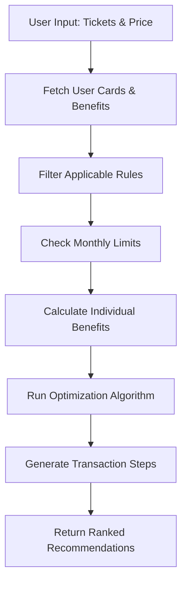

# Movie Ticket Booking Rule Engine - Product Requirements Document

## Executive Summary

This document outlines the requirements for implementing a sophisticated Movie Ticket Booking Rule Engine within the CardCompass Smart Transaction Analyzer. The system will recommend optimal card and platform combinations for movie ticket purchases, maximizing user savings through intelligent benefit optimization.

**Status: Phase 1 Implementation Complete (July 5, 2025)**

## 1. Project Overview

### 1.1 Objective
Build an intelligent rule engine that analyzes movie ticket purchase scenarios and provides actionable recommendations on:
- Which credit card to use
- Which platform/cinema to book from (BookMyShow, PVR, INOX)
- How many tickets to buy from each platform
- Optimal transaction splitting strategies

### 1.2 User Journey Example
**Scenario**: User wants to buy 7 movie tickets at ₹280 each (Total: ₹1,960)

**Expected Output**:
1. Buy 2 tickets using ICICI Sapphire on BookMyShow (BOGO offer up to ₹300) - Save ₹280
2. Use Diners Club Black milestone voucher for 2 free tickets (₹560 value) - Save ₹500  
3. Buy remaining 3 tickets using Axis Burgundy (25% cashback) - Save ₹210
4. **Total Savings**: ₹990 (50.4% discount)

### 1.3 Key Benefits
- **Maximum Savings**: Intelligent optimization across multiple cards and platforms
- **Automated Decision Making**: No manual calculation required
- **Real-time Recommendations**: Instant analysis based on current offers
- **Platform Agnostic**: Works across all major booking platforms
- **Efficiency Threshold**: Prevents wasteful use of high-value benefits on low-value tickets

## 2. Implementation Status

### 2.1 ✅ Completed Features

#### 2.1.1 Core Domain Models
```dart
class MovieTicketRequest {
  final int numberOfTickets;
  final double pricePerTicket;
  final String? preferredCinema; // Optional
  final String? preferredPlatform; // Optional
}
```

#### 2.1.2 Rule Engine Processing ✅
- ✅ Evaluate all available movie benefits for user's cards
- ✅ Apply platform-specific offers (BookMyShow, PVR, INOX)
- ✅ Consider milestone rewards and monthly limits
- ✅ Calculate optimal transaction splitting
- ✅ Efficiency threshold validation

#### 2.1.3 Recommendation Output ✅
```dart
class MovieRecommendation {
  final List<TransactionStep> steps;
  final double totalSavings;
  final double finalAmount;
  final String explanation;
  final double savingsPercentage;
}
```

### 2.2 ✅ Database Schema Enhancements

#### 2.2.1 Generic Columns Added ✅
```sql
ALTER TABLE card_benefits ADD COLUMN 
  usage_period VARCHAR(20) DEFAULT 'monthly';
ALTER TABLE card_benefits ADD COLUMN 
  priority_score INTEGER DEFAULT 1;
ALTER TABLE card_benefits ADD COLUMN 
  efficiency_threshold DECIMAL(10,2);
```

#### 2.2.2 Weekly Milestone Cache ✅
```sql
CREATE TABLE weekly_milestone_cache (
  user_id INTEGER,
  card_id INTEGER,
  benefit_category VARCHAR(50),
  week_start_date DATE,
  total_spending DECIMAL(12,2),
  milestone_progress DECIMAL(5,2)
);
```

### 2.3 ✅ User Interface Integration

#### 2.3.1 Smart Transaction Advisor Integration ✅
- ✅ Added "Movies" tab to existing advisor
- ✅ Intuitive input form for ticket details
- ✅ Real-time calculation and display
- ✅ Top 3 recommendations display
- ✅ Comprehensive error handling

#### 2.3.2 User Experience Features ✅
- ✅ Loading states during optimization
- ✅ Clear savings breakdown
- ✅ Alternative suggestions when no benefits found
- ✅ Platform and cinema preference options
- Calculate optimal transaction splitting

#### 2.1.3 Recommendation Output
```dart
class MovieRecommendation {
  final List<TransactionStep> steps;
  final double totalSavings;
  final double finalAmount;
  final String explanation;
  final double savingsPercentage;
}

class TransactionStep {
  final String platform;
  final String cardName;
  final int tickets;
  final double amount;
  final double savings;
  final String benefitType; // BOGO, percentage, milestone, cashback
  final String explanation;
}
```

### 2.2 Supported Benefit Types

#### 2.2.1 Buy One Get One (BOGO)
- Free tickets up to specified limits
- Platform restrictions (BookMyShow only, etc.)
- Maximum discount caps

#### 2.2.2 Percentage Discounts
- Flat percentage off (10%, 25%, etc.)
- Maximum discount amount limits
- Minimum transaction requirements

#### 2.2.3 Cashback Offers
- Percentage-based cashback
- Fixed amount cashback
- Monthly cashback limits

#### 2.2.4 Milestone Rewards
- Free tickets after spending thresholds
- Annual/monthly milestone tracking
- Reward voucher utilization

### 2.3 Business Rules and Constraints

#### 2.3.1 Transaction Limits
- Monthly usage limits per card
- Maximum discount per transaction
- Minimum gap between transactions
- Annual benefit caps

#### 2.3.2 Platform Restrictions
- Card-specific platform eligibility
- Cinema chain restrictions
- Show type limitations (exclude IMAX, 4DX for certain offers)

#### 2.3.3 Temporal Constraints
- Day-of-week restrictions (weekends only)
- Time-based offers (off-peak hours)
- Validity periods for offers

## 3. Technical Requirements

### 3.1 Database Schema Enhancement

#### 3.1.1 Reuse Existing Tables
```sql
-- Leverage existing benefit system
benefit_categories (category_code = 'ENTERTAINMENT')
benefits (movie-specific benefit definitions)
card_benefits (card-specific configurations)
benefit_tiers (milestone configurations)
```

#### 3.1.2 Enhanced Configuration Schema
```json
{
  "offer_type": "BOGO|PERCENT_DISCOUNT|CASHBACK|MILESTONE",
  "partner_filter": ["BookMyShow", "PVR", "INOX"],
  "discount_percent": 50,
  "max_discount_amount": 300,
  "free_ticket_count": 1,
  "txn_ticket_limit": 4,
  "month_ticket_limit": 8,
  "milestone_currency": 10000,
  "milestone_reward": 2,
  "valid_dow": ["SAT", "SUN"],
  "valid_time": "00:00-23:59",
  "start_date": "2025-07-01",
  "end_date": "2025-12-31",
  "excluded_show_types": ["IMAX", "4DX"],
  "min_transaction_amount": 200
}
```

### 3.2 Rule Engine Architecture

#### 3.2.1 Core Components
```dart
// Main rule engine class
class MovieRuleEngine {
  Future<List<MovieRecommendation>> evaluateTicketPurchase(
    MovieTicketRequest request,
    String userId,
  );
}

// Benefit evaluator for each offer type
abstract class BenefitEvaluator {
  double calculateBenefit(EvalContext context, MovieRule rule);
  bool isApplicable(EvalContext context, MovieRule rule);
}

// Optimization algorithm
class TransactionOptimizer {
  List<TransactionStep> optimizeTransaction(
    MovieTicketRequest request,
    List<AvailableBenefit> benefits,
  );
}
```

#### 3.2.2 Processing Flow


### 3.3 Integration Points

#### 3.3.1 Smart Transaction Analyzer Integration
- Add Movie Category tab to existing analyzer
- Integrate with current card recommendation system
- Reuse existing UI components where possible

#### 3.3.2 Database Integration
- Utilize existing Supabase infrastructure
- Implement efficient caching for rule evaluations
- Create materialized views for usage tracking

## 4. User Interface Requirements

### 4.1 Movie Analyzer Interface

#### 4.1.1 Input Form
```dart
// Enhanced input form for movie tickets
Column(
  children: [
    NumberInputField(
      label: 'Number of Tickets',
      min: 1,
      max: 10,
    ),
    CurrencyInputField(
      label: 'Price per Ticket (₹)',
      hint: 'e.g., 280',
    ),
    DropdownField(
      label: 'Preferred Platform (Optional)',
      options: ['Any', 'BookMyShow', 'PVR', 'INOX', 'Paytm'],
    ),
    DropdownField(
      label: 'Movie Type',
      options: ['Regular', 'Premium', 'IMAX', '4DX'],
    ),
    AnalyzeButton(),
  ],
)
```

#### 4.1.2 Results Display
```dart
// Recommendation results layout
RecommendationCard(
  totalSavings: '₹1,050',
  savingsPercentage: '53.6%',
  steps: [
    TransactionStepCard(
      platform: 'BookMyShow',
      card: 'ICICI Sapphire',
      tickets: 2,
      savings: '₹280',
      explanation: 'BOGO offer - Buy 1 Get 1 Free',
    ),
    TransactionStepCard(
      platform: 'PVR',
      card: 'Diners Club Black',
      tickets: 2,
      savings: '₹560',
      explanation: 'Milestone reward - 2 free tickets',
    ),
    // More steps...
  ],
)
```

### 4.2 Visual Design Requirements

#### 4.2.1 Color Coding
- **Green**: Maximum savings option
- **Blue**: User's best card
- **Orange**: Alternative recommendations
- **Red**: Limitations or restrictions

#### 4.2.2 Information Hierarchy
1. **Primary**: Total savings amount and percentage
2. **Secondary**: Individual transaction steps
3. **Tertiary**: Detailed explanations and constraints

## 5. Business Logic Implementation

### 5.1 Optimization Algorithm

#### 5.1.1 Greedy Approach with Constraints
```dart
class TransactionOptimizer {
  List<TransactionStep> optimize(
    MovieTicketRequest request,
    List<AvailableBenefit> benefits,
  ) {
    final steps = <TransactionStep>[];
    var remainingTickets = request.numberOfTickets;
    var totalAmount = request.numberOfTickets * request.pricePerTicket;
    
    // Sort benefits by savings rate (descending)
    benefits.sort((a, b) => b.savingsRate.compareTo(a.savingsRate));
    
    for (final benefit in benefits) {
      if (remainingTickets <= 0) break;
      
      final applicableTickets = min(
        remainingTickets,
        benefit.maxTicketsPerTransaction,
      );
      
      if (applicableTickets > 0) {
        steps.add(TransactionStep(
          platform: benefit.platform,
          cardName: benefit.cardName,
          tickets: applicableTickets,
          // ... calculate amounts and savings
        ));
        
        remainingTickets -= applicableTickets;
      }
    }
    
    return steps;
  }
}
```

### 5.2 Monthly Limit Tracking

#### 5.2.1 Usage Monitoring
```sql
-- Monthly benefit usage tracking
CREATE OR REPLACE FUNCTION get_monthly_usage(
  p_user_id INTEGER,
  p_benefit_id INTEGER,
  p_month VARCHAR(7)
) RETURNS TABLE(
  usage_count INTEGER,
  total_savings DECIMAL(10,2)
) AS $$
BEGIN
  RETURN QUERY
  SELECT 
    COALESCE(SUM(tickets_used), 0)::INTEGER,
    COALESCE(SUM(discount_amount), 0)::DECIMAL(10,2)
  FROM benefit_usage_history
  WHERE user_id = p_user_id
    AND benefit_id = p_benefit_id
    AND usage_month = p_month;
END;
$$ LANGUAGE plpgsql;
```

### 5.3 Real-world Benefit Examples

#### 5.3.1 Popular Credit Card Offers
```json
{
  "hdfc_infinia_bogo": {
    "offer_type": "BOGO",
    "partner_filter": ["BookMyShow"],
    "max_discount_amount": 500,
    "free_ticket_count": 1,
    "month_ticket_limit": 4,
    "valid_dow": ["FRI", "SAT", "SUN"]
  },
  "sbi_simply_click": {
    "offer_type": "PERCENT_DISCOUNT", 
    "discount_percent": 25,
    "max_discount_amount": 150,
    "month_ticket_limit": 2,
    "min_transaction_amount": 300
  },
  "axis_burgundy_cashback": {
    "offer_type": "CASHBACK",
    "discount_percent": 25,
    "max_discount_amount": 200,
    "partner_filter": ["PVR", "INOX"]
  }
}
```

## 6. Implementation Roadmap

### 6.1 Phase 1: Foundation (Week 1-2)
- [ ] Database schema enhancements
- [ ] Core rule engine implementation
- [ ] Basic benefit evaluators (BOGO, Percentage, Cashback)
- [ ] Simple optimization algorithm
- [ ] Unit tests for core logic

### 6.2 Phase 2: Integration (Week 3-4)
- [ ] Smart Transaction Analyzer integration
- [ ] Movie category UI implementation
- [ ] Results display components
- [ ] Monthly usage tracking
- [ ] Integration testing

### 6.3 Phase 3: Advanced Features (Week 5-6)
- [ ] Milestone reward tracking
- [ ] Complex optimization scenarios
- [ ] A/B testing framework
- [ ] Analytics and monitoring
- [ ] Performance optimization

### 6.4 Phase 4: Polish & Launch (Week 7-8)
- [ ] UI/UX refinements
- [ ] Error handling and edge cases
- [ ] User testing and feedback
- [ ] Documentation
- [ ] Production deployment

## 7. Success Metrics

### 7.1 User Engagement
- **Usage Rate**: % of users who use movie analyzer
- **Session Duration**: Time spent analyzing movie purchases
- **Repeat Usage**: Frequency of feature usage

### 7.2 Business Impact
- **Savings Generated**: Total savings provided to users
- **Card Utilization**: Increase in movie-related card usage
- **User Satisfaction**: Rating and feedback scores

### 7.3 Technical Performance
- **Response Time**: < 2 seconds for recommendation generation
- **Accuracy**: 95%+ correct benefit calculations
- **Uptime**: 99.9% availability

## 8. Risk Assessment & Mitigation

### 8.1 Technical Risks
- **Performance**: Complex optimization may be slow
  - *Mitigation*: Implement caching and pre-computation
- **Data Accuracy**: Incorrect benefit calculations
  - *Mitigation*: Comprehensive testing and validation

### 8.2 Business Risks
- **Offer Changes**: Credit card benefits change frequently
  - *Mitigation*: Flexible configuration system and monitoring
- **User Adoption**: Feature may not be used
  - *Mitigation*: User testing and iterative improvements

## 9. Future Enhancements

### 9.1 Machine Learning Integration
- Personalized recommendations based on user behavior
- Predictive analytics for optimal booking times
- Dynamic pricing awareness

### 9.2 Platform Expansion
- Integration with more booking platforms
- Real-time offer availability checking
- Group booking optimization

### 9.3 Advanced Features
- Calendar integration for show planning
- Price tracking and alerts
- Social sharing of deals

---

## Appendix A: Detailed Technical Specifications

### A.1 API Specifications
```dart
class MovieRuleEngineAPI {
  // Get recommendations for movie ticket purchase
  Future<MovieRecommendationResponse> getMovieRecommendations({
    required int numberOfTickets,
    required double pricePerTicket,
    String? preferredPlatform,
    String? movieType,
    DateTime? showTime,
  });
  
  // Get available benefits for user
  Future<List<MovieBenefit>> getUserMovieBenefits({
    required String userId,
  });
  
  // Track benefit usage
  Future<void> recordBenefitUsage({
    required String userId,
    required String benefitId,
    required int ticketsUsed,
    required double discountAmount,
  });
}
```

### A.2 Error Handling
```dart
enum MovieAnalyzerError {
  insufficientData,
  noApplicableBenefits,
  monthlyLimitExceeded,
  invalidInput,
  serviceUnavailable,
}

class MovieAnalyzerException implements Exception {
  final MovieAnalyzerError errorType;
  final String message;
  final dynamic originalError;
  
  const MovieAnalyzerException(
    this.errorType,
    this.message,
    [this.originalError]
  );
}
```

This comprehensive PRD provides a complete roadmap for implementing the Movie Ticket Rule Engine within the CardCompass Smart Transaction Analyzer, ensuring maximum user value through intelligent benefit optimization.
