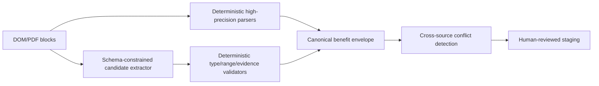
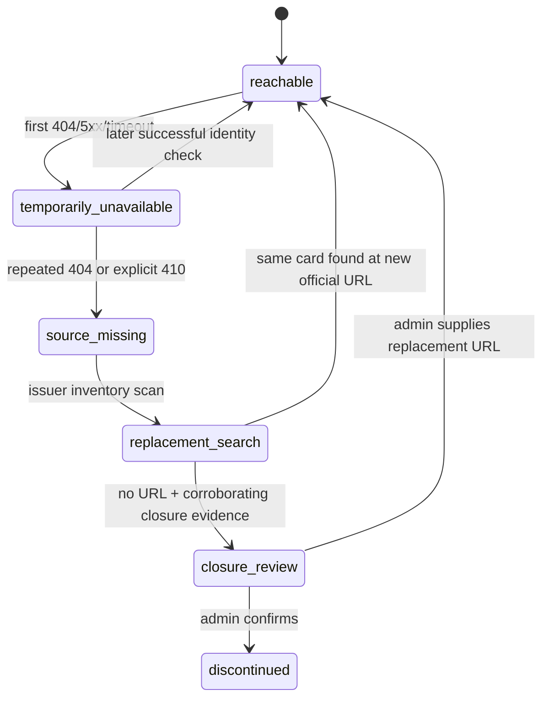
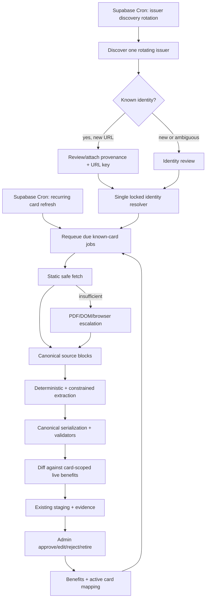

# Card Ingestion Modernization Review

**Reviewed:** 2026-08-19  
**Basis:** effective schema reconstructed from ordered migrations plus current Edge Function code  
**Constraint:** improve reliability and coverage with the smallest practical database change

## Executive verdict

The architecture has a good safety core: first-party-only fetches, bounded redirects, leases, idempotent staging, evidence retention, and human approval before live benefit writes. Those parts should be kept.

The system is nevertheless not a functioning continuous catalog-enrichment architecture yet. Its principal weaknesses are correctness and lifecycle defects rather than obsolete infrastructure:

1. A successfully staged job is never automatically scheduled again. With the same URL and parser version, queue seeding ignores the existing terminal job forever.
2. Issuer discovery runs only when the enrichment queue is empty and always chooses the first eligible issuer in alphabetic order. It does not rotate through issuers.
3. Approval drops structured commercial terms for most non-movie benefits because flat `rate`, `cap`, `threshold`, `period`, and `restrictions` fields are not serialized into `benefits.value_config`.
4. Benefit identity is global across all cards. Approving one card can update a `benefits` row shared by other cards, including its source URL, description, dates, and terms.
5. Crawler review approval bypasses the canonical URL resolver, provenance write, URL-key write, and benefit-job enqueue path promised by the design.
6. One automatic discovery path writes a nonexistent `card_catalog_aliases.discovery_job_id` column.
7. The pilot gate largely validates values that the worker sets about itself; it does not measure extraction precision or actually rerun work to prove idempotency.
8. Public reference tables are exposed by the Data API without RLS, and the migration chain does not explicitly revoke default write grants before granting read access.

These are P0/P1 issues. Expanding the parser or adding an LLM before fixing them would create more proposals on top of unreliable identity, persistence, and recrawl semantics.

### Priority and database-cost summary

| Priority | Change | Risk reduced | Database cost |
|---|---|---|---|
| P0 | Canonical benefit serialization | Prevents approved rates/caps/conditions from disappearing | None |
| P0 | Card-scope automated benefit keys | Prevents one card approval mutating another card | Data migration only; no schema alteration |
| P0 | One catalog identity resolver | Prevents duplicate/orphan card identities and missing enrichment jobs | None |
| P0 | Fix alias write to nonexistent column | Prevents automatic submitted-URL resolution from failing after partial work | None |
| P0 | Real pilot verification | Prevents unsafe parser rollout based on self-reported flags | None |
| P1 | Recurring refresh | Turns one-shot enrichment into continuous freshness | One column: `next_run_at` + index |
| P1 | Rotating independent discovery | Prevents permanent first-issuer bias and backlog starvation | None |
| P1 | RLS, grants, JSON shape constraints | Closes exposed-schema and silent-contract risks | Constraints/policies only |
| P1 | Card-specific reviewed retirement | Removes stale mappings without destroying history | One column: `retired_at` + index |
| P2 | DOM/PDF/browser escalation and hybrid extraction | Improves issuer and benefit-family coverage | None |

---

## Effective database schema as it exists now

The local Supabase database was not running during this review, so the effective schema was reconstructed from every ordered migration rather than from the stale root `schema.sql` alone.

### Read-only baseline audit — 2026-08-19

`scripts/audit-card-ingestion.sql` is the release-ticket baseline query. It returns only aggregate counts, catalog IDs involved in a conflict, and database metadata; it does not return customer identifiers.

| Audit area | Verified finding count | Baseline status |
|---|---:|---|
| Catalog/discontinuation, benefit JSON shapes, mappings, staging, jobs, identity, URL provenance, and active discontinued-card assignments | Not executed | Not zero: local Docker was unavailable, so no database cardinality has been recorded. |
| RLS state, policies, relation grants, and function grants | Not executed | Not zero: this metadata requires the same local migrated database. |
| Static audit contract | 0 contract failures | Executed: the Node contract test confirms every required stable check label and rejects mutating SQL. |

When Docker is available, run `supabase db reset`, then `supabase db query --local --file scripts/audit-card-ingestion.sql`, and attach the output to the release ticket before treating any unexecuted check as a zero finding.

### Catalog and identity

| Table | Effective purpose | Important fields and constraints | Review |
|---|---|---|---|
| `card_catalog` | Canonical card products | UUID PK; name; nullable bank/network/type/URL; fees/APR; discontinued flag | No database-level canonical issuer/name identity; no RLS; correctness depends on all writers using resolver logic, but they do not |
| `card_catalog_aliases` | Alternate card names | unique `(card_id, normalized_alias)`; evidence type; source URL | Good supporting identity table; code currently attempts one nonexistent column |
| `card_catalog_provenance` | Source-grounded identity evidence | unique `(card_id, source_url, content_hash)` plus globally unique submitted/final URL hashes | Strong model, but several approval/insertion paths bypass it |
| `card_catalog_url_keys` | Canonical URL hash → card | SHA-256 PK; FK to card | Correct primitive; underused because not all catalog writers call the resolver |

### Discovery and review

| Table | Effective purpose | Important fields and constraints | Review |
|---|---|---|---|
| `card_discovery_jobs` | Statement and issuer-crawl identity work | nullable user for service jobs; source; status; evidence JSONB; dedupe key; retry fields | Adequate; rejected URL-keyed crawler work can never be reconsidered when page content changes |
| `card_catalog_review_queue` | Proposed identity decisions | one row per discovery job; proposed/evidence/candidates/warnings JSONB; reviewer/status | Adequate; approval implementation bypasses canonical resolver/provenance |
| `card_catalog_review_audit` | Append-only identity decision audit | action, actor, details | Good, but `purgeCalculatorReviewRows` deletes the parent discovery job and cascades away review/audit history |

### Enrichment and publication

| Table | Effective purpose | Important fields and constraints | Review |
|---|---|---|---|
| `card_catalog_enrichment_jobs` | Durable domain queue and latest job state | unique `job_key = card + URL hash + parser`; status; mode; attempt/retry; lease; content/staging; summary JSONB | Custom queue is serviceable, but terminal jobs have no recurrence clock or run history |
| `card_benefits_staging` | Catalog requests and benefit proposals | request type; source/parser/content identity; extracted JSONB; confidence/evidence; review decisions | Useful audit snapshot, but overloaded and weakly constrained across request shapes |
| `benefits` | Live benefit terms | globally unique `dedupe_key`; category/type; `value_config`; JSONB partners/exclusions/regions; source/dates | Global upsert is unsafe for card-specific terms; JSONB shapes are inconsistent |
| `card_benefit_mapping` | Card ↔ benefit publication | unique `(card_id, benefit_id)`; priority/primary; category array | No card-specific retirement or validity state |
| `card_benefits` | Legacy generic value/config rows | card association columns removed | Historical residue; not part of the canonical relationship model |

### Effective JSON contracts

The intended and implemented JSON shapes do not agree:

- `benefits.value_config` is an object and should contain all machine-readable commercial terms.
- `benefits.partners` and `regions` are JSON arrays.
- Seed data and application code treat `benefits.exclusions` as an object such as `{categories, merchants, mcc_codes, ...}`.
- The automated parser produces `exclusions: string[]`, and approval writes that array directly into `benefits.exclusions`.
- `card_benefits_staging.extracted_data` contains the complete proposal, but publication copies only selected fields and silently loses flat non-movie terms.

The database accepts these mixed shapes because the JSONB columns have no shape constraints.

---

## What should remain unchanged

The following choices are still appropriate and should not be rewritten merely because newer Supabase products exist:

- Keep PostgreSQL as the job source of truth.
- Keep the relational enrichment job table. Supabase Queues/`pgmq` would still need a domain job table for status, parser generation, admin links, retries, and quarantine. Migrating now would create two sources of truth without solving the current defects.
- Keep `FOR UPDATE SKIP LOCKED`, advisory locking, and lease tokens.
- Keep first-party issuer allowlisting and manual redirect validation.
- Keep content hashes and parser versions as idempotency inputs.
- Keep staging and explicit admin approval.
- Keep “absence is not deletion” as the automated default.
- Keep JSONB for heterogeneous benefit terms, but impose a canonical envelope and validation.

---

## P0 — correctness fixes before any feature expansion

### 1. Make enrichment recurrent

#### Current failure

`job_key` is unique for `(card_id, final_url_hash, parser_version)`. Scheduled seeding uses an upsert with `ignoreDuplicates: true`. After the first job becomes `staged`, it remains terminal and is never claimed again. The architecture therefore performs one crawl per parser generation, not continuous enrichment.

#### Minimal target

Add one nullable column:

```sql
alter table public.card_catalog_enrichment_jobs
  add column next_run_at timestamptz;

create index card_catalog_enrichment_jobs_due_run
  on public.card_catalog_enrichment_jobs (
    parser_version, run_mode, next_run_at, issuer
  )
  where status in ('staged', 'completed');
```

Then change queue orchestration:

1. On successful staging, set `next_run_at` according to a freshness policy, initially 30 days with deterministic issuer jitter.
2. Before claiming, reset due `staged/completed` rows to `queued`, clear the old lease/failure state, and reset `attempt_count`.
3. On admin rejection/approval, do not stop recurrence.
4. Do not recur quarantined rows until an admin unquarantines them.
5. Use conditional HTTP headers stored in the existing `result_summary` JSONB (`etag`, `last_modified`) to avoid downloading unchanged pages.

No new queue table is required. Historical successful snapshots already live in `card_benefits_staging`; failure details should remain in structured logs.

### 2. Fix benefit serialization before approval

#### Current failure

Cashback, rewards, and lounge parsers commonly emit flat fields. The approval RPC saves only `value_config/valueConfig`, so these terms disappear:

- `value`
- `rate`
- `cap`
- `threshold`
- `frequency`
- `period`
- `restrictions`

The next diff cannot reconstruct the approved condition set and will report false conflicts.

#### Fix without schema change

Create one canonical proposal serializer used by extraction, diffing, admin display, and approval:

```json
{
  "value": 500,
  "rate": 5,
  "cap": 1000,
  "threshold": 20000,
  "frequency": "2 redemptions",
  "period": "month",
  "restrictions": ["online spends"],
  "category": "cashback"
}
```

All machine-readable commercial fields must be merged into `value_config` before staging. The parser may keep flat convenience fields in the proposal DTO, but the database projection must never depend on them.

Normalize exclusions to the existing object contract, for example:

```json
{
  "days": [],
  "mcc_codes": [],
  "merchants": [],
  "categories": [],
  "transaction_types": [],
  "additional": {"source_terms": ["cash advances"]}
}
```

Backfill any automated array-shaped exclusions, then add JSON shape checks as `NOT VALID`, clean existing rows, and validate them.

### 3. Make live benefits card-scoped in identity

#### Current failure

The parser’s benefit `dedupeKey` is a hash of normalized terms without `card_id`. `benefits.dedupe_key` is globally unique, and approval performs `ON CONFLICT (dedupe_key) DO UPDATE`. Identical offers on two cards share one row. A later approval for one card may rewrite title, source URL, dates, exclusions, or value config for every card mapped to that row.

#### Minimum-change fix

Do not add `card_id` to `benefits` or replace the mapping model. Instead, make newly automated keys card-scoped in code:

```text
card-benefit-v2:<card_uuid>:<sha256(canonical_condition_json)>
```

The existing `dedupe_key text UNIQUE` supports this with no schema alteration. For mapped shared rows, perform a one-time data migration that clones the benefit once per card and rewires mappings. Manual/global reusable benefits may retain legacy keys until migrated.

Also use SHA-256 rather than the current short non-cryptographic stable hash. Hash collision is not the largest risk here, but changing identity format is the right time to remove it.

### 4. Enforce one card identity publication path

#### Current failure

The code has at least three catalog insertion paths:

- `resolve_card_catalog_identity` with locks and URL keys;
- statement-discovery direct insertion;
- admin review direct insertion.

The last two can bypass URL identity and provenance. Crawler approval also fails to enqueue benefit enrichment. Additionally, the automatic submitted-URL path writes `discovery_job_id` to `card_catalog_aliases`, but that column does not exist in migrations.

#### Fix without schema change

1. Remove direct `card_catalog` inserts from Edge Functions and review RPCs.
2. Route automatic, statement, crawler, and admin decisions through `resolve_card_catalog_identity`.
3. Harden the resolver to reject submitted/final URL hashes that already point to different cards, and verify that an existing URL-key match is compatible with issuer/product identity.
4. After every successful resolution, write provenance and aliases, then enqueue `benefits-v5` in one orchestrated operation.
5. Remove the nonexistent `discovery_job_id` property from the alias write. The discovery relationship already exists through provenance/review audit; adding a new alias column is unnecessary.
6. Add integration tests against a real migrated local database so TypeScript mocks cannot accept nonexistent columns.

This is a code/RPC consolidation, not a schema redesign.

### 5. Replace the self-attested pilot gate

#### Current failure

The worker sets:

- `unsafe_mutation_count = 0`
- `raw_body_stored = false`
- `idempotency_passed = conflicts.length === 0`
- `evidence_passed = every populated field has a nonempty evidence string`

Those are useful assertions, but they do not prove what their names claim. In particular, “idempotency” never performs a second run and evidence presence does not establish that the excerpt entails the extracted value.

#### Fix without schema change

The pilot should require:

1. A second extraction of the exact same source manifest produces byte-equivalent canonical proposals.
2. A curated expected-output fixture passes for each pilot card.
3. An admin samples every proposed field and records accepted/rejected counts.
4. Zero unexpected live-table mutations are verified by database snapshots or audit queries, not a hard-coded counter.
5. Parser rollout requires precision and critical-field recall thresholds, not merely terminal job statuses.

Store these metrics in the existing `result_summary` JSONB; no new table is needed for the initial rollout.

---

## P1 — operational architecture

### 6. Decouple issuer discovery from the enrichment backlog

#### Current failure

Issuer discovery runs only on an otherwise idle enrichment invocation. Initial catalog processing can delay discovery for roughly two days at one card per 15-minute run. When idle, `loadDiscoverySeed` orders catalog rows by bank, scans at most 100, and returns the first eligible row, so the same issuer is repeatedly crawled.

#### Target

- Use a separate scheduled action or Edge Function for issuer discovery.
- Run it daily or several times per week, not every enrichment tick.
- Select the issuer deterministically from the current time slot and the sorted distinct issuer list, so all issuers rotate without a cursor table.
- Persist candidate content hash and retrieval time inside existing discovery `evidence` JSONB.
- Reopen previously rejected URL candidates only when content hash changes.
- Persist summarized quarantines as discovery jobs/reviews; current `runIssuerDiscovery` drops `result.quarantined`.

This is an infrastructure/code change with no schema change.

Supabase Cron can invoke both Edge paths directly and record run status inside Postgres. The current GitHub Actions scheduler is workable, but separate Supabase Cron jobs reduce external dependency and make operational visibility local to the platform.

### 7. Treat known-card/new-URL discoveries as evidence

`persistCrawlerCandidate` returns `existing` when a name or alias uniquely matches and then stops. A newly discovered official URL is not attached as URL identity/provenance and is not evaluated as a better canonical source.

For a unique match:

1. Create a reviewable provenance proposal if the URL is new.
2. After approval or sufficiently strong multi-signal identity, attach the URL hash to the existing card.
3. Enqueue enrichment against the new URL.
4. Preserve the previous catalog URL until the new page passes identity and extraction quality gates.

No new table is needed; URL keys, provenance, and review queue already model this.

### 8. Introduce fetch escalation instead of weakening the safe fetcher

Keep the current fast HTTP fetch as tier one. Add controlled fallbacks behind the same `BenefitDocument` contract:

1. Static HTML/PDF fetch.
2. Robust DOM/table parsing and embedded JSON/JSON-LD extraction.
3. Production PDF parser; OCR only for scanned documents.
4. Browser-rendered fetch only for allowlisted issuers known to require JavaScript.

Each tier must preserve canonical URL, content hash, retrieval time, source type, and sanitized evidence. Browser fallback must retain the same hostname and navigation policy.

This can be implemented without schema changes because the staging manifest already accepts multiple source documents; add source type and fetch tier to its JSON.

### 9. Move from regex-only extraction to a validated hybrid

The current parser supports a narrow set of cashback, rewards, lounge, and movie clauses. A modern but safe design is:



Use an LLM only to propose fields from bounded source blocks when deterministic rules do not cover the benefit. It must not browse, infer missing terms, or publish directly. Every candidate must quote a local evidence span and pass deterministic validators. High-risk fields—caps, thresholds, dates, exclusions, and eligibility—remain review-required.

No database change is required if the canonical benefit envelope is kept inside existing JSONB.

### 10. Add drift-aware parsing and quality metrics

Parser version is currently a deployment label. Turn it into a measured compatibility contract:

- golden issuer fixtures;
- mutation tests for rates/caps/dates;
- per-benefit-family precision/recall;
- HTML structural drift signals;
- percentage of cards with fresh successful evidence;
- percentage quarantined by issuer and reason;
- proposal acceptance/edit/rejection rate;
- stale pending-review age.

Use structured Edge logs and the existing job summary/staging rows first. Add a run-events table only if retention/query requirements exceed platform logs.

---

## P1 — security and database integrity

### 11. Enable RLS and explicit grants on public reference tables

`public` is in the configured Data API schemas. The migrations grant authenticated `SELECT` on `card_catalog`, `benefit_categories`, `benefits`, `card_benefits`, and `card_benefit_mapping`, but do not enable RLS or explicitly revoke default privileges first.

Apply a hardening migration:

```sql
revoke all on table
  public.card_catalog,
  public.benefit_categories,
  public.benefits,
  public.card_benefits,
  public.card_benefit_mapping
from anon, authenticated;

alter table public.card_catalog enable row level security;
alter table public.benefit_categories enable row level security;
alter table public.benefits enable row level security;
alter table public.card_benefits enable row level security;
alter table public.card_benefit_mapping enable row level security;

grant select on table
  public.card_catalog,
  public.benefit_categories,
  public.benefits,
  public.card_benefit_mapping
to authenticated;

-- Add explicit authenticated SELECT policies for active/reference rows.
```

Do not grant `card_benefits` unless the application still reads the legacy table. If it is unused, revoke client access and plan retirement.

Also set safe default privileges for future tables. This is aligned with current Supabase guidance that grants and RLS are separate controls for exposed schemas.

### 12. Remove deprecated `auth.role()` checks from service-only invoker RPCs

The queue/staging RPCs are `SECURITY INVOKER`, revoked from `PUBLIC/anon/authenticated`, and granted only to `service_role`. That grant is the authorization boundary. Current Supabase guidance deprecates `auth.role()` in favor of role grants/policy `TO` clauses.

Remove the redundant `auth.role()` body checks after verifying function grants in integration tests. Keep `SECURITY INVOKER`, a fixed `search_path`, and explicit `REVOKE`/`GRANT` on every signature.

### 13. Use the existing server-governed admin flag

`public.users.is_admin` exists and authenticated clients cannot modify it, but the admin Edge Function still authorizes by an environment email allowlist. Make `is_admin` the primary server-side authorization source, retain the environment allowlist only as a break-glass fallback, and audit every admin action.

No schema change is required.

### 14. Never delete review/audit history as cleanup

Replace `purgeCalculatorReviewRows`, which deletes discovery parents and cascades audit data, with a transition to `rejected`/`quarantined` and reason `invalid_calculator_candidate`. The existing tables already support this.

---

## Functional lifecycle and edge-case contract

The ingestion system must distinguish four independent facts:

1. **Source reachability:** can CardCompass retrieve this URL now?
2. **Source identity:** does the retrieved resource still describe the expected card?
3. **Product availability:** can a new customer still apply for this product?
4. **Benefit validity:** is an individual benefit currently usable by an existing cardholder?

One observation must never silently update all four. In particular, a dead product page is not proof that a card or its benefits have ceased to exist.

### Observation matrix

| Observation | Automated response | Review proposal | Immediate live effect | Additional schema |
|---|---|---|---|---|
| HTTP 200, byte hash unchanged | Mark refresh successful; schedule next run; skip parsing when parser version is unchanged | None | None | None |
| Raw page changed, canonical extracted benefits unchanged | Record new source hash/retrieval time; no benefit proposal | None | None | None |
| Concrete benefit added | Stage addition with field evidence | Approve/edit/reject | None until approval | None |
| Existing benefit terms changed | Stage old/new comparison as modification | Approve/edit/keep existing | Old terms remain until approval | None |
| Explicit `valid_until` has passed | Treat benefit as ineligible in reads; retain historical row/mapping | Optional renewal/correction review | User-facing eligibility ends by date | None |
| Benefit disappears from one crawl | Record possible removal only if crawl was complete | No retirement yet | None | None |
| Benefit absent from repeated complete crawls | Escalate removal confidence | Admin may retire mapping | None until reviewed retirement | Uses proposed `retired_at` |
| 301/308 to same-card, allowlisted URL | Follow redirect, revalidate identity, attach new URL provenance | Review canonical URL change if necessary | Keep old catalog URL until accepted | None |
| Redirect to generic card index/application/login | Quarantine source as identity mismatch/generic redirect | Operator investigates replacement URL | Do not discontinue card or benefits | None |
| Redirect to a different named card | Quarantine as successor/migration candidate | Admin chooses new card, merge, or replacement handling | No automatic user-card migration | None initially |
| HTTP 404/soft-404 once | Retry with backoff and issuer discovery | None | None | None |
| HTTP 410, or repeated 404 plus absent from issuer inventory | Mark source unavailable; seek another official URL | Propose product closed only with corroboration | No automatic discontinuation | None |
| HTTP 401/403 | Treat as access/rendering problem; use approved browser/document fallback | Operator only if persistent | None | None |
| HTTP 429 | Respect `Retry-After`, apply issuer backoff | None | None | None |
| HTTP 5xx, timeout, or DNS failure | Retry; do not classify product or benefit lifecycle | Review after retry budget | None | None |
| HTTP 200 custom error page | Fail identity/content gate; classify as soft-404 | Operator if persistent | None | None |
| Product says “closed to new applications” | Capture evidence and propose `is_discontinued = true` | Admin confirms acquisition status | Hide from new-card discovery/recommendation after approval | Reuse `is_discontinued` |
| Discontinued card still held by users | Continue benefit refresh for active `user_cards` | Review benefit changes normally | Existing cardholders retain current benefits | None |
| Card removed from sitemap but page remains valid | Treat sitemap absence as weak discovery signal only | None | None | None |
| Card renamed/rebranded with stable issuer/product identity | Add alias and propose canonical display-name update | Admin confirms rename | Same card ID retained | None |
| Network variant or genuinely new co-brand appears | Treat as separate/ambiguous identity | Admin creates or merges deliberately | No automatic merge | None |
| Main page and official terms conflict | Preserve both source claims with dates/hashes | Mandatory conflict review | Existing live terms remain | None |
| Terms PDF is unreadable/scanned | Mark crawl incomplete and escalate to PDF/OCR tier | No removal proposal from incomplete evidence | None | None |
| JavaScript page returns empty shell | Mark crawl incomplete and use issuer-specific browser tier | No removal proposal | None | None |
| Allowed issuer changes domain | Reject redirect until new domain is explicitly allowlisted | Security/operator approval | None | None |
| Parser version changes but source does not | Reparse existing source or refetch conditionally; compare canonical output | Only changed proposals enter review | None | None |

### Required completeness rule

Every enrichment result needs a `crawl_complete` decision in existing staging/job JSON. It is true only when:

- the primary product identity passed;
- every required/selected supporting source either succeeded or was explicitly classified as optional;
- no browser/PDF fallback remained outstanding;
- source conflicts were captured rather than silently discarded; and
- the extractor completed without truncation or resource-limit recovery.

`possibleRemovals` may be displayed only from a complete crawl. A reviewed retirement should require at least two complete observations separated by a configurable time window, unless an official dated statement explicitly terminates the benefit.

### Product-page expiration policy

Use a progressive evidence model:



- A `404` is a source observation, not a product status.
- A `410` is stronger source-removal evidence, but still not enough by itself to retire benefits for existing cardholders.
- A same-domain redirect is accepted only after the final page passes the same card identity gate.
- A card marked `is_discontinued = true` must be excluded from acquisition/recommendation flows but **must still be refreshed when an active user owns it**. The current queue seeder excludes all discontinued cards and must be changed accordingly.

### Benefit expiration and retirement policy

There are three cases:

1. **Explicit date:** persist `valid_until`; user-facing queries stop treating the benefit as eligible after that date. Keep the mapping for history.
2. **Official replacement:** stage a modification when the semantic benefit remains the same but its rate/cap/period/date changes.
3. **Silent disappearance:** create a non-actionable possible-removal observation only after a complete crawl. After repeated complete absence, allow an admin to set `card_benefit_mapping.retired_at`.

Approval of a new version should not globally deactivate the old `benefits` row because other cards may still use legacy rows. Card-scoped dedupe keys and mapping retirement keep this decision local to the card.

### Preventing change noise

Issuer pages frequently change banners, navigation, analytics IDs, legal footers, and generated markup without changing benefits. Maintain two hashes in the existing JSON payloads:

- **raw content hash:** integrity and fetch provenance;
- **canonical benefit hash:** normalized sorted proposal envelope.

Only a canonical benefit-hash change should create a benefit review proposal. A raw-only change updates freshness/provenance and schedules the next run.

### Conflicting and partial evidence

- Terms/conditions with an explicit effective date outrank undated marketing copy only as a review suggestion, never as an automatic overwrite.
- Two current official documents with incompatible terms create a conflict, not two independently approvable additions.
- A failed supporting PDF, truncated response, browser-render failure, or resource-limit lease expiry makes the crawl incomplete.
- Incomplete crawls can propose positively observed additions, but cannot propose removals or product discontinuation.
- Evidence excerpts must identify source URL, retrieval time, parser version, and the exact field they support.

This lifecycle contract fits the existing job, staging, provenance, and review tables. It requires no additional status table and no new product-status column in the first modernization pass.

---

## Minimal schema delta

The recommended first implementation needs **no replacement tables** and only two new business columns.

### Required new columns

```sql
alter table public.card_catalog_enrichment_jobs
  add column next_run_at timestamptz;

alter table public.card_benefit_mapping
  add column retired_at timestamptz;
```

`next_run_at` makes the queue recurrent without overloading retry semantics. `retired_at` provides card-specific soft removal while preserving mapping history. Automated absence still cannot retire a mapping; only an explicit reviewed decision can set it.

### Required indexes

```sql
create index card_catalog_enrichment_jobs_due_run
  on public.card_catalog_enrichment_jobs (
    parser_version, run_mode, next_run_at, issuer
  )
  where status in ('staged', 'completed');

create index card_benefit_mapping_active_card
  on public.card_benefit_mapping (card_id, display_priority)
  where retired_at is null;
```

### Required constraints and grants, with no new model

- Enable RLS and explicit grants/policies on client-readable reference tables.
- Add `jsonb_typeof` checks for `benefits.value_config`, `partners`, `exclusions`, and `regions` after data cleanup.
- Add request-type-specific `card_benefits_staging` checks after legacy rows are classified.
- Add `jsonb_typeof(result_summary) = 'object'` to enrichment jobs.
- Add `NOT VALID` constraints first, repair rows, then validate to avoid a risky one-shot migration.

### Explicitly deferred schema ideas

Do **not** add these in the first modernization pass:

- separate issuer/domain tables;
- a generic event store;
- a source-document child table;
- a new benefit-version table;
- a second queue based on `pgmq`;
- separate staging tables per request type;
- normalized partner/restriction tables.

Those may become useful later, but the existing JSONB snapshots and provenance tables are sufficient once their contracts are enforced.

---

## Recommended target flow



---

## Delivery order

### Phase 0 — stop correctness leakage

1. Fix the nonexistent alias column write.
2. Canonically serialize all commercial fields into `value_config`.
3. Normalize exclusions to object shape.
4. Scope automated benefit keys by card.
5. Route every catalog approval/insertion through the identity resolver and enqueue benefits.
6. Replace destructive review cleanup.

### Phase 1 — make it continuous

1. Add `next_run_at` and the due index.
2. Requeue successful jobs on a measured cadence.
3. Separate and rotate issuer discovery.
4. Add conditional fetches.
5. Replace the self-attested pilot with fixture and second-run verification.

### Phase 2 — improve coverage safely

1. DOM/table and robust PDF parsing.
2. Browser fallback for specific issuers.
3. Hybrid constrained candidate extraction.
4. Benefit-family evaluation suite and production drift metrics.

### Phase 3 — reviewed staleness handling

1. Add `retired_at` to mappings.
2. Require repeated complete crawls before showing removal suggestions.
3. Allow only admins to retire mappings.
4. Keep old staging evidence and decisions as the audit trail.

---

## Acceptance criteria

The modernization should not be considered complete until these are true:

- Every active catalog card has a last successful retrieval and a future due time.
- Every issuer is selected by discovery within the promised rotation window.
- Re-extracting identical documents produces byte-equivalent canonical proposals.
- Approving cashback/reward/lounge benefits retains every parsed rate, cap, threshold, period, restriction, and exclusion.
- Updating a benefit for one card cannot change another card’s live terms.
- Every approved new card has URL keys, provenance, aliases, and a benefit job.
- No Edge Function writes columns absent from migrated schema.
- Client roles cannot mutate catalog or benefit reference data.
- Every live benefit field shown to users can be traced to a staging evidence span and admin decision.
- Removal suggestions never retire mappings without an explicit reviewed decision.

---

## Evidence map

| Finding | Current implementation evidence |
|---|---|
| One-time jobs | `benefit-enrichment-batch/batch_policy.ts` ignores duplicate `job_key`; claim only accepts queued/failed |
| One scheduled card per invocation | `benefit-enrichment-batch/index.ts` passes `_max_jobs: 1` in scheduled mode |
| Discovery starvation/first issuer | `benefit-enrichment-batch/index.ts` runs discovery only when idle and `loadDiscoverySeed` returns the first ordered eligible row |
| Lost scalar terms | `benefit_enrichment.ts` emits flat fields; `approve_card_benefit_enrichment` persists only `value_config` |
| Global cross-card upsert | `benefit_enrichment.ts` condition hash omits card; migration approval uses `ON CONFLICT (dedupe_key) DO UPDATE` |
| Mixed exclusion shape | seed migration stores exclusion objects; parser emits arrays; approval copies proposal directly |
| Resolver bypass | `review_card_catalog_discovery` and a statement-discovery branch insert `card_catalog` directly |
| Missing alias column | `card-discovery/index.ts` writes `discovery_job_id`; alias table migrations do not define it |
| Crawler approval does not enqueue | admin endpoint returns immediately after `review_card_catalog_discovery` RPC |
| Quarantined discovery dropped | `runIssuerDiscovery` persists only `result.candidates` |
| Destructive audit cleanup | `purgeCalculatorReviewRows` deletes `card_discovery_jobs`, whose review/audit children cascade |
| Reference-table RLS gap | initial schema grants reads but enables RLS only on user-facing tables; `public` is exposed in `config.toml` |

## Current platform guidance considered

- [Supabase Row Level Security](https://supabase.com/docs/guides/database/postgres/row-level-security)
- [Supabase Cron](https://supabase.com/docs/guides/cron)
- [Supabase Queues](https://supabase.com/docs/guides/queues)
- [Supabase changelog](https://supabase.com/changelog)
