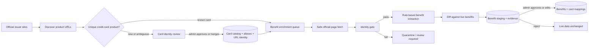
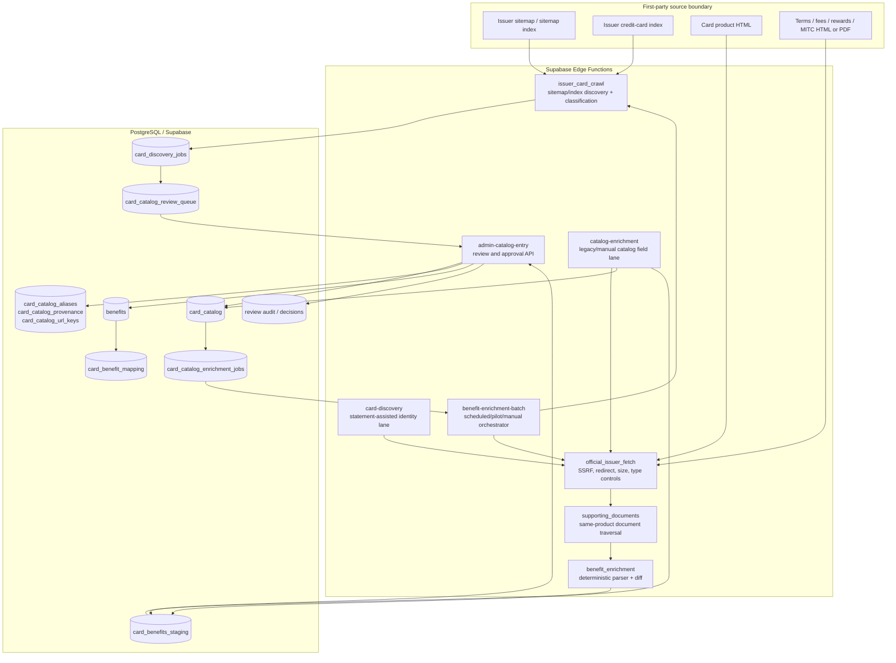
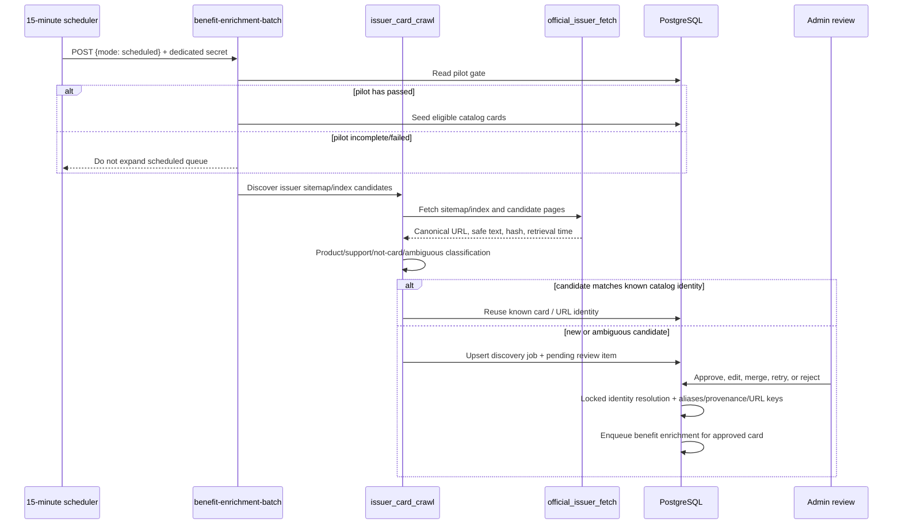
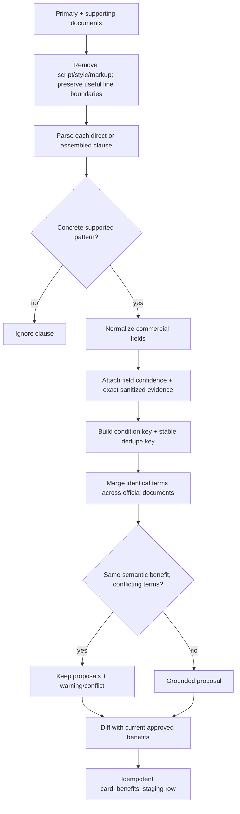
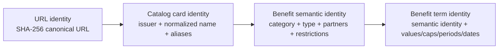
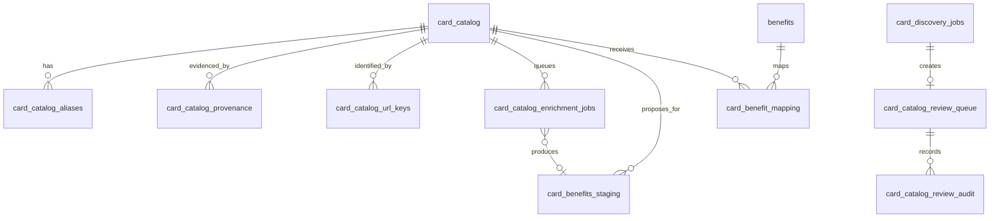
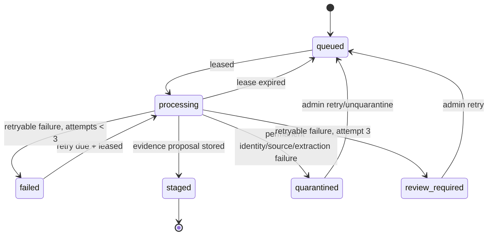
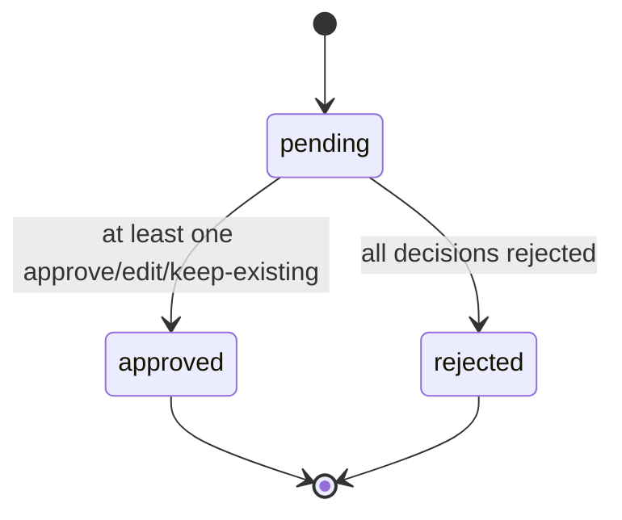

# Card Product Discovery, Scraping, Benefit Extraction, and Storage

**Status:** implementation-derived architecture, inspected 2026-08-19
**Scope:** official issuer product discovery through reviewed benefit publication
**Primary runtime:** Supabase Edge Functions + PostgreSQL

## How to read this document

This document describes the system at five depths:

- **Depth 0 — one-minute map:** business-level flow and trust boundary.
- **Depth 1 — system containers:** deployable functions and persistent stores.
- **Depth 2 — end-to-end sequence:** the exact happy path and failure branches.
- **Depth 3 — extraction internals:** what is fetched, recognized, normalized, and diffed.
- **Depth 4 — database and operations:** tables, state machines, identity, security, retries, and gaps.

The description prioritizes executable code and migrations over aspirational design. Where the design target differs from current behavior, the difference is called out explicitly.

---

## Depth 0 — one-minute map

The central architectural rule is **two-phase publication**:

1. Official sources may create a proposed card identity or proposed benefit set.
2. Only an authenticated admin decision publishes those proposals to the live catalog or live benefit tables.

The scheduled worker never directly writes live benefits. It writes a source-grounded proposal to `card_benefits_staging`; the approval RPC is the only normal bridge into `benefits` and `card_benefit_mapping`.

### The product in one sentence

CardCompass inventories allowlisted issuer sites, resolves each candidate to a stable catalog identity, safely fetches first-party product/support documents, extracts only concrete benefit patterns, stores field-level evidence and a non-destructive diff, then requires admin approval before publishing.

---

## Depth 1 — system containers

### Responsibilities

| Component | Responsibility | Important constraint |
|---|---|---|
| `benefit-enrichment-batch` | Seeds/claims jobs, discovers issuer inventory, fetches cards, verifies identity, extracts, diffs, stages, retries | Claim RPC supports five jobs, but scheduled mode currently requests one; a claim contains one issuer; parser is `benefits-v5` |
| `issuer_card_crawl` | Reads sitemap/index candidates, scores URLs, classifies pages, persists new-card review candidates | 200 URLs considered, 40 candidate fetches, sitemap depth 2 |
| `official_issuer_fetch` | Canonicalizes URL, validates issuer domain and DNS, follows bounded redirects, enforces type/size/time policy, hashes content | HTTPS and first-party allowlist only; rejects private/loopback resolution |
| `supporting_documents` | Follows same-card links for benefits, fees, charges, rewards, terms, conditions, or MITC | Hard limit 8 and depth 2; batch currently passes `maximumLinks: 1` |
| `benefit_enrichment` | Converts source text to grounded proposals and computes a review-only diff | Deterministic regex/rules; does not infer missing commercial terms |
| `admin-catalog-entry` | Authenticated listing, retry, quarantine, approve/edit/reject actions | Server-side admin allowlist; calls service-role-only approval RPC |
| PostgreSQL RPCs | Identity locking, queue leases, idempotent staging, and atomic publication | Restricted to `service_role` |

### Two entry lanes into card identity

1. **Issuer-wide crawler lane:** issuer sitemap/index → official candidate page → `card_discovery_jobs` with `discovery_source = issuer_crawl` → mandatory review for a new card.
2. **Statement-assisted lane:** statement-derived product signals enter `card-discovery`; official metadata and statement identity can resolve an existing card or satisfy the automatic identity gate. Failures enter the same review queue.

Both lanes converge on the same canonical catalog identity primitives: normalized issuer/name, aliases, URL hashes, provenance, and `resolve_card_catalog_identity`.

---

## Depth 2 — end-to-end runtime sequence

### A. Find card products

Discovery sources are deliberately bounded. Conventional sitemap locations and issuer card-index paths are tried. Candidate ranking favors paths containing credit-card/product context, while login, application, tracking, blog/story, protection, support, and other unsafe/generic paths are rejected or quarantined.

### B. Scrape and validate a known card

1. Scheduled queue seeding selects active `credit` catalog rows with HTTPS URLs on the issuer allowlist.
2. A deterministic job key is derived from `card_id + final_url_hash + parser_version`; pilot cards are excluded from duplicate scheduled seeding.
3. `claim_card_catalog_enrichment_jobs` takes a transaction advisory lock, selects one issuer, then leases due jobs with `FOR UPDATE SKIP LOCKED`. The database function supports up to five; the current endpoint asks for **one in scheduled mode** and up to five in pilot/manual mode.
4. The worker loads the catalog card, issuer peers, and recorded aliases.
5. The primary official URL is fetched with a 2 MiB batch limit. The shared fetcher:
   - canonicalizes the URL against issuer-specific domains;
   - resolves A/AAAA records and rejects private/loopback addresses;
   - manually follows at most four redirects and revalidates every target;
   - accepts HTML/XHTML/PDF only for document fetches;
   - applies a deadline and streaming size ceiling;
   - returns SHA-256 content hash and retrieval timestamp.
6. `requireMatchingIdentity` checks that the page is a product document and uniquely matches the expected issuer/card name or alias. A competing same-issuer match is not accepted.
7. Supporting links are discovered from the primary page. Only allowlisted, same-product paths related to benefits/fees/rewards/terms/MITC are eligible. PDF text is extracted from literal PDF text operators; an unreadable PDF contributes no text.
8. A combined content hash is computed over `sourceUrl:contentHash` for all collected documents.

### C. Extract, diff, and stage

The staged `extracted_data` contains:

- request type, parser version, aggregate content hash, and retrieval time;
- source document URLs and individual content hashes;
- normalized proposals;
- additions, modifications, unchanged entries, possible removals, and conflicts.

`source_evidence` separately indexes each proposal by dedupe key with source URL, sanitized excerpt, and field-level evidence. Raw page bodies are intentionally not persisted.

### D. Review and publish

An admin decision may be `approve`, `edit`, `reject`, or `keep_existing` for each proposed change. `approve_card_benefit_enrichment` locks the pending staging row and validates every accepted proposal.

- The category must resolve through `benefit_categories`.
- `benefits` is upserted by `dedupe_key`.
- `card_benefit_mapping` is upserted by `(card_id, benefit_id)` with priority, primary flag, and category code.
- Decisions, reviewer, review time, and final staging status are recorded.
- A possible removal cannot be approved. Absence in a crawl is informational only and never deletes a benefit.

This approval is atomic inside PostgreSQL: either the accepted benefits/mappings and review state commit together, or none do.

---

## Depth 3 — extraction internals

### What the current parser actually extracts

The production parser is deterministic TypeScript, not an LLM. The current `benefits-v5` implementation recognizes the following concrete structures:

| Family | Recognized values and conditions | Stored projection |
|---|---|---|
| Cashback | percentage or fixed cashback; optional cap, period, restriction, exclusions, end date | category `cashback`; `rate` or `value`; `cap`; `period`; restrictions/exclusions |
| Reward points | “earn N reward points”; optional spend threshold and spend restriction | category `rewards`; type `reward_points`; value/threshold; movie reward config when applicable |
| Lounge | explicit number of complimentary lounge visits; optional period/exclusions/end date | category `travel`; type `lounge_access`; visit count/frequency/period |
| Movie percentage discount | explicit percent; optional transaction cap; detected platform/partner | category `entertainment`; `value_config.discount_type = percent` |
| Movie BOGO | explicit buy-one-get-one plus mandatory cap and usage frequency | `discount_type = bogo`; cap; monthly/quarterly/yearly usage |
| Movie fixed discount | explicit rupee discount | `discount_type = fixed`; discount amount |
| Movie milestone | explicit ticket count, spend threshold, per-ticket worth, monthly billing cycle | milestone threshold and reward value |
| Annual movie allowance | complimentary/free movie ticket wording plus explicit annual amount | annual cap and year period |

Movie partners currently recognized by name are BookMyShow, District, Zomato, PVR, INOX, and Cinepolis.

### Extraction safeguards

- A marketing heading is not a benefit unless a supported concrete rate/value/visit rule is present.
- Missing amounts, caps, merchants, periods, and eligibility are not guessed.
- BOGO is rejected unless both a monetary cap and a usage limit are present.
- Movie food-and-beverage text is excluded unless it explicitly concerns movie tickets.
- Adjacent lines are assembled only for narrowly defined incomplete clauses, such as a discount whose cap appears immediately afterward.
- Long digit sequences are redacted in stored excerpts.
- Every populated field receives evidence; the job summary verifies that evidence coverage is complete.

### Identity and deduplication

There are three different identities, each solving a different problem:

- **Card URL identity:** `card_catalog_url_keys.url_hash` prevents the same official URL from creating multiple cards.
- **Card name identity:** locked issuer/name and alias comparison resolves canonical catalog membership.
- **Benefit dedupe key:** a stable hash of the full normalized condition set groups identical official terms.
- **Semantic grouping:** detects two official statements describing the same benefit family but with different commercial conditions; these become conflicts, not silent merges.

### Diff semantics

The parser compares proposed terms with benefits currently mapped to the card:

- **addition:** new semantic/term identity;
- **modification:** semantic match with changed conditions;
- **unchanged:** matching dedupe key and condition set;
- **possible removal:** a currently mapped benefit was not observed; informational and non-actionable;
- **conflict:** ambiguous duplicates or conflicting proposed terms.

---

## Depth 4 — database, states, and operations

### Core data model

| Store | Key information |
|---|---|
| `card_catalog` | canonical card name, issuer, network/type, official URL, fees/APR, discontinued flag |
| `card_catalog_aliases` | alternate product names and normalized alias, evidence type/source |
| `card_catalog_provenance` | source URL and canonical submitted/final URL hashes |
| `card_catalog_url_keys` | globally unique URL hash → card ID mapping |
| `card_discovery_jobs` | source, status, statement/official signals, retry and resolved identity |
| `card_catalog_review_queue` | proposed identity, official evidence, candidates, warnings, confidence, decision state |
| `card_catalog_enrichment_jobs` | card/issuer/URL/parser identity, status, attempt, lease, retry, staging link, safe summary |
| `card_benefits_staging` | immutable source identity, proposals/diff, confidence, evidence, warnings, decisions |
| `benefits` | live normalized benefit, value config, partners, exclusions, dates, source, dedupe key |
| `card_benefit_mapping` | many-to-many card/benefit publication with display metadata |

### Job state machine

Permanent quarantine categories include `not_a_card`, `ambiguous_product`, `identity_mismatch`, `unapproved_domain`, `unsupported_content`, and `insufficient_evidence`. Transient network/fetch failures use backoff and become `review_required` after the third attempt.

### Staging state machine

Staging identity is unique on `(card_id, source_url_hash, parser_version, content_hash)` for official benefit enrichment. Reprocessing identical content with the same parser reuses the pending/approved staging row.

### Scheduler and rollout gate

- GitHub Actions invokes the scheduled endpoint every 15 minutes with a dedicated cron secret.
- The first rollout is a five-card pilot spanning at least three issuers and multiple page profiles.
- Scheduled seeding is blocked until the pilot gate proves terminal outcomes, no unsafe mutation, complete evidence, idempotency, and no raw-body storage.
- The queue/claim design supports batches of five, but the current scheduled endpoint deliberately claims one job per invocation; pilot/manual modes may claim up to five. Claimed jobs are processed sequentially.

### Security boundaries

- Source fetches are restricted by issuer-specific hostname allowlists, not caller-provided arbitrary domains.
- DNS answers are checked for private addresses before each request; redirects are manually revalidated.
- Queue, identity, review, and staging tables have RLS enabled and are revoked from `anon` and `authenticated` roles.
- Queue/stage/finalize/approve RPCs require `auth.role() = service_role`.
- Admin HTTP operations additionally validate the verified Supabase user against `CARD_CATALOG_ADMIN_EMAILS`.
- Logs and result summaries store IDs, counts, categories, hashes, and sanitized evidence—not raw bodies, authorization headers, or service keys.

---

## Canonical path vs adjacent/legacy paths

### Canonical benefit path

`benefit-enrichment-batch` → safe official fetch → identity gate → supporting documents → `extractGroundedBenefits` → `diffBenefits` → `stage_card_benefit_enrichment` → admin API → `approve_card_benefit_enrichment`.

### Manual catalog enrichment lane

`catalog-enrichment` uses the same safe fetcher and rule parser, but is a separately owned `manual` / `catalog-v1` job path. It may directly backfill **missing catalog scalar fields** (`network`, `card_type`, `joining_fee`, `annual_fee`, `apr`) when confidence is high; conflicting scalar values go to catalog review. Extracted benefits still go to staging. This is not the scheduled `benefits-v5` pipeline.

### `scrape-card` compatibility proxy

`scrape-card` is an older frontend-oriented HTML proxy with its own allowlist and CORS surface. It returns raw HTML to the caller and is not used by the canonical scheduled benefit pipeline. New ingestion work should use `official_issuer_fetch`, whose DNS/redirect/content controls and provenance output are stronger and centralized.

---

## Current limitations and architectural risks

1. **Extractor coverage is intentionally narrow.** Dining, fuel, insurance, forex markup, fee waivers, travel credits, golf, concierge, EMI, milestone rewards outside the implemented movie form, and many issuer-specific offers are not yet parsed.
2. **Runtime supporting-document breadth is below the audited ceiling.** The collector supports eight links/depth two, but the batch worker currently requests only one supporting link for Edge compute safety. Important terms can therefore be missed and appear as possible removals.
3. **PDF extraction is lightweight.** It reads common literal `Tj`/`TJ` operators and deflated streams; scanned, encrypted, font-encoded, or structurally complex PDFs can yield empty text and be skipped.
4. **No JavaScript execution.** Client-rendered issuer pages can appear empty or insufficient even when visible in a browser.
5. **Presence is stronger than absence.** A found, grounded term can be proposed; a missing term can never prove removal. This is safe but creates ongoing review debt for stale benefits.
6. **Two scraping implementations exist.** The legacy `scrape-card` proxy and canonical fetcher have different allowlists and controls, increasing drift risk.
7. **Broad design model exceeds live parser.** The design discusses general rates, caps, thresholds, merchants, channels, effective dates, and exclusions. The schema can carry much of this, but only the patterns listed in Depth 3 are currently populated.

### Recommended next architecture steps

1. Add a parser capability registry and fixtures per benefit family, with an explicit “supported / detected-but-unparsed / absent” outcome.
2. Persist a source-document manifest per run as a normalized child table if source-level querying and recrawl lineage become important; today it lives inside staging JSON.
3. Replace lightweight PDF decoding with a production PDF text service or library while retaining the same hash/evidence contract.
4. Add an issuer adapter boundary for JavaScript-heavy pages rather than weakening the generic fetcher.
5. Retire or route `scrape-card` through `official_issuer_fetch` to remove duplicate security policy.
6. Measure extraction coverage by issuer and benefit family before increasing batch breadth.

---

## Implementation evidence map

| Concern | Source of truth |
|---|---|
| Product normalization, issuer allowlist, official identity | `supabase/functions/_shared/card_discovery.ts` |
| Sitemap/index discovery, classification, crawler candidate persistence | `supabase/functions/_shared/issuer_card_crawl.ts` |
| SSRF protection, redirects, content policies, hashing, PDF text | `supabase/functions/_shared/official_issuer_fetch.ts` |
| Supporting-document traversal | `supabase/functions/benefit-enrichment-batch/supporting_documents.ts` |
| Concrete benefit parsing, evidence, dedupe, diff | `supabase/functions/_shared/benefit_enrichment.ts` |
| Batch seeding, identity gate, staging payload, failure handling | `supabase/functions/benefit-enrichment-batch/index.ts` |
| Claim size, parser/version policy, pilot selection/gate | `supabase/functions/benefit-enrichment-batch/batch_policy.ts` |
| Admin benefit decisions | `supabase/functions/admin-catalog-entry/benefit_admin.ts` |
| Discovery/review/alias/provenance tables | `supabase/migrations/20260817020000_card_discovery_queue.sql` |
| URL identity and catalog job foundation | `supabase/migrations/20260817030000_card_catalog_url_identity.sql` |
| Leases, idempotent staging, publication RPC | `supabase/migrations/20260817040000_automated_benefit_enrichment.sql` |
| Versioned pilot isolation | `supabase/migrations/20260818100125_version_benefit_enrichment_pilot_lane.sql` |
| Scheduler contract | `.github/workflows/benefit-enrichment-schedule.yml` |

## Compact glossary

- **Catalog identity:** the single canonical database row representing one issuer/card variant.
- **Official evidence:** sanitized excerpt and source metadata from an allowlisted first-party issuer resource.
- **Proposal:** extracted terms that have not yet changed live product data.
- **Dedupe key:** deterministic identity for a normalized benefit condition set.
- **Possible removal:** a live benefit not observed in the current crawl; never an executable deletion.
- **Lease:** time-bounded ownership token preventing two workers from finalizing the same job.
- **Quarantine:** terminal automated outcome requiring operator review or retry.
