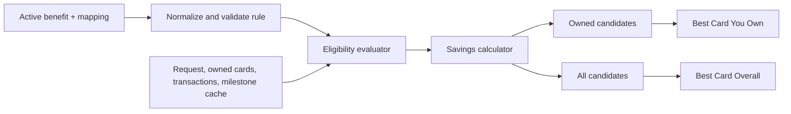

# Movie Deals Rule Engine — Design Spec & Implementation Plan

## Design Specification

# Movie Deals Rule Engine Design

## Goal

Make the Movie Deals drawer return trustworthy, explainable recommendations for both the best card the user owns and the best card overall, without creating or altering database tables.

## Scope and constraints

- Reuse the existing `benefits`, `card_benefit_mapping`, `user_cards`, `transactions`, and `statement_milestone_cache` tables.
- Do not create tables, add columns, or rely on `benefit_usage_records` or `benefit_usage`; neither exists in the checked-in schema.
- Read movie rule terms only from active `benefits.value_config`, with card association from `card_benefit_mapping`.
- Do not create synthetic transactions or mark a benefit as redeemed merely because a user sees a recommendation.
- Keep the existing Movie Deals drawer and its `MovieAnalyzerTab` entry point.

## Existing schema usage

| Need | Existing source | Rule |
| --- | --- | --- |
| Benefit terms and validity | `benefits.value_config`, `valid_from`, `valid_until`, `is_active` | Parse and validate before evaluation. |
| Card association and display precedence | `card_benefit_mapping` | Use `card_id`, `benefit_id`, and `display_priority`. |
| Owned-card pool | `user_cards` | Match active `catalog_card_id` values. |
| Confirmed historical activity | `transactions` | Count a ticket only when `metadata.ticket_count` exists and the platform/merchant matches. |
| Statement-cycle milestone progress | `statement_milestone_cache` | Compare `total_spending` with the rule threshold. |

## Canonical in-memory rule

Raw `value_config` is normalized into an immutable `MovieDealRule`. It is not persisted in a new table.

```text
MovieDealRule
- benefitId, catalogCardId, title, sourceUrl
- offerType: bogo | percentDiscount | fixedDiscount | cashback | freeTickets | voucher
- platforms, cinemas
- buyCount, freeCount
- discountPercent, fixedAmount, maximumDiscount
- minimumTransaction
- transactionTicketLimit, cycleTicketLimit, cycleTransactionLimit
- validityStart, validityEnd, validWeekdays
- milestoneThreshold, milestoneReward
- exclusions
```

The normalizer accepts documented legacy shapes:

- `offer_type=BOGO` with `free_ticket_count` becomes `bogo` with `buyCount=1` and the supplied free count.
- `discount_percent` becomes `percentDiscount` when no explicit `offer_type` exists.
- `rate` plus `unit=percent` becomes `percentDiscount`.
- `discount_amount` becomes `fixedDiscount`.
- `reward_value` plus a movie voucher/category becomes `voucher` only when its terms identify a usable movie value.

No commercial terms are invented. Missing minimum spend means none; missing cap means uncapped. Ambiguous fixed-value rules, malformed BOGO rules, and milestones missing either threshold or reward are rejected with a diagnostic reason.

## Evaluation flow



For each candidate, evaluate in this order:

1. Rule is active, complete, and within its validity dates.
2. Requested platform and cinema match the rule.
3. Weekday, exclusions, and minimum transaction amount pass.
4. Per-transaction ticket and transaction-count limits pass.
5. Statement-cycle or calendar-cycle usage is calculated from confirmed matching transaction metadata. If ticket/redemption data is unavailable, capped rules are marked `usageUnverified` rather than claimed as guaranteed.
6. Milestones require `statement_milestone_cache.total_spending >= milestoneThreshold`; absent cache data means the milestone is not verified.
7. Calculate savings by offer type, then clamp it to `[0, eligibleTransactionAmount]` and any declared cap.

BOGO uses `floor(eligibleTickets / (buyCount + freeCount)) * freeCount * pricePerTicket`. Percentage discount and cashback use eligible spend times the stated rate. Fixed discount, voucher, and free-ticket savings cannot exceed eligible spend.

## Recommendation results and ranking

The engine returns a result containing `bestOwned`, `bestOverall`, evaluated candidates, and rejected candidates. A candidate includes card identity, ownership state, platform, rule, gross amount, savings, final amount, eligibility state, remaining verified usage where available, and an explanation.

Candidates are sorted by:

1. Guaranteed savings in rupees.
2. Lower final payable amount.
3. Higher verified-usage confidence.
4. Mapping display priority.
5. Stable card and benefit identifiers for deterministic ties.

Owned and overall pools are ranked independently. Ownership is not a score bonus, so it cannot make a worse deal beat a better one. If the same card wins both pools, the UI displays that fact rather than duplicate, indistinguishable cards. Non-owned results are explicitly labelled as such.

## Usage confidence

The engine recognizes three states:

- `verified`: matching transactions include platform identity and explicit ticket/redemption metadata sufficient to apply the rule limit.
- `unverified`: the rule has no usage limit, or a limit exists but confirmed ticket/redemption usage is unavailable. Unverified limited deals are presented as potential, conditional savings.
- `unavailable`: required statement-cycle data or milestone cache is unavailable. Milestone rewards do not become eligible in this state.

## Drawer behavior

`MovieAnalyzerTab` continues to submit ticket count, ticket price, preferred platform, and preferred cinema. The result area displays:

- Best Card You Own and Best Card Overall.
- Exact calculation arithmetic and final amount.
- Platform/cinema, validity, minimum spend, caps, and usage confidence.
- A clear condition when user action is needed to confirm capped usage.
- A no-deal state when no verified eligible rule exists.

Debug views may show rejected-rule reasons. Customer-facing views never expose raw parsing failures.

## Error handling

- A malformed rule is rejected independently; it cannot fail the full analysis.
- Database errors produce an explicit unavailable state rather than an empty no-benefits result.
- All calculations are non-negative, capped by eligible purchase value, and deterministic for equal inputs.

## Verification strategy

- Unit tests normalize each legacy movie-benefit shape found in the reference data.
- Rule validation tests reject expired, incomplete, and ambiguous terms.
- Calculator table tests cover BOGO, percentage, fixed, cashback, voucher, free-ticket, and cap behavior.
- Eligibility tests cover platform, cinema, date, weekday, exclusions, threshold, transaction limits, and usage confidence.
- Ranking tests prove independent owned and overall winners, plus deterministic ties.
- Repository tests cover catalog-card/user-card identifier boundaries and existing-schema queries.
- Widget/provider integration tests submit a Movie Deals request and render both result sections.
- A fixture test evaluates every active entertainment benefit and reports accepted versus rejected rules.

## Out of scope

- New database tables, columns, triggers, or RPC functions.
- Automatic redemption writes before a matching transaction exists.
- Changes to the generic Smart Transaction Analyzer.


---

## Implementation Plan

# Movie Deals Rule Engine Implementation Plan

> **For agentic workers:** REQUIRED SUB-SKILL: Use superpowers:subagent-driven-development (recommended) or superpowers:executing-plans to implement this plan task-by-task. Steps use checkbox (`- [ ]`) syntax for tracking.

**Goal:** Produce reliable, explainable best-owned and best-overall Movie Deals recommendations without altering the database schema.

**Architecture:** Introduce pure normalization, eligibility, calculation, and ranking units. A thin read-only repository translates existing Supabase data into snapshots; the existing service orchestrates those units and the drawer renders two result panels.

**Tech Stack:** Flutter/Dart, Riverpod, Supabase Flutter, Flutter test.

## Global Constraints

- Do not create tables, columns, triggers, RPC functions, or migrations.
- Read terms from `benefits.value_config`, mappings from `card_benefit_mapping`, ownership from `user_cards`, activity from `transactions`, and milestone progress from `statement_milestone_cache`.
- Do not use `benefit_usage_records` or `benefit_usage`.
- Do not invent commercial terms or write synthetic transactions/redemptions.
- Preserve unrelated workspace changes.

---

## File structure

- Create `lib/features/movie_rule_engine/domain/models/movie_deal_rule.dart`: canonical in-memory rule types.
- Create `lib/features/movie_rule_engine/domain/models/movie_deal_candidate.dart`: candidate, usage confidence, and dual-result types.
- Create `lib/features/movie_rule_engine/domain/movie_deal_rule_normalizer.dart`: raw benefit configuration conversion.
- Create `lib/features/movie_rule_engine/domain/movie_deal_evaluator.dart`: pure eligibility, arithmetic, and ranking.
- Create `lib/features/movie_rule_engine/data/movie_deals_repository.dart`: existing-schema read-only snapshot loader.
- Modify `lib/features/movie_rule_engine/data/movie_rule_engine_service.dart`: orchestration only.
- Modify `lib/features/movie_rule_engine/presentation/movie_analyzer_tab.dart` and `providers/movie_optimization_provider.dart`: dual result rendering.
- Create test files under `test/features/movie_rule_engine/`.

### Task 1: Canonical rule model and normalizer

**Files:** Create `lib/features/movie_rule_engine/domain/models/movie_deal_rule.dart`, `lib/features/movie_rule_engine/domain/movie_deal_rule_normalizer.dart`; test `test/features/movie_rule_engine/movie_deal_rule_normalizer_test.dart`.

**Produces:**

```dart
enum MovieDealOfferType { bogo, percentDiscount, fixedDiscount, cashback, freeTickets, voucher }
sealed class RuleNormalizationResult { const RuleNormalizationResult(); }
RuleNormalizationResult normalizeMovieDealRule(MovieBenefitSource source);
```

- [ ] Write failing tests:

```dart
test('normalizes discount_percent without offer_type', () {
  final result = normalizeMovieDealRule(source({'discount_percent': 10, 'platform': 'BookMyShow'}));
  expect((result as AcceptedMovieDealRule).rule.offerType, MovieDealOfferType.percentDiscount);
});
test('rejects ambiguous fixed terms rather than assuming 15 percent', () {
  expect(normalizeMovieDealRule(source({'unit': 'fixed'})), isA<RejectedMovieDealRule>());
});
```

- [ ] Run `flutter test test/features/movie_rule_engine/movie_deal_rule_normalizer_test.dart`; expect compile failure because the types do not yet exist.
- [ ] Implement `MovieDealRule` with benefit/card identity, offer type, platform/cinema sets, discount terms, ticket limits, validity, milestones, and exclusions. Normalize `discount_percent`, `rate + unit=percent`, `discount_amount`, and explicit BOGO. Return a rejection with a non-empty reason for malformed or ambiguous rules. Missing cap/minimum remains null.
- [ ] Run the same command; expect BOGO, percentage, fixed discount, malformed records, and no implicit ₹150/₹300 defaults to pass.
- [ ] Commit only this task’s files: `git add lib/features/movie_rule_engine/domain/models/movie_deal_rule.dart lib/features/movie_rule_engine/domain/movie_deal_rule_normalizer.dart test/features/movie_rule_engine/movie_deal_rule_normalizer_test.dart && git commit -m "feat: normalize movie deal rules"`.

### Task 2: Pure evaluation and independent ranking

**Files:** Create `lib/features/movie_rule_engine/domain/models/movie_deal_candidate.dart`, `lib/features/movie_rule_engine/domain/movie_deal_evaluator.dart`; test `test/features/movie_rule_engine/movie_deal_evaluator_test.dart`.

**Consumes:** `MovieDealRule`, `MovieTicketRequest`.

**Produces:**

```dart
MovieDealsRecommendation evaluateMovieDeals({
  required MovieTicketRequest request,
  required List<MovieDealRule> rules,
  required Map<String, MovieDealContext> contexts,
  required DateTime now,
});
```

- [ ] Write failing tests:

```dart
test('calculates four ₹300 BOGO tickets as ₹600 saving', () {
  final result = evaluateMovieDeals(request: request(4, 300), rules: [bogoRule()], contexts: owned, now: today);
  expect(result.bestOwned!.savings, 600);
  expect(result.bestOwned!.finalAmount, 600);
});
test('keeps owned and overall winners independent', () {
  final result = evaluateMovieDeals(request: request(2, 300), rules: [ownedTenPercent, unownedBogo], contexts: contexts, now: today);
  expect(result.bestOwned!.cardId, 'owned-card');
  expect(result.bestOverall!.cardId, 'unowned-card');
});
```

- [ ] Run `flutter test test/features/movie_rule_engine/movie_deal_evaluator_test.dart`; expect compile failure.
- [ ] Implement pre-calculation checks for active dates, weekday, platform, cinema, exclusions, minimum spend, per-transaction limits, usage confidence, and milestone threshold. Calculate BOGO with `tickets ~/ (buyCount + freeCount) * freeCount * ticketPrice`; calculate percent/cashback from eligible spend; clamp each result to zero, eligible spend, and declared cap. Sort by savings, final amount, verified confidence, display priority, then stable IDs. Never apply an ownership bonus.
- [ ] Run the same command; expect BOGO, percentage, fixed, cashback, caps, expired rules, platform/cinema filters, milestones, and deterministic ties to pass.
- [ ] Commit: `git add lib/features/movie_rule_engine/domain/models/movie_deal_candidate.dart lib/features/movie_rule_engine/domain/movie_deal_evaluator.dart test/features/movie_rule_engine/movie_deal_evaluator_test.dart && git commit -m "feat: evaluate movie deals"`.

### Task 3: Read-only existing-schema repository

**Files:** Create `lib/features/movie_rule_engine/data/movie_deals_repository.dart`; test `test/features/movie_rule_engine/movie_deals_repository_test.dart`.

**Produces:**

```dart
abstract interface class MovieDealsRepository {
  Future<MovieDealsSnapshot> loadSnapshot(String userId, MovieTicketRequest request);
}
```

- [ ] Write failing repository contract tests proving that active user ownership is matched via `catalog_card_id`, mappings use catalog `card_id`, and capped usage is `unverified` when matching transaction metadata lacks numeric `ticket_count`.
- [ ] Run `flutter test test/features/movie_rule_engine/movie_deals_repository_test.dart`; expect compile failure.
- [ ] Implement only reads: query active entertainment benefits, mappings, catalog details, active user cards, matching transaction metadata, and `statement_milestone_cache.total_spending`. Treat usage as verified only if matching platform/merchant and numeric `metadata.ticket_count` are both present. Return missing milestone cache as unavailable, not eligible. Do not call insert, update, upsert, or any nonexistent table.
- [ ] Run the same command; expect mapping identity, verified/unverified usage, and absent milestone behavior to pass.
- [ ] Commit: `git add lib/features/movie_rule_engine/data/movie_deals_repository.dart test/features/movie_rule_engine/movie_deals_repository_test.dart && git commit -m "feat: load movie deals from existing schema"`.

### Task 4: Replace service writes with orchestration

**Files:** Modify `lib/features/movie_rule_engine/data/movie_rule_engine_service.dart`, `lib/features/movie_rule_engine/movie_rule_engine.dart`; test `test/features/movie_rule_engine/movie_rule_engine_service_test.dart`.

- [ ] Write failing tests:

```dart
test('returns unavailable rather than no deals when repository fails', () async {
  final result = await service.optimizeMovieDeals(userId: 'u', request: request(2, 300));
  expect(result.status, MovieDealsStatus.unavailable);
});
```

- [ ] Run `flutter test test/features/movie_rule_engine/movie_rule_engine_service_test.dart`; expect method/model failure.
- [ ] Inject `MovieDealsRepository`; load one snapshot, normalize each row, retain rejected-rule diagnostics, evaluate accepted rules, and return `MovieDealsRecommendation`. Remove `_updateStatementCycleMilestones` and every direct write from the service. Convert repository exceptions to the explicit unavailable state.
- [ ] Run the same command; expect owned/overall, no-deal, rejected diagnostics, and unavailable state tests to pass.
- [ ] Commit: `git add lib/features/movie_rule_engine/data/movie_rule_engine_service.dart lib/features/movie_rule_engine/movie_rule_engine.dart test/features/movie_rule_engine/movie_rule_engine_service_test.dart && git commit -m "refactor: orchestrate movie deal rules"`.

### Task 5: Render the two recommendations in Movie Deals

**Files:** Modify `lib/features/movie_rule_engine/presentation/movie_analyzer_tab.dart`, `lib/features/movie_rule_engine/providers/movie_optimization_provider.dart`; test `test/features/movie_rule_engine/movie_analyzer_tab_test.dart`.

- [ ] Write a failing widget test that submits a recommendation with distinct candidates and expects `Best Card You Own`, `Best Card Overall`, and `Not in your wallet`.
- [ ] Run `flutter test test/features/movie_rule_engine/movie_analyzer_tab_test.dart`; expect legacy single-result assertion failure.
- [ ] Render one candidate panel per result with card name, exact arithmetic, savings, final amount, platform/cinema constraints, and usage-confidence copy. For a shared winner, show the owned panel and `Also best overall`; for null results show `No verified eligible deal`; for unavailable state show a retryable data-unavailable message. Preserve the input’s `preferredCinema` through evaluation.
- [ ] Run the same command; expect distinct, shared, no-deal, unavailable, and usage-unverified cases to pass.
- [ ] Commit: `git add lib/features/movie_rule_engine/presentation/movie_analyzer_tab.dart lib/features/movie_rule_engine/providers/movie_optimization_provider.dart test/features/movie_rule_engine/movie_analyzer_tab_test.dart && git commit -m "feat: show owned and overall movie deals"`.

### Task 6: Production-format fixture regression and full verification

**Files:** Create `test/features/movie_rule_engine/movie_benefit_fixture_test.dart`; modify `test/features/movie_rule_engine/movie_deal_rule_normalizer_test.dart`.

- [ ] Write a failing test containing representative `value_config` payloads from `supabase/migrations/20260711043900_restore_reference_data.sql` for `discount_percent`, `discount_amount`, BOGO, milestone, and ambiguous benefits.
- [ ] Run `flutter test test/features/movie_rule_engine/movie_benefit_fixture_test.dart`; expect fixture coverage failure.
- [ ] Add explicit assertions that every fixture is either accepted with an offer type or rejected with a non-empty diagnostic; use no network calls and do not parse SQL at test runtime.
- [ ] Run `flutter test && flutter analyze`; expect exit code 0, with configured credential-dependent tests allowed to remain explicitly skipped.
- [ ] Commit: `git add test/features/movie_rule_engine/movie_benefit_fixture_test.dart test/features/movie_rule_engine/movie_deal_rule_normalizer_test.dart && git commit -m "test: cover movie deal benefit fixtures"`.

## Plan self-review

- The plan has no migration or schema task.
- Tasks 1–6 cover normalization, validation, calculation, usage confidence, milestones, owned/overall ranking, drawer output, errors, and production-format regression fixtures.
- Every new consumer depends on interfaces introduced by an earlier task.
