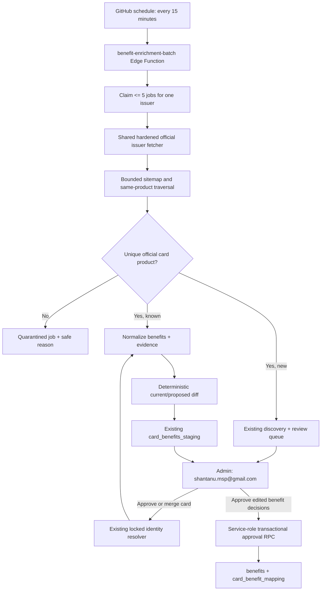

# Automated Credit-Card Benefit Enrichment Implementation Plan

> **For agentic workers:** REQUIRED SUB-SKILL: Use superpowers:subagent-driven-development (recommended) or superpowers:executing-plans to implement this plan task-by-task. Steps use checkbox (`- [ ]`) syntax for tracking.

**Goal:** Recursively inventory approved issuer credit-card pages, discover missing cards, stage evidence-backed benefit diffs, and process them in safe unattended batches through an admin-only review flow.

**Architecture:** A scheduled Edge Function claims at most five leased jobs, uses the existing hardened issuer fetch and identity primitives, and writes only to existing discovery/review/enrichment staging paths. Crawler-only cards and all benefit changes require approval by a verified allowlisted admin before the existing locked resolver or benefit tables are mutated.

**Tech Stack:** Supabase Postgres/RLS/RPCs, Supabase Edge Functions (Deno/TypeScript), Flutter/Riverpod, Node test runner, GitHub Actions, Azure Static Web Apps.

**Spec:** `docs/superpowers/specs/2026-08-17-automated-card-benefit-enrichment-design.md`

## Global Constraints

- Reuse `card_discovery_jobs`, `card_catalog_review_queue`, `card_catalog_enrichment_jobs`, `card_benefits_staging`, catalog aliases/provenance/URL keys, `benefits`, and `card_benefit_mapping`.
- Only approved first-party HTTPS issuer domains may provide identity or benefit evidence.
- Crawler-only discovery never auto-adds a card; it always enters admin review because it lacks an independent statement signal.
- Scheduled work never writes live benefits or mappings; only a service-role approval RPC may do so.
- Admin access requires a verified Supabase email present in `CARD_CATALOG_ADMIN_EMAILS`; initially configure `shantanu.msp@gmail.com` outside source control.
- Process one issuer sequentially, at most five cards per invocation, every 15 minutes after the five-card pilot passes.
- Per-card traversal is limited to eight same-product links at depth two; issuer discovery considers 200 sitemap/index URLs and fetches at most 40 product candidates at sitemap depth two.
- Store sanitized excerpts, hashes, URLs, and normalized fields only—never raw pages, credentials, statement PDFs, or customer data.
- Retry network failures after approximately 15 minutes, 1 hour, and 4 hours; the third failure becomes `review_required` without blocking other issuers.

## Architecture Flow



## File Map

- `supabase/migrations/20260817040000_automated_benefit_enrichment.sql`: additive queue fields, partial uniqueness, leases, and approval RPC.
- `supabase/functions/_shared/official_issuer_fetch.ts`: single hardened fetch implementation reused by discovery and enrichment.
- `supabase/functions/_shared/issuer_card_crawl.ts`: bounded sitemap traversal, link scoring, and page classification.
- `supabase/functions/_shared/benefit_enrichment.ts`: grounded benefit normalization, stable keys, and deterministic diffs.
- `supabase/functions/benefit-enrichment-batch/index.ts`: lease-based batch orchestration, pilot gate, retry, and safe metrics.
- `supabase/functions/admin-catalog-entry/index.ts`: authenticated benefit review and pilot actions beside current identity actions.
- `lib/features/admin/data/admin_catalog_repository.dart`: typed admin Edge Function client.
- `lib/features/admin/models/benefit_enrichment_review.dart`: safe UI models.
- `lib/features/admin/widgets/benefit_enrichment_review_panel.dart`: benefit proposal/quarantine UI.
- `lib/features/admin/screens/card_catalog_review_screen.dart`: two-tab admin shell.
- `.github/workflows/benefit-enrichment-schedule.yml`: isolated 15-minute scheduled trigger.

---

### Task 1: Extend the Existing Queue and Approval Schema

**Files:**
- Create: `supabase/migrations/20260817040000_automated_benefit_enrichment.sql`
- Create: `test/supabase/automated_benefit_enrichment_migration_test.js`

**Interfaces:**
- Produces: `claim_card_catalog_enrichment_jobs(integer, integer, text)`, `approve_card_benefit_enrichment(uuid, uuid, jsonb)`, nullable service-owned discovery rows, and additive enrichment-job metadata.
- Preserves: current user-owned discovery uniqueness and all current table/RPC contracts.

- [ ] **Step 1: Write the failing migration contract tests**

Assert that the new migration contains: `discovery_source` constrained to `statement|issuer_crawl`; a user partial unique index and a service partial unique index; `parser_version`, `lease_expires_at`, `staging_id`, `run_mode`, `job_key`, and `result_summary`; statuses `staged` and `quarantined`; `FOR UPDATE SKIP LOCKED`; and service-role-only grants for both new RPCs. Also assert the approval RPC upserts `benefits` by `dedupe_key`, preserves unrelated mappings, records `benefit_decisions`, and never deletes from `benefits`.

- [ ] **Step 2: Run the contract test and confirm the missing migration fails**

Run: `node --test test/supabase/automated_benefit_enrichment_migration_test.js`

Expected: FAIL because the migration and required SQL fragments do not exist.

- [ ] **Step 3: Create the additive migration**

Create `supabase/migrations/20260817040000_automated_benefit_enrichment.sql`; do not run the timestamp-generating CLI because the filename is part of the test contract.

Implement these exact contracts:

```sql
alter table public.card_discovery_jobs alter column user_id drop not null;
alter table public.card_discovery_jobs
  add column discovery_source text not null default 'statement'
  check (discovery_source in ('statement', 'issuer_crawl'));

alter table public.card_catalog_enrichment_jobs
  add column parser_version text not null default 'benefits-v1',
  add column lease_expires_at timestamptz,
  add column staging_id uuid references public.card_benefits_staging(id),
  add column run_mode text not null default 'scheduled'
    check (run_mode in ('pilot', 'scheduled', 'manual')),
  add column job_key text,
  add column result_summary jsonb not null default '{}'::jsonb;
```

Replace incompatible uniqueness/status constraints safely, backfill `job_key` before making it unique, and implement `claim_card_catalog_enrichment_jobs` with `SECURITY INVOKER`, service-role enforcement, expired-lease release, one-issuer selection, `FOR UPDATE SKIP LOCKED`, and a hard cap of five. Implement `approve_card_benefit_enrichment` as one transaction that accepts per-benefit `approve|edit|reject|keep_existing` decisions, upserts approved benefit rows by `dedupe_key`, upserts mappings, never applies proposed removals, and stamps reviewer fields.

- [ ] **Step 4: Verify migration safety and contracts**

Run: `node --test test/supabase/automated_benefit_enrichment_migration_test.js test/supabase/card_data_hardening_migration_test.js`

Expected: PASS, including explicit revokes from `anon` and `authenticated` and grants only to `service_role`.

- [ ] **Step 5: Commit the schema slice**

```bash
git add supabase/migrations test/supabase/automated_benefit_enrichment_migration_test.js
git commit -m "feat: extend catalog enrichment queue safely"
```

### Task 2: Extract One Hardened Official-Issuer Fetcher

**Files:**
- Create: `supabase/functions/_shared/official_issuer_fetch.ts`
- Create: `test/supabase/official_issuer_fetch_rules.test.mjs`
- Modify: `supabase/functions/card-discovery/index.ts`
- Modify: `supabase/functions/catalog-enrichment/index.ts`

**Interfaces:**
- Produces: `fetchOfficialIssuerResource(input: OfficialFetchInput): Promise<OfficialFetchResult>`.
- Consumes: `allowedOfficialUrl`, `canonicalOfficialUrl`, and `officialDomainsForIssuer` from `_shared/card_discovery.ts`.

- [ ] **Step 1: Write failing fetcher tests**

Cover HTTPS enforcement, issuer-domain validation, every redirect revalidation, loopback/private host rejection, HTML/PDF allowlist, 8 MB limit, 12-second timeout, sanitized error codes, and SHA-256 hashing. Inject `fetchImpl` and DNS resolution so tests never use the network.

```ts
type OfficialFetchInput = {
  issuer: string;
  url: string;
  maxBytes?: number;
  timeoutMs?: number;
  fetchImpl?: typeof fetch;
  resolveHost?: (host: string) => Promise<string[]>;
};
```

- [ ] **Step 2: Confirm the new module is absent**

Run: `node --test test/supabase/official_issuer_fetch_rules.test.mjs`

Expected: FAIL with module-not-found.

- [ ] **Step 3: Move the existing safe fetch behavior into the shared module**

Return `{submittedUrl, finalUrl, canonicalUrl, contentType, bytes, text, contentHash, retrievedAt}`. Abort on timeout/size and expose only enumerated codes: `unapproved_domain`, `private_address`, `redirect_rejected`, `unsupported_content`, `oversized`, `timeout`, `unreachable`.

- [ ] **Step 4: Refactor both current functions to use the shared fetcher**

Remove duplicate direct fetching without changing the existing discovery gate or catalog-enrichment responses.

- [ ] **Step 5: Run regression tests**

Run: `node --test test/supabase/official_issuer_fetch_rules.test.mjs test/supabase/card_discovery_rules.test.mjs test/supabase/card_catalog_enrichment_rules.test.mjs`

Expected: PASS.

- [ ] **Step 6: Commit the fetcher slice**

```bash
git add supabase/functions/_shared/official_issuer_fetch.ts supabase/functions/card-discovery/index.ts supabase/functions/catalog-enrichment/index.ts test/supabase
git commit -m "refactor: share hardened issuer fetcher"
```

### Task 3: Build Bounded Sitemap and Product-Link Discovery

**Files:**
- Create: `supabase/functions/_shared/issuer_card_crawl.ts`
- Create: `test/supabase/issuer_card_crawl_rules.test.mjs`

**Interfaces:**
- Produces: `discoverIssuerCardCandidates(input): Promise<IssuerCrawlResult>` and `classifyIssuerPage(input): PageClassification`.
- Consumes: `fetchOfficialIssuerResource` and existing identity normalization.

- [ ] **Step 1: Write failing traversal and classification tests**

Fixtures must prove: nested sitemap indexes stop at depth two; only 200 sitemap URLs and 40 candidate fetches are allowed; canonical duplicates collapse; same-domain index fallback works; links are sequential; product, benefit, fee, rewards, terms, and MITC links score positively; login, apply, tracking, blog, story, protection, and generic pages quarantine. Include the known invalid examples from Axis, HDFC, Kotak, and generic PNB.

- [ ] **Step 2: Verify the crawler tests fail**

Run: `node --test test/supabase/issuer_card_crawl_rules.test.mjs`

Expected: FAIL with missing exports.

- [ ] **Step 3: Implement pure sitemap parsing, link scoring, and classification**

Use these result types:

```ts
type PageClassification = {
  kind: 'card_product' | 'supporting_document' | 'not_a_card' | 'ambiguous';
  canonicalUrl: string;
  proposedName?: string;
  aliases: string[];
  network?: string;
  confidence: number;
  warnings: string[];
  sanitizedEvidence: string[];
};

type IssuerCrawlResult = {
  candidates: PageClassification[];
  quarantined: PageClassification[];
  consideredCount: number;
  fetchedCount: number;
};
```

The implementation must accept injected fetch/delay functions, redact long digit sequences, and never retain response bodies in results.

- [ ] **Step 4: Run crawler tests**

Run: `node --test test/supabase/issuer_card_crawl_rules.test.mjs`

Expected: PASS with boundary tests at 201 URLs, depth three, and 41 candidates.

- [ ] **Step 5: Commit the crawler slice**

```bash
git add supabase/functions/_shared/issuer_card_crawl.ts test/supabase/issuer_card_crawl_rules.test.mjs
git commit -m "feat: discover issuer card pages safely"
```

### Task 4: Reuse Discovery Review for Newly Found Cards

**Files:**
- Modify: `supabase/functions/_shared/issuer_card_crawl.ts`
- Modify: `supabase/functions/card-discovery/index.ts`
- Create: `test/supabase/issuer_card_discovery_rules.test.mjs`

**Interfaces:**
- Produces: `persistCrawlerCandidate(supabase, issuer, candidate)` returning `{outcome: 'existing'|'review'|'duplicate', catalogCardId?, reviewId?}`.
- Consumes: catalog URL keys, aliases, provenance, discovery jobs, and review queue.

- [ ] **Step 1: Write failing identity/deduplication tests**

Test URL-hash match, canonical issuer/name match, alias match, ambiguous candidates, and a genuinely new product. Assert that new crawler rows have `user_id = null`, `discovery_source = 'issuer_crawl'`, warning `crawler_discovered_without_statement_signal`, and always create review rather than invoking automatic insertion.

- [ ] **Step 2: Confirm tests fail on the missing persistence helper**

Run: `node --test test/supabase/issuer_card_discovery_rules.test.mjs`

Expected: FAIL with missing export.

- [ ] **Step 3: Implement idempotent persistence through existing tables**

Use canonical URL hashes first, then issuer/name/alias candidates. Reuse one service discovery job per safe dedupe key. Store normalized proposal, safe evidence, hash, candidates, confidence, and warnings only. Keep `resolve_card_catalog_identity` exclusively behind existing admin approval/merge paths.

- [ ] **Step 4: Run discovery regression tests**

Run: `node --test test/supabase/issuer_card_discovery_rules.test.mjs test/supabase/card_discovery_rules.test.mjs`

Expected: PASS and no test path auto-inserts crawler-only evidence.

- [ ] **Step 5: Commit the discovery slice**

```bash
git add supabase/functions/card-discovery/index.ts supabase/functions/_shared/issuer_card_crawl.ts test/supabase/issuer_card_discovery_rules.test.mjs
git commit -m "feat: queue issuer-discovered cards for review"
```

### Task 5: Normalize Benefits and Produce Stable Diffs

**Files:**
- Create: `supabase/functions/_shared/benefit_enrichment.ts`
- Modify: `supabase/functions/_shared/card_catalog_enrichment.ts`
- Create: `test/supabase/benefit_enrichment_rules.test.mjs`

**Interfaces:**
- Produces: `extractGroundedBenefits(documents, parserVersion)` and `diffBenefits(current, proposed)`.
- Each proposal includes `dedupeKey`, conditions, official source, sanitized excerpt, content hash, field confidence, and warnings.

- [ ] **Step 1: Write failing grounded-extraction tests**

Use fixtures for cashback with cap/period, reward rate and threshold, lounge frequency, merchant/channel exclusions, duplicated page/terms wording, conflicting terms, expiry dates, and marketing copy with no concrete value. Assert no inferred amount/cap/merchant, stable keys across whitespace changes, and distinct keys when conditions differ.

- [ ] **Step 2: Verify tests fail**

Run: `node --test test/supabase/benefit_enrichment_rules.test.mjs`

Expected: FAIL with missing module.

- [ ] **Step 3: Implement evidence-first normalization and diffing**

```ts
type BenefitProposal = {
  dedupeKey: string;
  title: string;
  description: string;
  category: string;
  valueType?: string;
  value?: number;
  rate?: number;
  cap?: number;
  threshold?: number;
  frequency?: string;
  period?: string;
  restrictions: string[];
  exclusions: string[];
  effectiveFrom?: string;
  effectiveTo?: string;
  sourceUrl: string;
  sourceExcerpt: string;
  contentHash: string;
  confidence: Record<string, number>;
  warnings: string[];
};
```

Return additions, modifications, possible removals, unchanged, and conflicts. Possible removals are informational and cannot become approval mutations.

- [ ] **Step 4: Run extraction and existing enrichment tests**

Run: `node --test test/supabase/benefit_enrichment_rules.test.mjs test/supabase/card_catalog_enrichment_rules.test.mjs`

Expected: PASS.

- [ ] **Step 5: Commit the normalization slice**

```bash
git add supabase/functions/_shared/benefit_enrichment.ts supabase/functions/_shared/card_catalog_enrichment.ts test/supabase
git commit -m "feat: stage grounded benefit diffs"
```

### Task 6: Implement the Five-Job Resumable Batch Worker

**Files:**
- Create: `supabase/functions/benefit-enrichment-batch/index.ts`
- Create: `supabase/functions/benefit-enrichment-batch/batch_policy.ts`
- Create: `supabase/functions/benefit-enrichment-batch/batch_policy_test.ts`
- Modify: `supabase/config.toml`

**Interfaces:**
- Produces: authenticated POST operation returning `{runId, queued, claimed, staged, quarantined, failed, retried, pilotStatus}`.
- Consumes: lease RPC, shared crawler/fetcher/extractor, discovery persistence, and `card_benefits_staging`.

- [ ] **Step 1: Write failing pure orchestration tests**

Cover maximum five, one issuer per run, sequential execution, expired lease recovery, idempotent `(card,url,parser)` keys, same-content staging reuse, 15m/1h/4h retry schedule, third failure review, and pilot blocking/unblocking rules.

- [ ] **Step 2: Confirm policy tests fail**

Run: `deno test supabase/functions/benefit-enrichment-batch/batch_policy_test.ts`

Expected: FAIL with missing policy module.

- [ ] **Step 3: Implement batch policy and handler**

Require either a valid service-role JWT or `x-cardcompass-cron-secret` matching `BENEFIT_ENRICHMENT_CRON_SECRET`. Claim with the RPC, process sequentially, update every claimed row in `finally`, store only safe summaries, and stage `request_type = 'official_benefit_enrichment'`. Never update `benefits` or `card_benefit_mapping` in this function.

- [ ] **Step 4: Add the pilot selector**

Select five active catalog entries across at least three issuers: one straightforward HTML page, one redirect/JS-heavy candidate, one terms-linked candidate, one known invalid URL, and one additional valid URL. Mark them `run_mode='pilot'`; later scheduled jobs remain unclaimable until all five are `staged` or justified `quarantined` with zero unsafe mutations and idempotency checks passing.

- [ ] **Step 5: Run worker tests and type-check**

Run: `deno test supabase/functions/benefit-enrichment-batch/*.ts && deno check supabase/functions/benefit-enrichment-batch/index.ts`

Expected: PASS.

- [ ] **Step 6: Commit the worker slice**

```bash
git add supabase/functions/benefit-enrichment-batch supabase/config.toml
git commit -m "feat: process benefit enrichment batches"
```

### Task 7: Extend the Protected Admin API

**Files:**
- Modify: `supabase/functions/admin-catalog-entry/index.ts`
- Create: `supabase/functions/admin-catalog-entry/benefit_admin.ts`
- Create: `supabase/functions/admin-catalog-entry/benefit_admin_test.ts`

**Interfaces:**
- Produces actions: `benefit-list`, `benefit-status`, `benefit-approve`, `benefit-edit-approve`, `benefit-reject`, `benefit-retry`, `benefit-quarantine`, `benefit-unquarantine`, `benefit-start-pilot`.
- Consumes: verified JWT email, `CARD_CATALOG_ADMIN_EMAILS`, service-role client, and approval RPC.

- [ ] **Step 1: Write failing authorization and action tests**

Assert 401 for missing/expired JWT, 403 for unverified or non-allowlisted email, and success only for an allowlisted verified email. Assert list responses exclude page bodies and secrets; decisions validate staging/job ownership and allowed action values; retries reset retryable state only.

- [ ] **Step 2: Confirm admin tests fail**

Run: `deno test supabase/functions/admin-catalog-entry/benefit_admin_test.ts`

Expected: FAIL because benefit actions are not registered.

- [ ] **Step 3: Implement typed admin handlers**

Keep authorization in `index.ts`, delegate benefit operations to `benefit_admin.ts`, call `approve_card_benefit_enrichment` for approvals, require a rejection reason, and return safe evidence/confidence/history/run counts. Expired auth must return 401 promptly so the Flutter client can request sign-in again.

- [ ] **Step 4: Run admin and discovery tests**

Run: `deno test supabase/functions/admin-catalog-entry/*.ts && node --test test/supabase/card_discovery_rules.test.mjs`

Expected: PASS.

- [ ] **Step 5: Commit the admin API slice**

```bash
git add supabase/functions/admin-catalog-entry
git commit -m "feat: add benefit enrichment admin actions"
```

### Task 8: Add the Benefit-Enrichment Admin View

**Files:**
- Create: `lib/features/admin/data/admin_catalog_repository.dart`
- Create: `lib/features/admin/models/benefit_enrichment_review.dart`
- Create: `lib/features/admin/widgets/benefit_enrichment_review_panel.dart`
- Modify: `lib/features/admin/screens/card_catalog_review_screen.dart`
- Create: `test/features/admin/benefit_enrichment_review_test.dart`

**Interfaces:**
- Produces: two tabs, typed review list, evidence/diff cards, progress summary, and single-item actions.
- Consumes: the existing `admin-catalog-entry` function and Supabase auth session.

- [ ] **Step 1: Write failing widget/repository tests**

Test tab labels `Card identity` and `Benefit enrichment`; proposed/current/evidence rendering; issuer coverage and last-run counts; approve/edit/reject/retry/quarantine controls; official URL opening; no bulk approve; and a 401 path that opens the existing authorization flow instead of leaving a spinner.

- [ ] **Step 2: Confirm the widget test fails**

Run: `flutter test test/features/admin/benefit_enrichment_review_test.dart`

Expected: FAIL because the model, repository, and panel do not exist.

- [ ] **Step 3: Implement the typed model and repository**

Model only the safe API response fields. The repository calls the action names from Task 7, maps 401 to `AdminAuthorizationRequired`, maps 403 to `AdminAccessDenied`, and never caches admin response bodies beyond view state.

- [ ] **Step 4: Implement the two-tab review UI**

Keep the current identity UI intact in the first tab. The second tab shows issuer/card/source/parser, current-versus-proposed diffs, field evidence/confidence/warnings, job history, and the specified individual actions. Clearly label crawler-discovered cards as lacking statement evidence.

- [ ] **Step 5: Run focused Flutter checks**

Run: `flutter test test/features/admin/benefit_enrichment_review_test.dart && flutter analyze --no-fatal-infos --no-fatal-warnings lib/features/admin test/features/admin`

Expected: PASS with no compile errors.

- [ ] **Step 6: Commit the admin UI slice**

```bash
git add lib/features/admin test/features/admin
git commit -m "feat: add benefit enrichment review UI"
```

### Task 9: Add the Unattended 15-Minute Scheduler

**Files:**
- Create: `.github/workflows/benefit-enrichment-schedule.yml`
- Create: `test/gtm/benefit-enrichment-schedule.test.js`

**Interfaces:**
- Produces: `schedule: '*/15 * * * *'` plus `workflow_dispatch`, one concurrency group, and a bounded POST to the batch function.
- Consumes repository secrets: `SUPABASE_URL` and `BENEFIT_ENRICHMENT_CRON_SECRET`.

- [ ] **Step 1: Write a failing static workflow test**

Assert the workflow has the 15-minute cron, manual dispatch, `concurrency.cancel-in-progress: false`, `timeout-minutes: 5`, no service-role or anon key, secret header usage, curl failure flags, and response validation for a JSON `runId`.

- [ ] **Step 2: Confirm the workflow test fails**

Run: `node --test test/gtm/benefit-enrichment-schedule.test.js`

Expected: FAIL because the workflow is absent.

- [ ] **Step 3: Create the isolated scheduler workflow**

Use `curl --fail-with-body --connect-timeout 10 --max-time 240 --retry 2`, POST `{\"mode\":\"scheduled\"}`, pass `x-cardcompass-cron-secret` from the dedicated secret, and validate the safe JSON response. Do not place Supabase service-role credentials in the workflow.

- [ ] **Step 4: Run workflow and production-workflow contract tests**

Run: `node --test test/gtm/benefit-enrichment-schedule.test.js test/landing/final-review-contract.test.js`

Expected: PASS.

- [ ] **Step 5: Commit the scheduler slice**

```bash
git add .github/workflows/benefit-enrichment-schedule.yml test/gtm/benefit-enrichment-schedule.test.js
git commit -m "ci: schedule benefit enrichment batches"
```

### Task 10: Verify End-to-End Safety Locally

**Files:**
- Create: `test/supabase/benefit_enrichment_integration_test.dart`
- Modify: `test/supabase/README.md`

**Interfaces:**
- Verifies: migration, service-job dedupe, lease recovery, crawler review, staging reuse, approval transaction, and RLS denial.

- [ ] **Step 1: Write the integration test against local Supabase**

Seed two issuers, a known card, a crawler-only candidate, current benefits, and deterministic HTML fixtures served by the test. Assert crawler-only data lands in review, batch output lands in staging, repeated runs reuse rows, unauthenticated clients cannot read queues, rejected proposals do not change live mappings, and one approved addition creates exactly one benefit/mapping.

- [ ] **Step 2: Run it before wiring the stack and confirm failure**

Run: `flutter test test/supabase/benefit_enrichment_integration_test.dart`

Expected: FAIL when the local migration/functions are not active.

- [ ] **Step 3: Reset local Supabase, serve functions, and run the integration test**

Run in separate terminals:

```bash
supabase db reset
supabase functions serve card-discovery catalog-enrichment benefit-enrichment-batch admin-catalog-entry --env-file supabase/.env.local
flutter test test/supabase/benefit_enrichment_integration_test.dart
```

Expected: PASS; compare live benefit/mapping counts before and after rejection and verify they are identical.

- [ ] **Step 4: Run the complete relevant suite**

Run: `node --test test/supabase/*.test.mjs test/supabase/*_test.js test/gtm/*.test.js && deno test supabase/functions/benefit-enrichment-batch/*.ts supabase/functions/admin-catalog-entry/*.ts && flutter test test/features/admin test/supabase/benefit_enrichment_integration_test.dart`

Expected: PASS.

- [ ] **Step 5: Commit integration coverage**

```bash
git add test/supabase/benefit_enrichment_integration_test.dart test/supabase/README.md
git commit -m "test: cover benefit enrichment integration"
```

### Task 11: Deploy the Five-Card Pilot Behind the Gate

**Files:**
- Modify only if deployment reveals a reproducible defect in files owned by Tasks 1-10.

**Interfaces:**
- Produces: live migration/functions/secrets and five terminal pilot jobs; does not enable scheduled rollout until gate verification succeeds.

- [ ] **Step 1: Record pre-deployment live safety counts**

Using service-side Supabase tooling, record counts for `card_catalog`, `benefits`, `card_benefit_mapping`, discovery review, enrichment jobs, and staging. Do not print row data or credentials.

- [ ] **Step 2: Apply and deploy server components**

```bash
supabase db push
supabase secrets set CARD_CATALOG_ADMIN_EMAILS=shantanu.msp@gmail.com
supabase secrets set BENEFIT_ENRICHMENT_CRON_SECRET
supabase functions deploy card-discovery catalog-enrichment benefit-enrichment-batch admin-catalog-entry
```

Generate the cron secret interactively or from a secure password manager, then set the same value as the GitHub Actions secret `BENEFIT_ENRICHMENT_CRON_SECRET`. Never echo it into logs or commit it.

- [ ] **Step 3: Start the pilot manually through the authenticated admin action**

Invoke `benefit-start-pilot`, then manually dispatch the scheduler workflow once. Confirm exactly five jobs across at least three issuers and no sixth claim.

- [ ] **Step 4: Verify every pilot gate condition**

Require all five to be `staged` or justified `quarantined`; every staged field to have official evidence; no raw page bodies; repeated dispatch to create no duplicate jobs/proposals; and unchanged `benefits`/mapping counts before admin approval. If any check fails, leave scheduled jobs blocked, capture the job ID/failure category, fix the smallest reproducible defect with a failing test, redeploy, and rerun the pilot.

- [ ] **Step 5: Approve one pilot proposal in the admin UI**

Verify the authenticated allowlisted account can approve one reviewed diff, a non-admin cannot access it, one expected live mapping changes, and unrelated mappings remain unchanged.

- [ ] **Step 6: Route any pilot defect back through its owning task**

If a correction was necessary, add a failing regression case to the exact test file named by the owning task, implement the correction in that task's owned source file, rerun that task's full command, and use its listed commit command. When no correction was necessary, record the pilot job IDs and count-only verification in the deployment handoff without changing source files.

### Task 12: Enable, Observe, and Verify the Automated Rollout

**Files:**
- Modify only for tested defects found during rollout.

**Interfaces:**
- Produces: enabled recurring workflow, safe issuer coverage metrics, and reviewable catalog/benefit proposals.

- [ ] **Step 1: Enable scheduled claiming after pilot success**

Mark the pilot gate passed through the admin action/state defined in Task 6, push the scheduler workflow to the deployment branch, and manually dispatch once to verify the next five jobs are claimed.

- [ ] **Step 2: Observe at least two scheduled invocations**

Confirm each invocation claims at most five, stays within one issuer, returns safe counts, respects retries, and does not expose secrets or bodies in GitHub/Supabase logs.

- [ ] **Step 3: Inspect admin outcomes**

Verify discovered new cards appear only in Card identity review, invalid pages are quarantined with enumerated reasons, known cards produce deterministic benefit staging, and no scheduled action changes live benefits.

- [ ] **Step 4: Run final security and regression checks**

```bash
node --test test/landing/*.test.js test/gtm/*.test.js test/supabase/*_test.js test/supabase/*.test.mjs
flutter analyze --no-fatal-infos --no-fatal-warnings lib test/core test/features
flutter test test/core test/features
```

Expected: PASS. Also run Supabase database lint/security advisors and resolve any new finding caused by this migration before completion.

- [ ] **Step 5: Commit the final verified state**

```bash
git status --short
git log --oneline -12
```

Expected: clean worktree and one focused commit per task. Push through the existing `main` to `prod` release process only after tests and live pilot gates pass.
