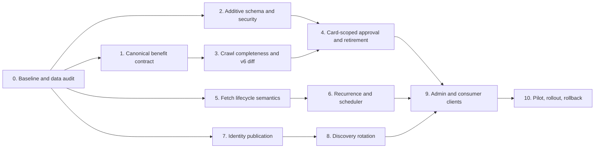
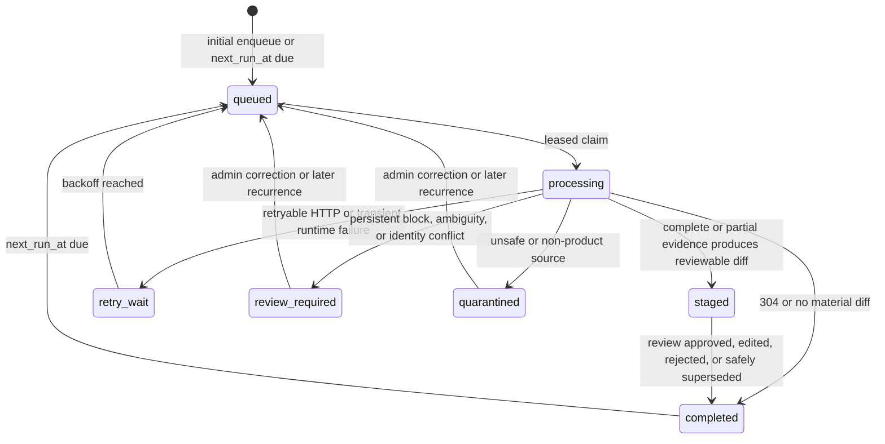

# Credit-Card Ingestion Core Modernization Implementation Plan

> **For agentic workers:** REQUIRED SUB-SKILL: Use superpowers:subagent-driven-development (recommended) or superpowers:executing-plans to implement this plan task-by-task. Steps use checkbox (`- [ ]`) syntax for tracking.

**Goal:** Make issuer-card discovery and benefit ingestion recurring, evidence-complete, card-scoped, reviewable, and operationally safe while preserving the current product schema and admin workflow.

**Architecture:** Keep the existing discovery jobs, review queue, enrichment jobs, benefit staging, canonical catalog, benefits, and mapping tables. Introduce a `benefits-v6` lane that separates source observation from product identity and publication, records crawl completeness, uses card-scoped canonical benefit keys, and schedules the next observation after every terminal run. All live catalog, mapping, retirement, or acquisition-status changes remain explicit admin-reviewed transitions.

**Tech Stack:** Supabase PostgreSQL 17, RLS and service-role RPCs, Supabase Edge Functions on Deno/TypeScript, Flutter/Riverpod admin and consumer clients, Node and Deno test runners, GitHub Actions scheduler.

**Spec:** `docs/architecture/card-ingestion-modernization-review.md`

## Global Constraints

- Treat the migration-built Supabase schema as authoritative. Do not implement from the stale root `schema.sql` snapshot.
- Keep schema change deliberately small: add only `card_catalog_enrichment_jobs.next_run_at timestamptz` and `card_benefit_mapping.retired_at timestamptz` as new business columns. Use existing JSONB evidence/summary fields for observations and hashes.
- Do not create a second catalog, a second benefit table, a raw-page store, or a new queueing subsystem in this release.
- Preserve the current staged-review-publication boundary. Scheduled code may stage proposals; only service-role RPCs reached through an authenticated admin action may mutate live catalog, benefit, or mapping state.
- `benefits-v5` remains the rollback lane. New recurring work and new extraction behavior use `benefits-v6`; do not mutate historical v5 job keys.
- Do not automatically discontinue a card or retire a benefit from one failed fetch, one `404`, one `410`, one missing phrase, or one incomplete crawl.
- A missing benefit is eligible for a retirement proposal only after an explicit issuer end date or two complete, independent observations separated by at least seven days. Retirement itself still requires admin approval.
- An incomplete crawl may propose additions or modifications supported by evidence but must suppress removals.
- Keep discontinued products refreshing when an active `user_cards` row proves an existing cardholder still depends on the product. Exclude discontinued products only from new-acquisition discovery surfaces.
- Persist normalized values and bounded evidence excerpts, never raw issuer pages, credentials, statement content, cookies, or customer data.
- Append a bounded maximum of 24 sanitized observation summaries per recurring job inside existing `result_summary`; never overwrite all absence history and never let the JSON array grow without limit.
- Keep GitHub Actions as the scheduler in this release. Moving scheduling to Supabase Cron is a separate operational migration, not a hidden prerequisite.
- Browser rendering, OCR, and LLM-assisted candidate extraction are not prerequisites for this core correctness release. They require an explicit provider/runtime/cost design and are listed as a follow-on gate in this document.
- Use one scheduled/pilot card per invocation. The five-card pilot is five invocations, not one oversized batch. Stop starting new network work after 180 seconds, keep the HTTP caller timeout at 240 seconds and the workflow timeout at five minutes, and use a lease longer than the internal deadline.
- Use a named crawler user agent/contact, issuer-specific rate limits, bounded same-host concurrency, and the approved-source/robots policy. Never submit application/login forms or execute page-provided instructions.
- Authorize admin operations primarily with the server-governed `public.users.is_admin` flag for the authenticated user ID. Keep the email allowlist only as a logged break-glass path for a confirmed email; never treat an unverified email claim as admin authority.
- Use `supabase migration new <name>` for every new migration. Never hand-invent a migration timestamp.
- Per the execution override, do not use Docker or local Supabase. Run database gates against the linked active project `cardcompass` (`prbcoxqobhjnnfnxevxf`) only after re-verifying that exact name/ref, completing the read-only audit, and proving the migration set with `supabase db push --linked --dry-run`. Apply additive, rollback-compatible migrations only; never reset, seed, or repair migration history on the live project.
- Every task follows red-green-refactor: add a failing focused test, demonstrate the intended failure, implement the minimum change, run focused tests, then run the named regression set.

## Plan at Three Depths

### Depth 1: Delivery sequence



### Depth 2: Release slices

| Slice | Outcome | Deployment state | Exit gate |
|---|---|---|---|
| A — Foundations | Read-only preflight, canonical contracts, additive columns, indexes, RLS/grants | No behavior change | Unit/static tests plus guarded live migration and role checks pass |
| B — Safe observation | HTTP semantics, crawl completeness, deterministic v6 proposals, recurring jobs | `benefits-v6` pilot/manual only | Golden corpus and five-card pilot pass |
| C — Reviewed publication | Card-scoped approvals, mapping retirement, unified identity publication, admin UI | Scheduled claims still off | Integration tests and admin acceptance pass |
| D — Scheduled rollout | Daily discovery plus recurring benefit observation | Issuer allowlist ramp: 1 → 3 → all | SLOs, no unsafe removals, rollback rehearsal |

### Depth 3: Required state transitions



The existing status vocabulary must be preserved unless a migration contract test proves a status is already valid. If `retry_wait` is not an allowed stored status, represent it as `queued` plus future retry scheduling; do not widen the constraint merely to match this diagram.

## Non-Negotiable Data Contracts

### Canonical benefit payload

```ts
export type CanonicalBenefitInput = {
  benefitId?: string;
  dedupeKey?: string;
  semanticKey?: string | null;
  category?: string | null;
  title: string;
  description?: string | null;
  benefitType?: string | null;
  value?: number | string | null;
  rate?: number | string | null;
  cap?: number | string | null;
  threshold?: number | string | null;
  frequency?: string | null;
  period?: string | null;
  valueConfig?: Record<string, unknown> | null;
  exclusions?: unknown;
  restrictions?: string[] | string | null;
  partners?: string[] | null;
  regions?: string[] | null;
  validFrom?: string | null;
  validUntil?: string | null;
};
```

The serializer must produce:

- `value_config` as one JSON object containing every populated value/rate/cap/threshold/frequency/period field plus supported explicit configuration;
- `exclusions` as an object with stable array-valued keys, never as a top-level JSON array;
- normalized, sorted, duplicate-free arrays for partners, regions, restrictions, merchants, MCCs, categories, transaction types, and days;
- a stable condition JSON encoding that includes normalized category, benefit type/semantic key, and every term that changes eligibility or value while excluding purely presentational wording;
- a card-scoped key: `card-benefit-v2:<card_uuid>:<sha256(condition_json)>`.

### Observation completeness

```ts
export type SourceAttempt = {
  url: string;
  role: "primary" | "supporting";
  required: boolean;
  outcome:
    | "fetched"
    | "not_modified"
    | "missing"
    | "blocked"
    | "unreadable"
    | "failed";
  httpStatus?: number;
  contentHash?: string;
  etag?: string;
  lastModified?: string;
  errorCode?: string;
};

export type CrawlAssessment = {
  complete: boolean;
  reasons: string[];
  allowPossibleRemovals: boolean;
};
```

Primary product evidence is required. A supporting document is required only when the classifier identified it as holding terms necessary for the current extraction. A `304` counts as observed only when the previous successful observation used the same parser version and has a usable canonical proposal envelope in the job's existing `normalized_fields`; otherwise retry once without validators.

### Publication invariants

- A benefit row may be reused only when its card-scoped key is identical.
- Modifying Card A must never mutate a benefit row still mapped to Card B.
- `benefits.is_active` is not the lifecycle switch for one card. Use `card_benefit_mapping.retired_at`; a future value represents a reviewed, scheduled retirement at that instant.
- Every live mapping mutation must append a decision object to the owning staging row's `benefit_decisions` JSONB array and retain its source evidence; it must not overwrite or delete prior decision objects.
- Every new catalog identity must pass the existing locked resolver; no Edge Function may directly insert a canonical card as a shortcut.
- Submitted and final canonical URL hashes must not resolve to different cards. Any conflict enters admin review.

## Surprise Register and Explicit Decisions

| Risk that would otherwise appear late | Decision in this plan |
|---|---|
| Conditional fetch returns `304` after a parser upgrade | Force a full body fetch whenever parser version changes; same-version `304` may reuse the last canonical extraction |
| Recrawl creates a second pending proposal | Atomically mark the older pending staging row rejected with reason `superseded_by_newer_crawl`, then link the new row |
| Existing benefit is shared by multiple cards | Leave legacy row intact; a reviewed v6 modification creates the card-scoped replacement and retires only the current card’s old mapping |
| Every legacy key appears modified under v6 | Label it `identity_migration`; batch it separately in the UI; do not silently auto-publish it |
| Product page disappears | Record source observation, retry according to status, seek corroboration, and require admin approval before `is_discontinued` changes |
| Product URL moves | Treat same-issuer redirect/new canonical URL as provenance plus URL-key evidence, then resolve identity before changing canonical URL |
| Crawl loses a PDF or terms page | Mark crawl incomplete and suppress removals; retain additions with their own evidence |
| Review is not completed before next crawl | Supersede visibly; never delete the old staging/audit row |
| Reusing one unique job overwrites lifecycle evidence | Finalizer appends a capped 24-entry observation history in `result_summary` |
| `valid_until` passes while no crawl runs | Consumer queries enforce validity dates independently of crawler state |
| GitHub schedule overlaps | Lease/claim RPC plus idempotent job key prevents double processing |
| GitHub schedule is down | `next_run_at` remains overdue; the next successful invocation catches up with a bounded claim |
| Issuer discovery starves behind benefit jobs | Separate daily discovery action; deterministic rotating issuer selection |
| RLS blocks the app after hardening | Add authenticated read policies before revoking broad grants; verify anon/authenticated/service-role behavior locally |
| Root `schema.sql` disagrees with migrations | Regenerate it only from the verified linked live schema after migration history is clean; migrations remain the source of truth |
| Browser-only issuer pages remain unreadable | Quarantine with `rendering_required`; do not call the core rollout complete for those issuers; handle under the follow-on extraction program |

---

### Task 0: Freeze the Baseline and Run a Read-Only Data Audit

**Files:**

- Create: `scripts/audit-card-ingestion.sql`
- Create: `test/supabase/card_ingestion_audit_contract_test.js`
- Modify: `docs/architecture/card-ingestion-modernization-review.md`
- Modify: `supabase/functions/catalog-enrichment/index.ts`
- Modify: `supabase/functions/card-discovery/index.ts`
- Modify: `supabase/functions/request-card-catalog-entry/index.ts`
- Modify: `deno.lock`

**Interfaces:** Produces a read-only, repeatable report; it must never change production data.

- [ ] **Step 0: Restore a reproducible Deno dependency baseline**

The current checkout's admin Deno test cannot resolve `npm:@supabase/supabase-js@2.95.0` because that graph exists only in the function-local lock and is absent from the root test graph/`node_modules`. Pin the floating imports in `catalog-enrichment`, `card-discovery`, and `request-card-catalog-entry` to the root-lock-resolved `https://esm.sh/@supabase/supabase-js@2.110.2`; leave the other already exact `2.45.4` and `2.95.0` imports unchanged in this baseline slice. Then run:

```bash
deno install --entrypoint \
  supabase/functions/admin-catalog-entry/index.ts \
  supabase/functions/benefit-enrichment-batch/index.ts \
  supabase/functions/card-discovery/index.ts \
  supabase/functions/catalog-enrichment/index.ts \
  supabase/functions/request-card-catalog-entry/index.ts \
  --node-modules-dir=auto --lock=deno.lock
deno test --node-modules-dir=auto --allow-env --allow-net=0.0.0.0:8000 --frozen \
  supabase/functions/admin-catalog-entry/benefit_admin_test.ts \
  supabase/functions/benefit-enrichment-batch/index_test.ts
```

Expected: the lockfile contains every exact graph and both test files type-check/run. If dependency resolution changes application code or requires lifecycle scripts, stop and review the graph; do not use `--allow-scripts` automatically.

- [ ] **Step 1: Add the failing audit contract test**

Assert the SQL reports, without `insert`, `update`, `delete`, `alter`, `drop`, or `truncate`:

- catalog counts by `is_discontinued` including nulls;
- benefit exclusions grouped by `jsonb_typeof`;
- benefits mapped to more than one card;
- orphan mappings and duplicate mappings;
- pending staging age and count;
- job counts by status, parser version, and run mode;
- duplicate normalized issuer/name/network identities;
- submitted/final URL-key conflicts and missing URL provenance;
- active `user_cards` mapped to discontinued catalog products;
- current table RLS state, policies, relation grants, and function grants.

Run: `node --test test/supabase/card_ingestion_audit_contract_test.js`

Expected: FAIL because the audit file does not exist.

- [ ] **Step 2: Write the audit SQL using only `SELECT` and CTEs**

Use stable section labels in a `check_name` column so results can be attached to a release ticket. Redact customer identifiers; return counts, conflicting catalog IDs, and schema metadata only.

- [ ] **Step 3: Run static and linked-project preflight checks**

```bash
node --test test/supabase/card_ingestion_audit_contract_test.js
supabase projects list
```

Expected now: Node PASS and exactly the intended active project is identified as `cardcompass` (`prbcoxqobhjnnfnxevxf`).

- [ ] **Step 4: Establish the immutable live baseline without writes**

```bash
test "$(sed -n '1p' supabase/.temp/project-ref)" = "prbcoxqobhjnnfnxevxf"
supabase db query --linked --file scripts/audit-card-ingestion.sql
supabase migration list --linked
```

Expected: the read-only audit and linked migration inventory succeed. Attach the audit output; resolve unexplained orphan rows or URL conflicts before Task 2. A linked-login failure is a blocker for live schema work, never a reason to substitute Docker or skip the audit.

- [ ] **Step 5: Record verified cardinalities in the modernization review**

Add a dated baseline subsection containing counts, not customer data. Clearly distinguish zero findings from checks not yet executed.

- [ ] **Step 6: Commit the audit slice**

```bash
git add scripts/audit-card-ingestion.sql test/supabase/card_ingestion_audit_contract_test.js docs/architecture/card-ingestion-modernization-review.md supabase/functions/card-discovery/index.ts supabase/functions/catalog-enrichment/index.ts supabase/functions/request-card-catalog-entry/index.ts deno.lock
git commit -m "test: baseline card ingestion data integrity"
```

### Task 1: Define One Canonical Benefit Contract

**Files:**

- Create: `supabase/functions/_shared/benefit_contract.ts`
- Create: `supabase/functions/_shared/benefit_contract_test.ts`
- Modify: `supabase/functions/_shared/benefit_enrichment.ts`
- Modify: `test/supabase/benefit_enrichment_rules.test.mjs`

**Interfaces:**

```ts
export function canonicalValueConfig(input: CanonicalBenefitInput): Record<string, unknown>;
export function canonicalExclusions(input: unknown): Record<string, unknown>;
export function canonicalConditionObject(input: CanonicalBenefitInput): Record<string, unknown>;
export async function canonicalBenefitHash(input: CanonicalBenefitInput[]): Promise<string>;
export async function cardScopedBenefitKey(cardId: string, input: CanonicalBenefitInput): Promise<string>;
```

- [ ] **Step 1: Add failing pure unit tests**

Cover flat value fields, explicit `valueConfig`, numeric strings, zero values, decimals, Indian lakh/crore formatting, rupee symbols, legacy array exclusions, current object exclusions, duplicate arrays, Unicode/case/whitespace normalization, key-order independence, null omission, validity dates, semantic-family separation, and card scope. Prove identical conditions on two card UUIDs produce different dedupe keys and two same-value insurance benefits with different semantic keys cannot collapse into one row.

- [ ] **Step 2: Demonstrate the current data-loss behavior**

```bash
deno test --node-modules-dir=auto --allow-env --frozen supabase/functions/_shared/benefit_contract_test.ts
node --test test/supabase/benefit_enrichment_rules.test.mjs
```

Expected: new test FAILS; existing tests expose that flat terms are not serialized into `value_config`.

- [ ] **Step 3: Implement the canonical serializer as a dependency-free pure module**

Do not import Edge Function entrypoints. Preserve zero/false values. Sort object keys recursively before hashing. Normalize exclusions to this shape:

```json
{
  "days": [],
  "mcc_codes": [],
  "merchants": [],
  "additional": {"source_terms": []},
  "categories": [],
  "transaction_types": []
}
```

- [ ] **Step 4: Make v6 proposal generation use the contract**

Add an explicit parser-version argument. Keep v5 output untouched for rollback tests; v6 proposals include `benefitId`, `dedupeKey`, canonical `valueConfig`, canonical exclusions, and `conditionHash`.

- [ ] **Step 5: Add a checked-in golden corpus**

Create sanitized fixtures inside the existing benefit-enrichment test tree for at least: cashback cap, lounge quota, fee waiver threshold, points multiplier, partner discount, fuel surcharge waiver, insurance exclusion, tiered milestone rewards, per-transaction plus monthly caps, date-bounded offer, ambiguous “up to” language, and explicit “no longer available” wording. Expected output must be fully asserted rather than snapshot-approved blindly.

- [ ] **Step 6: Run focused tests**

```bash
deno test --node-modules-dir=auto --allow-env --frozen supabase/functions/_shared/benefit_contract_test.ts
node --test test/supabase/benefit_enrichment_rules.test.mjs
```

Expected: PASS, including deterministic hashes across property order and replay.

- [ ] **Step 7: Commit the contract slice**

```bash
git add supabase/functions/_shared/benefit_contract.ts supabase/functions/_shared/benefit_contract_test.ts supabase/functions/_shared/benefit_enrichment.ts test/supabase
git commit -m "feat: canonicalize card-scoped benefit terms"
```

### Task 2: Add the Minimal Lifecycle Schema and Harden Public Data Access

**Files:**

- Create with CLI: `supabase/migrations/*_card_ingestion_lifecycle_hardening.sql`
- Create: `test/supabase/card_ingestion_lifecycle_hardening_migration_test.js`
- Modify: `test/supabase/benefit_enrichment_integration_test.dart`

**Interfaces:** Adds `next_run_at`, `retired_at`, supporting indexes/constraints/policies, a security-invoker `active_card_benefits` read view, and updated service-role-only RPC contracts. Adds no new table.

- [ ] **Step 1: Create the migration through Supabase CLI**

```bash
supabase migration new card_ingestion_lifecycle_hardening
```

All later references to `*_card_ingestion_lifecycle_hardening.sql` mean the single CLI-generated file. Fail if zero or multiple files match that suffix.

- [ ] **Step 2: Add the failing SQL contract test**

The test locates the migration by suffix and asserts:

- `next_run_at timestamptz` and an index usable for due scheduled v6 jobs;
- `retired_at timestamptz` and an active-mapping index;
- an explicit-column `active_card_benefits` view with `security_invoker = true` that applies mapping retirement, global active state, and validity dates using the database UTC date;
- backfill of null `card_catalog.is_discontinued` followed by `NOT NULL`;
- normalization/backfill of legacy array exclusions followed by a `NOT VALID` object-shape check, validation after repair;
- object/array shape checks for `value_config`, `exclusions`, `partners`, and `regions`;
- nested exclusion checks requiring arrays for `days`, `mcc_codes`, `merchants`, `categories`, and `transaction_types`, plus an object for `additional` and an array for `additional.source_terms` when present;
- `jsonb_typeof(card_catalog_enrichment_jobs.result_summary) = 'object'`;
- request-type-specific staging checks: official enrichment requires card/source/parser/hash and non-empty array evidence; catalog-entry staging requires requester and object-shaped extracted data, after legacy rows are classified;
- authenticated read policies on reference/catalog tables;
- no client writes to `benefits`, `card_benefit_mapping`, or `card_benefits`;
- revocation of legacy client-executable catalog write functions including `create_credit_card` and `create_or_get_card_catalog`;
- explicit service-role grants for write/claim/finalize RPCs;
- no `auth.role()` authorization check;
- no new table and no destructive drop.

Run: `node --test test/supabase/card_ingestion_lifecycle_hardening_migration_test.js`

Expected: FAIL against the empty generated migration.

- [ ] **Step 3: Implement additive columns, backfills, indexes, and constraints**

Use idempotent data repairs before validating shape constraints. Do not coerce unknown exclusion values into false precision; place unclassified strings in `additional.source_terms`. Preserve existing object-valued `additional` data while adding a normalized `source_terms` array.

Set a short `lock_timeout` and a bounded `statement_timeout` in the migration so deployment fails safely instead of blocking production traffic. The Task 0 production preflight must confirm row counts before deployment. If either affected table exceeds 25,000 rows or the dry-run query plan predicts a sequential rewrite beyond the maintenance window, stop and split backfill/index creation into an operator-approved online migration; do not improvise during rollout.

Create partial indexes equivalent to:

```sql
create index ... on public.card_catalog_enrichment_jobs(
  parser_version, run_mode, next_run_at, issuer
)
where status in ('staged', 'completed', 'review_required', 'quarantined')
  and next_run_at is not null;

create index ... on public.card_benefit_mapping(card_id, display_priority)
where retired_at is null;
```

Create `active_card_benefits` without `SELECT *`; expose the identifiers and benefit fields consumed by the app and filter:

```sql
(mapping.retired_at is null or mapping.retired_at > now())
and benefit.is_active = true
and (benefit.valid_from is null or benefit.valid_from <= current_date)
and (benefit.valid_until is null or benefit.valid_until >= current_date)
```

Set `(security_invoker = true)` and grant select only to the roles that already have a verified read use case.

- [ ] **Step 4: Apply RLS and grants in safe order**

Create `TO authenticated FOR SELECT USING (true)` policies on public reference/catalog tables first, then revoke writes from `anon` and `authenticated`. Revoke access to the legacy `card_benefits` table unless a verified consumer test proves it is required. Revoke client execution of legacy catalog write RPCs (`create_credit_card`, `create_or_get_card_catalog`, and any equivalent found by the Task 0 grant audit). Keep service-role RPC execution explicit and narrow.

- [ ] **Step 5: Add integration assertions for all three roles**

Prove:

- anon cannot write catalog/benefit/mapping data;
- authenticated can read required active reference/catalog data but cannot write it;
- authenticated cannot execute claim/finalize/approval RPCs;
- authenticated cannot set or update its own `public.users.is_admin` value;
- service role can execute those RPCs;
- a past-retired mapping remains queryable for audit but is excluded by normal active queries; a future-retired mapping remains active until its scheduled instant.

- [ ] **Step 6: Run static migration tests**

```bash
node --test test/supabase/card_ingestion_lifecycle_hardening_migration_test.js test/supabase/automated_benefit_enrichment_migration_test.js test/supabase/card_data_hardening_migration_test.js
```

Expected: PASS.

- [ ] **Step 7: Run the mandatory guarded live database gate**

```bash
test "$(sed -n '1p' supabase/.temp/project-ref)" = "prbcoxqobhjnnfnxevxf"
supabase db query --linked --file scripts/audit-card-ingestion.sql
supabase migration list --linked
supabase db push --linked --dry-run
supabase db push --linked
supabase migration list --linked
supabase db lint --linked --level warning --fail-on error
supabase db advisors --linked --type security --level warn --fail-on error
supabase db advisors --linked --type performance --level warn --fail-on error
```

Then run the guarded live integration command documented in `test/supabase/README.md`. It must require the exact project ref, use uniquely prefixed synthetic fixtures, avoid existing rows, and clean up only fixture identifiers it created.

Expected: the dry run lists only the intended additive migration, the live apply succeeds, migration history matches, no new lint warning appears, and role/lifecycle integration tests pass. Do not use migration repair, reset, seed, or destructive cleanup to force this gate through.

- [ ] **Step 8: Commit the schema slice**

```bash
git add supabase/migrations test/supabase
git commit -m "feat: add minimal ingestion lifecycle state"
```

### Task 3: Model Crawl Completeness and Safe Absence

**Files:**

- Create: `supabase/functions/benefit-enrichment-batch/crawl_policy.ts`
- Create: `supabase/functions/benefit-enrichment-batch/crawl_policy_test.ts`
- Modify: `supabase/functions/benefit-enrichment-batch/index.ts`
- Modify: `supabase/functions/benefit-enrichment-batch/index_test.ts`
- Modify: `supabase/functions/_shared/benefit_enrichment.ts`

**Interfaces:**

```ts
export function assessCrawlCompleteness(attempts: SourceAttempt[]): CrawlAssessment;
export function retirementEligibility(input: {
  explicitEndDate?: string | null;
  completeAbsenceObservedAt: string[];
  now: string;
}): { eligible: boolean; reason: string };
```

- [ ] **Step 1: Add failing policy tests**

Cover primary success, primary `304`, missing required PDF, optional supporting failure, JS challenge, corrupt PDF, timeout, `403`, `404`, `410`, redirect outside issuer, contradictory terms between a product page and official PDF, two observations less than seven days apart, two observations at least seven days apart, explicit past/future end dates, and clock/timezone boundaries.

- [ ] **Step 2: Demonstrate the unsafe current behavior**

Run: `deno test --node-modules-dir=auto --allow-env --frozen supabase/functions/benefit-enrichment-batch/crawl_policy_test.ts supabase/functions/benefit-enrichment-batch/index_test.ts`

Expected: FAIL because supporting-document errors are currently dropped and removals lack completeness context.

- [ ] **Step 3: Implement completeness assessment**

Return every attempted source, including failures. Bound evidence to URL, role, status, hashes/validators, sanitized error code, and timestamp. Each persisted observation also records crawl completeness, canonical hash, and sorted absent card-scoped/legacy benefit identifiers needed by retirement policy. Never store response bodies.

- [ ] **Step 4: Change supporting-document collection to return attempts**

Replace the current array-only return with:

```ts
type CollectedSources = {
  documents: BenefitSourceDocument[];
  attempts: SourceAttempt[];
};
```

Do not catch-and-discard failed supporting documents.

- [ ] **Step 5: Gate possible removals and query absence history**

If the crawl is incomplete, force `possibleRemovals` to `[]` and include `suppressed_removal_count` in the result summary. For a complete crawl, query the bounded observation history in `card_catalog_enrichment_jobs.result_summary` across the same card's v6 jobs, using prior staging rows as corroborating audit when present. Only mark a proposal retirement-eligible after the policy threshold. Use existing JSONB/staging history rather than a new counter column.

When two current official sources disagree on a cap, threshold, rate, validity date, eligibility term, or exclusion, emit a review conflict with both excerpts/hashes. Do not choose the numerically larger, newer-looking, or more favorable term automatically.

Compute and retain both the raw/source-manifest hash and the canonical benefit hash. A raw-only HTML/PDF change updates retrieval evidence and `next_run_at` but creates no benefit proposal; only a canonical benefit-hash change may stage a material benefit diff.

- [ ] **Step 6: Supersede stale pending staging atomically**

Update `stage_card_benefit_enrichment` in a CLI-created migration so a newer v6 observation:

1. writes a `benefit_decisions` audit event for the older pending row with reason `superseded_by_newer_crawl`;
2. sets that staging row to `rejected`;
3. inserts/links the new staging row;
4. never deletes audit history.

Here “audit event” means appending an object to the existing staging row's `benefit_decisions` JSONB array. Preserve any prior entries rather than replacing the array.

Create the migration with:

```bash
supabase migration new supersede_stale_benefit_staging
```

- [ ] **Step 7: Run focused tests and guarded live migration verification**

```bash
deno test --node-modules-dir=auto --allow-env --frozen supabase/functions/benefit-enrichment-batch/crawl_policy_test.ts supabase/functions/benefit-enrichment-batch/index_test.ts
test "$(sed -n '1p' supabase/.temp/project-ref)" = "prbcoxqobhjnnfnxevxf"
supabase db push --linked --dry-run
supabase db push --linked
supabase db lint --linked --level warning --fail-on error
```

Expected: PASS. A missing required source cannot produce a removal; a later crawl supersedes rather than deletes.

- [ ] **Step 8: Commit the completeness slice**

```bash
git add supabase/functions/benefit-enrichment-batch supabase/functions/_shared/benefit_enrichment.ts supabase/migrations
git commit -m "feat: gate benefit removals on complete observations"
```

### Task 4: Publish Card-Scoped Benefits and Mapping Retirement Safely

**Files:**

- Create with CLI: `supabase/migrations/*_review_card_benefit_enrichment_v2.sql`
- Create: `test/supabase/review_card_benefit_enrichment_v2_migration_test.js`
- Modify: `supabase/functions/admin-catalog-entry/benefit_admin.ts`
- Modify: `supabase/functions/admin-catalog-entry/benefit_admin_test.ts`
- Modify: `supabase/functions/_shared/benefit_enrichment.ts`

**Interfaces:** `CREATE OR REPLACE FUNCTION public.approve_card_benefit_enrichment(uuid, uuid, jsonb)` preserves the current callable signature while replacing its implementation with decisions `approve`, `edit`, `reject`, `keep_existing`, and `retire`; it never globally deactivates a shared benefit.

- [ ] **Step 1: Create the migration and failing contracts**

```bash
supabase migration new review_card_benefit_enrichment_v2
```

Assert the RPC is security-invoker/service-role-only, uses canonical JSON objects, requires the staged card ID, writes audit decisions, and scopes mapping updates by both `card_id` and `benefit_id`.

- [ ] **Step 2: Add failing behavior tests**

Cover:

- addition creates one card-scoped benefit and active mapping;
- edit canonicalizes admin-supplied flat fields;
- modification never mutates the old benefit row;
- a benefit shared by Cards A and B remains unchanged for B when A is modified;
- `retire` sets only A’s mapping `retired_at`;
- a future-dated replacement maps the new benefit now, hides it until `valid_from`, and schedules the old mapping's `retired_at` for that UTC date boundary rather than retiring it immediately;
- an immediate or retroactive replacement retires the old mapping at review time;
- retirement is rejected if completeness/absence eligibility is missing;
- `keep_existing` preserves mapping;
- replaying the same approval is idempotent;
- two admins reviewing the same staging row serialize under a row lock; the loser receives `already_reviewed` or the identical idempotent result rather than applying a second edit;
- an approval for a staging row already marked `superseded_by_newer_crawl` is rejected as stale;
- legacy identity migration is explicit and audited;
- a pending v5 proposal can still be reviewed during rollback, but the v2 approval RPC recanonicalizes it into a card-scoped live key and never executes the old global upsert behavior;
- rejected proposal leaves live data unchanged;
- unknown/inactive categories, invalid date ranges, non-finite numbers, and malformed value/exclusion shapes are rejected server-side;
- successful review sets the linked job `completed` and computes its next run.

- [ ] **Step 3: Include current live benefit IDs in diffs**

Update `readCurrentBenefits` and proposal conversion so modifications and possible removals carry `benefitId`. Never identify the old mapping only by title or semantic key.

- [ ] **Step 4: Implement card-scoped replacement**

For an approved addition/modification:

1. validate/canonicalize server-side;
2. upsert the v6 card-scoped benefit row;
3. upsert its mapping with `retired_at = null`;
4. when replacing another benefit ID for the same card, set only that old mapping’s `retired_at`; use the proposed future `valid_from` UTC boundary when it is later than review time, otherwise use review time;
5. write decisions and source evidence in the same transaction.

Do not update the old benefit row’s title, description, value, exclusions, or global `is_active` flag.

- [ ] **Step 5: Handle legacy identity migration without silent publication**

When semantic/condition terms match but the current key is legacy, emit `changeType: "identity_migration"`. The admin may bulk-select these, but each transition must still be represented in the RPC payload and decision audit.

Allow only explicit parser versions `benefits-v5` and `benefits-v6` during the rollback window. Regardless of proposal version, the approval RPC is the new v2 implementation: it performs server-side canonical serialization and creates a card-scoped live key. Never route v5 reviews back to the old `ON CONFLICT (dedupe_key) DO UPDATE` mutation path.

- [ ] **Step 6: Run migration, unit, and shared-row integration tests**

```bash
node --test test/supabase/review_card_benefit_enrichment_v2_migration_test.js
deno test --node-modules-dir=auto --allow-env --allow-net=0.0.0.0:8000 --frozen supabase/functions/admin-catalog-entry/benefit_admin_test.ts
test "$(sed -n '1p' supabase/.temp/project-ref)" = "prbcoxqobhjnnfnxevxf"
supabase db push --linked --dry-run
supabase db push --linked
supabase db lint --linked --level warning --fail-on error
```

Run the focused Dart integration test for shared benefit rows described in `test/supabase/README.md`.

Expected: PASS; Card B’s row and mapping are byte-for-byte unchanged after Card A’s modification.

- [ ] **Step 7: Commit the publication slice**

```bash
git add supabase/migrations test/supabase supabase/functions/admin-catalog-entry supabase/functions/_shared/benefit_enrichment.ts
git commit -m "feat: publish card-scoped benefit lifecycle decisions"
```

### Task 5: Preserve HTTP and Product-Page Lifecycle Semantics

**Files:**

- Modify: `supabase/functions/_shared/official_issuer_fetch.ts`
- Modify: `test/supabase/official_issuer_fetch_rules.test.mjs`
- Modify: `supabase/functions/benefit-enrichment-batch/index.ts`
- Modify: `supabase/functions/benefit-enrichment-batch/index_test.ts`

**Interfaces:**

```ts
export class OfficialFetchError extends Error {
  code: string;
  httpStatus?: number;
  retryAfter?: string;
}

export type OfficialFetchResult = {
  status: number;
  submittedUrl: string;
  finalUrl: string;
  canonicalUrl: string;
  contentType?: string;
  contentHash?: string;
  text?: string;
  retrievedAt: string;
  etag?: string;
  lastModified?: string;
  notModified: boolean;
};
```

- [ ] **Step 1: Add failing HTTP-semantics tests**

Cover valid `200`, `200` soft-404, `200` login/captcha/challenge shell, same-version `304`, parser-change conditional suppression, one transient `404`, persistent `404`, `410`, `403`, `429` with seconds/date `Retry-After`, `500`, timeout, redirect loops, cross-issuer redirect, malformed content type, charset decoding, compressed/decompressed size enforcement, robots disallow, oversized response, and private-address resolution after redirect.

- [ ] **Step 2: Preserve status and validators in the fetcher**

Do not collapse all non-2xx responses into `unreachable`. Validate every redirect target. Reject URL user-info, strip fragments/tracking or sensitive query values from persisted/logged URLs, and retain only query parameters explicitly required by an approved issuer resource. Send `If-None-Match`/`If-Modified-Since` only when the previous successful observation used the same parser version. Enforce the byte limit on decompressed content as well as advertised length, use the named crawler user agent, and return a sanitized `robots_disallowed` outcome rather than bypassing source policy.

- [ ] **Step 3: Implement the retry matrix**

Use these decisions:

| Observation | Action |
|---|---|
| `304`, same parser, prior canonical extraction available | complete without new staging; schedule next run |
| `304`, no prior canonical extraction | force one unconditional fetch |
| first `404` | retry once after backoff |
| repeated `404` | review-required source observation; do not discontinue |
| `410` | review-required with stronger signal; do not discontinue |
| `403` or rendering challenge | quarantine/review as blocked |
| `429` | honor bounded `Retry-After` |
| `5xx`, timeout, network | bounded exponential retry |
| redirect to another approved URL for same issuer | record both URLs and pass identity review |
| redirect outside issuer allowlist | reject |

- [ ] **Step 4: Store a bounded source observation summary**

Use existing `result_summary`/staging evidence for status, validators, canonical/final URLs, content/source-manifest hashes, completeness, parser version, and sanitized reason codes. Do not add a source-status column.

- [ ] **Step 5: Add acquisition-status tests**

Prove no HTTP outcome directly updates `card_catalog.is_discontinued`. Prove a product with an active `user_cards` reference remains refresh-eligible after approved discontinuation.

- [ ] **Step 6: Run the focused suite**

```bash
node --test test/supabase/official_issuer_fetch_rules.test.mjs
deno test --node-modules-dir=auto --allow-env --frozen supabase/functions/benefit-enrichment-batch/index_test.ts
```

Expected: PASS, including parser-upgrade full-fetch behavior.

- [ ] **Step 7: Commit the fetch lifecycle slice**

```bash
git add supabase/functions/_shared/official_issuer_fetch.ts supabase/functions/benefit-enrichment-batch test/supabase/official_issuer_fetch_rules.test.mjs
git commit -m "feat: preserve issuer source lifecycle signals"
```

### Task 6: Make Enrichment Recurring Without Duplicating Jobs

**Files:**

- Create: `supabase/functions/benefit-enrichment-batch/recurrence_policy.ts`
- Create: `supabase/functions/benefit-enrichment-batch/recurrence_policy_test.ts`
- Create with CLI: `supabase/migrations/*_recur_card_enrichment_jobs.sql`
- Create: `test/supabase/recur_card_enrichment_jobs_migration_test.js`
- Modify: `supabase/functions/benefit-enrichment-batch/batch_policy.ts`
- Modify: `supabase/functions/benefit-enrichment-batch/index.ts`

**Interfaces:**

```ts
export function nextObservationAt(input: {
  cardId: string;
  completedAt: string;
  acquisitionStatus: "available" | "discontinued";
  hasActiveCardholder: boolean;
  outcome: "success" | "not_modified" | "blocked" | "missing" | "failed";
}): string;
```

SQL RPC: `requeue_due_card_catalog_enrichment_jobs(_parser_version text, _limit integer, _now timestamptz)`.

- [ ] **Step 1: Add failing recurrence tests**

Cover deterministic jitter, month boundaries, same-card repeatability, successful 30-day cadence, active-cardholder discontinued cadence, blocked-source cadence, no active-cardholder discontinued exclusion, overdue catch-up, bounded requeue batch, existing processing lease, pending staging supersession, append-not-overwrite observation history, 24-entry history truncation, refusal to start another card after the 180-second budget, and lease recovery after a process cutoff.

- [ ] **Step 2: Create the CLI migration and failing SQL contract**

```bash
supabase migration new recur_card_enrichment_jobs
```

Assert the RPC:

- is service-role-only and security invoker;
- selects only due `benefits-v6` rows;
- uses `FOR UPDATE SKIP LOCKED`;
- never mutates v5 jobs;
- resets attempts/lease/failure state needed for the new observation;
- preserves job key and historical staging/audit links;
- enforces a bounded limit.

- [ ] **Step 3: Implement terminal scheduling**

Every terminal v6 result—completed, staged, quarantined, or review-required—must set a future `next_run_at` according to policy. Admin review completion changes the job to `completed` without erasing its summary.

Keep the two clocks distinct: existing `next_retry_at` schedules another attempt inside the current observation after a transient failure; new `next_run_at` schedules the next independent observation after the current observation reaches a terminal/review state. The requeue RPC considers `next_run_at` only for non-processing, non-retry terminal rows.

Version `finalize_card_catalog_enrichment_job` in the same migration so it accepts `completed` with a null new staging ID, clears retry/lease state, sets `next_run_at`, and preserves the previous `staging_id` when a same-version `304` creates no new staging row. Under the job row lock, append the sanitized current observation to `result_summary.observations`, retain only the newest 24 entries, and separately retain the latest aggregate fields for inexpensive admin reads. Keep its old signature callable through the rollback window. Do not revoke it in this core release; evaluate a separate cleanup migration only after v6 has been stable for at least 30 days.

- [ ] **Step 4: Requeue due work before claiming**

At invocation start, call the requeue RPC for a bounded number, then claim the existing unique job row. The unique `(card/source/parser)` job identity remains stable; recurrence changes status and due time rather than inserting duplicates.

Scheduled and pilot mode claim at most one card per invocation. Use a 300-second processing lease around the 180-second internal work deadline; the workflow's `curl` remains capped at 240 seconds inside a five-minute job. When the deadline is reached, persist the current source attempts and release/retry the job instead of starting another fetch.

- [ ] **Step 5: Fix seed eligibility**

Seed:

- acquisition-available cards with approved official URLs;
- discontinued cards only when an active `user_cards` row exists;
- no card whose URL identity is in unresolved conflict.

Do not use `eq(is_discontinued, false)` alone because historical nulls and current cardholders require explicit handling.

- [ ] **Step 6: Run recurrence and regression tests**

```bash
deno test --node-modules-dir=auto --allow-env --frozen supabase/functions/benefit-enrichment-batch/recurrence_policy_test.ts supabase/functions/benefit-enrichment-batch/batch_policy_test.ts supabase/functions/benefit-enrichment-batch/index_test.ts
node --test test/supabase/recur_card_enrichment_jobs_migration_test.js test/supabase/scope_benefit_claims_by_parser_migration_test.js
test "$(sed -n '1p' supabase/.temp/project-ref)" = "prbcoxqobhjnnfnxevxf"
supabase db push --linked --dry-run
supabase db push --linked
supabase db lint --linked --level warning --fail-on error
```

Expected: PASS; the same v6 job may be observed repeatedly while v5 remains immutable.

- [ ] **Step 7: Commit the recurrence slice**

```bash
git add supabase/functions/benefit-enrichment-batch supabase/migrations test/supabase
git commit -m "feat: recur card benefit observations safely"
```

### Task 7: Unify Catalog Identity Publication and Remove Schema Drift

**Files:**

- Create with CLI: `supabase/migrations/*_publish_reviewed_card_identity.sql`
- Create: `test/supabase/publish_reviewed_card_identity_migration_test.js`
- Create: `supabase/functions/_shared/catalog_identity_publication.ts`
- Create: `supabase/functions/_shared/catalog_identity_publication_test.ts`
- Modify: `supabase/functions/card-discovery/index.ts`
- Modify: `supabase/functions/admin-catalog-entry/index.ts`
- Modify: `supabase/functions/catalog-enrichment/index.ts`

**Interfaces:** All statement, crawler-review, and manual-admin paths use a hardened same-signature `resolve_card_catalog_identity(text, text, text, text, text, text)` plus `publish_card_catalog_identity(uuid, uuid, uuid, text, jsonb, uuid, text, text)`. The latter accepts discovery job, optional review item/actor, action, fields, optional merge target, reason, and parser version; it returns `(card_id, job_id, resulting_status)`. Existing discovery/review rows also carry reviewed `mark_discontinued` and `reactivate` product-lifecycle actions; no new lifecycle table is introduced.

- [ ] **Step 1: Add failing path-invariant tests**

Assert every publication path:

- resolves normalized issuer/name/network under advisory locking;
- checks both submitted and final URL hashes;
- persists alias, URL key, and provenance;
- records source content hash and retrieved time when available;
- enqueues v6 enrichment idempotently after successful publication;
- never writes a nonexistent `card_catalog_aliases.discovery_job_id` column;
- never directly inserts a canonical card outside the resolver;
- never changes `is_discontinued` as a side effect of an HTTP status;
- changes `is_discontinued` only through an admin-reviewed lifecycle action with reason and evidence;
- applies `card_name`, `network`, `annual_fee`, `joining_fee`, `apr`, and canonical URL changes only through reviewed before/after fields, retaining old names/URLs as alias/provenance;
- replaces discovery/review cleanup deletion with terminal status transitions so foreign-key cascades cannot erase review audit.

- [ ] **Step 2: Create the migration and central publication RPC**

```bash
supabase migration new publish_reviewed_card_identity
```

Both resolver and publication RPC must be `SECURITY INVOKER`, service-role-only, and transactional. Harden the resolver so submitted/final hashes that already point to different cards fail with `conflicting_url_identity` instead of selecting the first row. Keep the existing `review_card_catalog_discovery(uuid, uuid, text, jsonb, uuid, text)` as a compatibility wrapper around `publish_card_catalog_identity` until the 30-day rollback window ends. Extend the existing `card_catalog_review_audit.action` check for `mark_discontinued` and `reactivate`; record the old/new acquisition state, reason, actor, and source observation in that existing audit table.

- [ ] **Step 3: Carry complete page identity evidence**

Extend `PageClassification` with `contentHash`, `retrievedAt`, submitted URL, final URL, and source status. The classifier still returns bounded sanitized excerpts rather than body content.

- [ ] **Step 4: Route every path through the helper/RPC**

Replace direct inserts in statement ingestion and admin review. After crawler review approval, persist identity/provenance and enqueue benefit observation before returning success.

Only the existing independently verified statement path may call the publication RPC with a null review item using action `resolve_verified`. Crawler-only and user-request-only discoveries must supply a pending review item and an authenticated admin actor; the RPC rejects attempts to use `resolve_verified` for those discovery sources.

For an existing card, distinguish identity evidence from mutable catalog fields. A reviewed `edit_approve` may update `card_name`, `network`, `annual_fee`, `joining_fee`, `apr`, or canonical URL and must store before/after values in `card_catalog_review_audit`. A missing or unparseable source value means “no proposal”; it must never clear a non-null live value. Preserve an old approved card name as an alias and an old URL as provenance/URL-key history.

- [ ] **Step 5: Define URL conflict outcomes**

- both hashes unused: attach to resolved identity;
- one hash used by the same identity: add the other as provenance/key;
- hashes point to different identities: no mutation; review-required conflict;
- existing URL identity conflicts with issuer/name/network evidence: no merge without explicit admin target;
- same issuer page moved: retain old provenance and mark new canonical URL through reviewed resolution.

- [ ] **Step 6: Implement reviewed acquisition-status transitions**

Create a review item from a known product's source observation when the crawler sees explicit issuer discontinuation language, a strong `410`, removal from an otherwise complete product directory, or a later reappearance. The review UI action calls the central RPC with `mark_discontinued` or `reactivate`; the RPC requires a non-empty reason, locks the card, updates only `is_discontinued`, appends `card_catalog_review_audit`, and schedules continued benefit refresh when an active cardholder exists. A `404`, `410`, redirect, or directory absence alone never calls this transition automatically.

Replace `purgeCalculatorReviewRows` and any equivalent delete-based cleanup with reviewed terminal statuses plus audit details. Historical statement/crawler jobs, review rows, and audit rows remain queryable; recurring scans exclude them by status rather than by deletion.

- [ ] **Step 7: Run unit, migration, and end-to-end identity tests**

```bash
deno test --node-modules-dir=auto --allow-env --frozen supabase/functions/_shared/catalog_identity_publication_test.ts
node --test test/supabase/publish_reviewed_card_identity_migration_test.js
flutter test test/supabase/card_catalog_url_identity_test.dart
test "$(sed -n '1p' supabase/.temp/project-ref)" = "prbcoxqobhjnnfnxevxf"
supabase db push --linked --dry-run
supabase db push --linked
supabase db lint --linked --level warning --fail-on error
```

Also run existing card-discovery and catalog-enrichment tests.

Expected: all entry paths produce the same identity/audit artifacts and never reference an absent column.

- [ ] **Step 8: Commit the identity slice**

```bash
git add supabase/functions/_shared/catalog_identity_publication.ts supabase/functions/_shared/catalog_identity_publication_test.ts supabase/functions/card-discovery supabase/functions/admin-catalog-entry supabase/functions/catalog-enrichment supabase/migrations test/supabase
git commit -m "fix: unify reviewed card identity publication"
```

### Task 8: Separate and Rotate Issuer Discovery

**Files:**

- Modify: `supabase/functions/benefit-enrichment-batch/index.ts`
- Modify: `supabase/functions/benefit-enrichment-batch/index_test.ts`
- Modify: `supabase/functions/_shared/issuer_card_crawl.ts`
- Modify: `test/supabase/issuer_card_crawl_rules.test.mjs`
- Create: `.github/workflows/card-discovery-schedule.yml`
- Create: `test/gtm/card-discovery-schedule.test.js`

**Interfaces:** Authenticated scheduler request `{ "action": "issuer_discovery", "runMode": "scheduled" }`; uses the existing cron secret.

- [ ] **Step 1: Add failing issuer-rotation tests**

Given a sorted set of issuers and a UTC day slot, prove deterministic round-robin selection, no first-issuer starvation, stable behavior across process restarts, skip of disabled/unapproved issuers, and safe behavior for an empty list. Do not add a cursor table.

- [ ] **Step 2: Separate discovery from the job-empty branch**

Scheduled benefit processing must not opportunistically rediscover an issuer only when no job is claimed. Add the explicit action and keep a bounded manual action for operators.

- [ ] **Step 3: Persist non-product outcomes**

Known card/new URL becomes provenance/review evidence. Ambiguous and quarantined candidates persist sanitized reason summaries. Do not silently discard them and rediscover them forever.

Persist each candidate outcome before fetching the next candidate. Stop at the shared 180-second internal deadline, mark the issuer run summary `budget_exhausted`, and rely on deterministic URL/review dedupe to skip completed candidates on the next invocation. This prevents a workflow cutoff from losing an entire issuer crawl without adding a cursor table.

- [ ] **Step 4: Add a daily workflow**

Use the existing `SUPABASE_FUNCTION_URL` and `BENEFIT_ENRICHMENT_CRON_SECRET`. Put both this workflow and `.github/workflows/benefit-enrichment-schedule.yml` in the same repository-wide `cardcompass-issuer-crawl` concurrency group with `cancel-in-progress: false`, so discovery cannot cancel or overlap an active enrichment crawl. Add a five-minute timeout, `curl --fail-with-body`, bounded network time, and a JSON body selecting `issuer_discovery`. No new secret is required.

- [ ] **Step 5: Test workflows and discovery behavior**

```bash
node --test test/gtm/card-discovery-schedule.test.js test/gtm/benefit-enrichment-schedule.test.js test/supabase/issuer_card_crawl_rules.test.mjs
deno test --node-modules-dir=auto --allow-env --frozen supabase/functions/benefit-enrichment-batch/index_test.ts
```

Expected: PASS; benefit backlog cannot starve daily issuer discovery.

- [ ] **Step 6: Commit the discovery slice**

```bash
git add .github/workflows/card-discovery-schedule.yml test/gtm/card-discovery-schedule.test.js supabase/functions/benefit-enrichment-batch supabase/functions/_shared/issuer_card_crawl.ts test/supabase/issuer_card_crawl_rules.test.mjs
git commit -m "feat: schedule fair issuer card discovery"
```

### Task 9: Update Admin Review and Consumer Read Paths

**Files:**

- Modify: `lib/features/admin/models/benefit_enrichment_review.dart`
- Modify: `lib/features/admin/data/admin_catalog_repository.dart`
- Modify: `lib/features/admin/widgets/benefit_enrichment_review_panel.dart`
- Modify: `test/features/admin/benefit_enrichment_review_test.dart`
- Modify: `supabase/functions/admin-catalog-entry/index.ts`
- Modify: `supabase/functions/admin-catalog-entry/benefit_admin_test.ts`
- Modify: `lib/core/repositories/movie_deals_repository.dart`
- Modify: `test/features/benefits/movie_deals/movie_deals_repository_test.dart`
- Inspect for contract compatibility: `lib/features/benefits/movie_deals/domain/movie_deal_rule.dart`
- Create: `test/supabase/active_benefit_read_rules.test.mjs`

**Interfaces:** Admin DTOs preserve `benefitId`, `changeType`, completeness, retirement eligibility/reason, and source attempts. Consumer queries exclude retired mappings and enforce validity windows.

- [ ] **Step 1: Inventory every live read before editing**

```bash
rg -n "card_benefit_mapping|benefits\(|valid_from|valid_until|is_active" lib test
```

Record the exact repository list in the task notes. Do not assume the movie repository is the only consumer.

- [ ] **Step 2: Add failing model/widget/repository tests**

Cover:

- legacy staging DTO compatibility;
- v6 `benefitId` preservation through edit/submit;
- incomplete-crawl warning;
- identity-migration grouping;
- retirement action hidden when ineligible;
- explicit confirmation and required reason when eligible;
- reviewed `mark_discontinued`/`reactivate` actions show corroborating evidence, require a reason, and never appear on a raw fetch error alone;
- reviewed catalog-field changes show old/new name, network, fees, APR, and URL; absent proposed fields cannot erase live values;
- expired/future benefit exclusion in app reads;
- retired-mapping exclusion;
- scheduled future retirement remains active before its instant and disappears at/after it;
- active mapping with null validity remains visible.

Add authorization tests proving `is_admin = true` plus confirmed identity is accepted, a normal user is denied even if they know an admin email, an unconfirmed allowlisted email is denied, the allowlist path is marked/logged as break-glass, and authenticated users cannot update their own `is_admin` flag.

- [ ] **Step 3: Update admin models and request serialization**

Never reconstruct identifiers from display text. Carry the server-issued benefit ID/key and completeness/eligibility metadata untouched. Server validation remains authoritative.

Update the Edge Function authorization gate to look up `public.users.is_admin` by the authenticated Supabase user ID before creating a service-role client for mutations. Require a confirmed auth email. Retain `CARD_CATALOG_ADMIN_EMAILS` only as an explicit logged break-glass fallback and expose the authorization source in the `access` response for operator diagnostics.

- [ ] **Step 4: Update the review panel**

Show source attempt outcomes, retrieved time, completeness reasons, old/new terms, and whether a change is an identity migration. Catalog review shows explicit before/after values for card name, network, joining fee, annual fee, APR, and canonical URL. `Retire` is distinct from `Reject proposal`; it requires a reason and confirmation. Product `Mark discontinued` and `Reactivate` are distinct catalog-review actions, show their corroborating source observations, and require a reason plus confirmation.

- [ ] **Step 5: Update every consumer query**

Read eligible benefit rows through the `active_card_benefits` security-invoker view so retirement and validity rules are centralized. If a consumer needs a base-table join the view cannot supply, its query must apply the identical predicates and receive a focused contract test. Use the user’s local calendar date only for presentation; database eligibility uses Supabase PostgreSQL's UTC `current_date` consistently.

- [ ] **Step 6: Run Flutter and static read-contract tests**

```bash
flutter test test/features/admin/benefit_enrichment_review_test.dart
flutter test test/features/benefits/movie_deals/movie_deals_repository_test.dart
node --test test/supabase/active_benefit_read_rules.test.mjs
flutter analyze
```

Expected: PASS with no new analyzer issue.

- [ ] **Step 7: Commit the client slice**

```bash
git add lib test/features/admin test/supabase/active_benefit_read_rules.test.mjs
git commit -m "feat: review and read benefit lifecycle state"
```

### Task 10: Add Truthful Pilot Evidence and Operational Metrics

**Files:**

- Modify: `supabase/functions/benefit-enrichment-batch/index.ts`
- Modify: `supabase/functions/benefit-enrichment-batch/index_test.ts`
- Modify: `supabase/functions/admin-catalog-entry/benefit_admin.ts`
- Modify: `supabase/functions/admin-catalog-entry/benefit_admin_test.ts`
- Modify: `docs/architecture/card-ingestion-modernization-review.md`

**Interfaces:** Pilot result summary contains computed evidence, never hard-coded success claims.

- [ ] **Step 1: Add failing pilot-integrity tests**

Require these computed fields:

```json
{
  "parser_version": "benefits-v6",
  "canonical_hash": "...",
  "repeat_canonical_hash": "...",
  "deterministic_replay_passed": true,
  "source_manifest_hash": "...",
  "crawl_complete": true,
  "suppressed_removal_count": 0
}
```

Prove the pilot fails when replay hashes differ, evidence belongs to another card, a required source is incomplete, or live benefit/mapping rows change.

- [ ] **Step 2: Execute extraction twice in pilot mode**

Use the same fetched documents in memory, canonicalize independently, and compare hashes. Do not fetch twice and mistake a stable network response for deterministic parsing.

- [ ] **Step 3: Make pilot side-effect assertions real**

Capture pre/post counts and row hashes for live catalog, benefits, and mappings around pilot execution. Pilot may create/update service job and staging/audit rows only.

- [ ] **Step 4: Define rollout metrics in result summaries and logs**

Track counts/rates for fetched, `304`, blocked, missing, incomplete, staged additions/modifications/removals, suppressed removals, identity conflicts, review age, approvals, edits, rejects, retirements, retries, and processing duration. Logs must contain IDs/hashes/reason codes, not bodies or customer data.

- [ ] **Step 5: Run pilot unit tests**

```bash
deno test --node-modules-dir=auto --allow-env --allow-net=0.0.0.0:8000 --frozen supabase/functions/benefit-enrichment-batch/index_test.ts supabase/functions/admin-catalog-entry/benefit_admin_test.ts
```

Expected: PASS; removing any computed evidence or substituting a constant makes the test fail.

- [ ] **Step 6: Document pilot acceptance thresholds**

The five-card pilot must include at least one HTML-only card, one card with a required PDF, one existing shared legacy benefit, one product with a changed term, and one incomplete-source simulation. Accept only if:

- 100% deterministic replay;
- 100% evidence links resolve to the correct card/source;
- 0 live mutations before review;
- 0 removal proposals from incomplete crawls;
- 0 cross-card benefit mutation;
- all proposed values verified by an admin against source excerpts.

- [ ] **Step 7: Commit the pilot slice**

```bash
git add supabase/functions/benefit-enrichment-batch supabase/functions/admin-catalog-entry docs/architecture/card-ingestion-modernization-review.md
git commit -m "test: make ingestion pilot evidence verifiable"
```

### Task 11: Verify Runtime Dependencies and Exercise the Full Local Story

**Files:**

- Verify: `supabase/functions/admin-catalog-entry/index.ts`
- Verify: `supabase/functions/benefit-enrichment-batch/index.ts`
- Verify: `supabase/functions/card-discovery/index.ts`
- Verify: `supabase/functions/catalog-enrichment/index.ts`
- Verify: `supabase/functions/request-card-catalog-entry/index.ts`
- Modify if the graph changed: `deno.lock`
- Modify: `test/supabase/README.md`
- Modify: `schema.sql`

**Interfaces:** Reproducible Edge builds and one documented local validation sequence.

- [ ] **Step 1: Inventory floating imports**

```bash
rg -n "esm\.sh/.+@2([\"'/]|$)|jsr:.+@\^|npm:.+@\^" supabase/functions deno.json deno.lock
```

Pin only dependencies touched by this rollout to an exact compatible version already proven elsewhere in the repository; refresh and commit the lockfile.

- [ ] **Step 2: Run all credential-free tests**

```bash
node --test test/supabase/*.test.js test/supabase/*.test.mjs test/gtm/*.test.js
deno test --node-modules-dir=auto --allow-env --allow-net=0.0.0.0:8000 --frozen supabase/functions/_shared/*_test.ts supabase/functions/benefit-enrichment-batch/*_test.ts supabase/functions/admin-catalog-entry/*_test.ts supabase/functions/catalog-enrichment/*_test.ts
flutter test test/features/admin/benefit_enrichment_review_test.dart
flutter analyze
git diff --check
```

If a glob includes unrelated tests requiring unavailable credentials, run the documented credential-free set and list every excluded test with its required environment. Do not report “all tests pass” when exclusions exist.

- [ ] **Step 3: Run the full guarded live validation**

```bash
test "$(sed -n '1p' supabase/.temp/project-ref)" = "prbcoxqobhjnnfnxevxf"
supabase db query --linked --file scripts/audit-card-ingestion.sql
supabase db push --linked --dry-run
supabase migration list --linked
supabase db lint --linked --level warning --fail-on error
supabase db advisors --linked --type security --level warn --fail-on error
supabase db advisors --linked --type performance --level warn --fail-on error
```

Run the complete Dart integration command from `test/supabase/README.md` against that same project with its guarded synthetic-fixture mode. Require the exact project ref and a unique run ID, and clean up only rows created by that run. Deploy Edge Functions only in Task 12's dark-deploy step; do not substitute local serving.

Expected: identity, queue, recurrence, RLS, staging, approval, retirement, and rollback-lane tests all pass.

- [ ] **Step 4: Regenerate the schema snapshot from the verified live schema**

The installed Supabase CLI 2.109.1 supports the required flags. Run:

```bash
supabase db dump --linked --schema public --file schema.sql
```

Verify the diff contains the effective schema and no seed/customer data.

- [ ] **Step 5: Add one documented validation command sequence**

Update `test/supabase/README.md` with prerequisites, exact-project live safety guards, test commands, expected outputs, environment variables, fixture isolation, and cleanup. Explicitly prohibit Docker/local Supabase and live reset/seed/migration-repair commands for this execution.

- [ ] **Step 6: Commit reproducibility changes**

```bash
git add supabase/functions deno.lock test/supabase/README.md schema.sql
git commit -m "chore: make ingestion validation reproducible"
```

### Task 12: Deploy Dark, Pilot, Ramp, and Rehearse Rollback

**Files:**

- Modify: `.github/workflows/benefit-enrichment-schedule.yml`
- Modify: `.github/workflows/card-discovery-schedule.yml`
- Modify: `docs/architecture/card-ingestion-modernization-review.md`
- Create: `docs/runbooks/card-ingestion-v6-rollout.md`

**Interfaces:** Feature controls default to disabled for scheduled v6 claims; manual/pilot actions remain available to verified admins.

- [ ] **Step 1: Add the rollout runbook before deployment**

Document exact owners, secrets, dashboard/log queries, rollout flags, issuer allowlist, batch size, pause procedure, rollback procedure, and customer-impact checks. Record current v5 schedule behavior as the baseline.

- [ ] **Step 2: Deploy additive migration first**

Before applying anything, verify the linked Supabase project reference and run `scripts/audit-card-ingestion.sql` against that target through an explicitly read-only connection; compare its shape counts with the local repaired baseline. Apply migrations with v6 scheduling disabled. Verify columns, indexes, policies, RPC grants, app reads, and v5 scheduled runs. Stop if authenticated reads regress or production contains an unhandled shape/conflict.

- [ ] **Step 3: Deploy Edge Functions and client with v6 dark**

Deploy code with scheduled v6 claims disabled and daily discovery workflow disabled. Run a manual smoke request using one allowlisted issuer and confirm no live publication occurs.

- [ ] **Step 4: Run the five-card pilot**

Use the acceptance corpus from Task 10. Complete admin reviews, compare source evidence manually, and capture proposal/edit/reject results. Do not proceed on an unexplained difference.

- [ ] **Step 5: Enable recurring v6 for one issuer**

Set batch size to one. Observe at least two scheduled invocations and one admin review cycle. Confirm next-run scheduling, lease behavior, and no v5 mutation.

- [ ] **Step 6: Enable daily discovery for one issuer slot**

Confirm rotation state is derived deterministically, outcomes persist, and benefit backlog does not affect execution.

- [ ] **Step 7: Ramp 1 → 3 → all approved issuers**

Hold each stage for at least one full schedule interval plus review completion. Gate each expansion on zero unsafe removals, zero cross-card mutation, no rising review-required loop, and acceptable duration/rate-limit behavior.

- [ ] **Step 8: Rehearse rollback**

Rollback means:

1. disable the discovery workflow and scheduled v6 claims;
2. leave additive columns/migrations in place;
3. resume or retain v5 scheduling;
4. set outstanding v6 `next_run_at` to null or leave them unclaimed under the disabled flag;
5. unretire an incorrectly retired mapping by setting its `retired_at` null through an audited admin correction;
6. do not delete v6 staging/audit/job history;
7. verify the consumer app still reads active mappings.

Execute the rehearsal in local/staging data and attach evidence to the runbook.

- [ ] **Step 9: Close the rollout only after the observation window**

After seven days or one full intended recurrence cycle in a staging-equivalent accelerated environment, record metrics, incidents, manual overrides, known blocked issuers, and the next planned extraction-coverage work. Keep the v5 parser lane and old RPC compatibility for at least 30 days; their removal requires a separately reviewed cleanup migration and another rollback decision.

- [ ] **Step 10: Commit the runbook/workflow slice**

```bash
git add .github/workflows docs/runbooks/card-ingestion-v6-rollout.md docs/architecture/card-ingestion-modernization-review.md
git commit -m "docs: define ingestion v6 rollout and rollback"
```

## Cross-Cutting Edge-Case Acceptance Matrix

Every row below needs an automated unit/integration test, a runbook outcome, or both. A release cannot mark a row “not applicable” without an owner and explanation.

| Area | Scenario | Required outcome | Test layer |
|---|---|---|---|
| Source | unchanged same-version page, `304` | reuse prior canonical extraction; no duplicate staging; reschedule | unit + integration |
| Source | parser upgraded, server would return `304` | unconditional full fetch | unit |
| Source | content changed but terms did not | completed/no material diff; new evidence hash retained | unit + integration |
| Source | wording/order changed only | stable canonical hash; no proposal noise | golden corpus |
| Source | terms changed | modification with old ID and evidence | unit + pilot |
| Source | page `404` once | retry; no discontinuation | unit |
| Source | repeated `404` | review-required; no discontinuation | unit + runbook |
| Source | page `410` | stronger review signal; no automatic change | unit |
| Source | `403`/JS challenge | rendering-required quarantine | unit |
| Source | `200` soft-404/login/captcha shell | blocked/incomplete; never interpreted as mass benefit removal | classifier fixture |
| Source | `429` | bounded Retry-After honored | unit |
| Source | timeout/`5xx` | bounded retry, lease released | unit + integration |
| Source | redirect within same issuer | submitted/final provenance retained; identity resolved | unit + integration |
| Source | redirect outside allowlist/private IP | reject safely | unit |
| Source | PDF missing/corrupt | incomplete crawl; no removals | unit |
| Source | product page and official PDF disagree | explicit conflict with both evidence sets; no automatic winner | unit + admin UI |
| Source | document exceeds size/depth/link budget | bounded failure summary; no removals | unit |
| Source | robots disallow or legal allowlist absent | do not fetch; persist policy-blocked outcome | unit + runbook |
| Source | regional/language variant | require issuer/card identity match; quarantine ambiguous terms | unit |
| Product | URL moved | reviewed URL-key/provenance update | integration |
| Product | renamed/rebranded | resolver proposes merge/update; no duplicate identity | integration |
| Product | network variant changes | identity conflict review | integration |
| Product | fee/APR changes | reviewed before/after update with source evidence | integration + admin UI |
| Product | field disappears from page | retain existing value; do not interpret absence as null | unit + integration |
| Product | acquisition discontinued | admin-reviewed `is_discontinued`; owned cards still refresh | integration |
| Product | product returns | admin-reviewed reactivation; provenance retained | integration |
| Product | crawler discovers new card | review queue before canonical publication | integration |
| Product | known card appears at new URL | provenance/review outcome persisted | integration |
| Product | comparison page mentions several cards | do not attribute page-wide benefits to one card | classifier fixture |
| Product | similarly named/co-branded/network variants | resolver conflict, never fuzzy auto-merge | integration |
| Product | issuer replaces card with a successor | new identity plus reviewed old-card discontinuation; never silently remap user cards | integration + admin UI |
| Benefit | addition | stage, review, card-scoped publish | unit + integration |
| Benefit | value/cap/threshold changes | no flat-field loss; old row not mutated | unit + integration |
| Benefit | removed from incomplete crawl | suppressed | unit |
| Benefit | absent twice ≥7 days | retirement becomes review-eligible | unit + integration |
| Benefit | explicit end date passes | retirement becomes review-eligible | unit |
| Benefit | validity window expired | consumer hides it even before crawler review | client test |
| Benefit | approved replacement starts in future | old stays visible until UTC start; new becomes visible then | integration + client test |
| Benefit | shared legacy row modified for one card | other card unchanged | integration |
| Benefit | admin edits staged proposal | server recanonicalizes | unit + integration |
| Benefit | approval replayed | idempotent | integration |
| Benefit | two admins approve concurrently | one serialized result; no double mutation | integration |
| Queue | scheduler overlap | one lease/claim | integration |
| Queue | worker crashes | lease expires and work resumes | integration |
| Queue | new crawl while review pending | old proposal visibly superseded | integration |
| Queue | scheduler outage | overdue work caught up in bounded batches | unit + runbook |
| Queue | v5 and v6 coexist | parser-lane isolation | migration + integration |
| Queue | 25th recurring observation | newest 24 retained; oldest summary dropped without losing staging/audit rows | integration |
| Discovery | continuous benefit backlog | daily discovery still runs | workflow + unit |
| Discovery | issuer rotation | no alphabetical starvation | unit |
| Security | anon write attempt | denied | integration |
| Security | authenticated write/RPC attempt | denied | integration |
| Security | authenticated catalog read | allowed | integration |
| Audit | reject/retire/supersede | immutable decision trail | integration |
| Privacy | logs/evidence | no raw bodies, credentials, or customer data | static + review |

## Release Gates

Do not advance to production scheduling until all are true:

- [ ] All CLI-generated migrations pass static contracts, appear exactly once in linked migration history, and the final guarded live dry run reports no pending migration.
- [ ] Data audit has no unexplained orphan mapping, identity conflict, or malformed exclusion shape.
- [ ] Node, Deno, Flutter, analyzer, and integration suites pass with exclusions explicitly documented.
- [ ] `benefits-v5` scheduled behavior remains functional as the rollback lane.
- [ ] Five-card pilot meets every threshold in Task 10.
- [ ] Shared-benefit isolation test proves cross-card safety.
- [ ] Incomplete-crawl test proves removals are suppressed.
- [ ] RLS role matrix passes.
- [ ] Scheduler overlap and lease recovery pass.
- [ ] Rollback rehearsal is recorded.
- [ ] Runbook names an operator and escalation path.

## Explicitly Deferred Follow-On Program

The core release deliberately stops at the current static HTML/PDF extraction envelope. After its correctness gates pass, create a separate approved design and implementation plan for:

1. DOM/structured-data extraction before regex fallback;
2. richer PDF table/layout extraction;
3. browser-rendered fallback for approved issuers;
4. OCR for image-only issuer documents;
5. LLM candidate extraction with deterministic validation, provider/model pinning, evaluation corpus, token/cost ceilings, prompt-injection isolation, and no direct live writes;
6. moving GitHub scheduling to Supabase Cron/Queues if operational evidence justifies it.

Entry criteria for that program: identify blocked issuer/page coverage from v6 metrics, choose runtime/provider and budget, approve data-handling rules, and establish a golden evaluation set. Until then, affected sources remain explicitly `rendering_required` or `unreadable`; they are not silently treated as complete.
