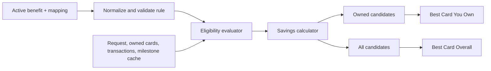

# Movie Deals Rule Engine Design

## Goal

Make the Movie Deals drawer return trustworthy, explainable recommendations for both the best card the user owns and the best card overall, without creating or altering database tables.

## Scope and constraints

- Reuse the existing `benefits`, `card_benefit_mapping`, `user_cards`, `transactions`, and `statement_milestone_cache` tables.
- Do not create tables, add columns, or rely on `benefit_usage_records` or `benefit_usage`; neither exists in the checked-in schema.
- Read movie rule terms only from active `benefits.value_config`, with card association from `card_benefit_mapping`.
- Do not create synthetic transactions or mark a benefit as redeemed merely because a user sees a recommendation.
- Keep the existing Movie Deals drawer and its `MovieAnalyzerTab` entry point.

## Existing schema usage

| Need | Existing source | Rule |
| --- | --- | --- |
| Benefit terms and validity | `benefits.value_config`, `valid_from`, `valid_until`, `is_active` | Parse and validate before evaluation. |
| Card association and display precedence | `card_benefit_mapping` | Use `card_id`, `benefit_id`, and `display_priority`. |
| Owned-card pool | `user_cards` | Match active `catalog_card_id` values. |
| Confirmed historical activity | `transactions` | Count a ticket only when `metadata.ticket_count` exists and the platform/merchant matches. |
| Statement-cycle milestone progress | `statement_milestone_cache` | Compare `total_spending` with the rule threshold. |

## Canonical in-memory rule

Raw `value_config` is normalized into an immutable `MovieDealRule`. It is not persisted in a new table.

```text
MovieDealRule
- benefitId, catalogCardId, title, sourceUrl
- offerType: bogo | percentDiscount | fixedDiscount | cashback | freeTickets | voucher
- platforms, cinemas
- buyCount, freeCount
- discountPercent, fixedAmount, maximumDiscount
- minimumTransaction
- transactionTicketLimit, cycleTicketLimit, cycleTransactionLimit
- validityStart, validityEnd, validWeekdays
- milestoneThreshold, milestoneReward
- exclusions
```

The normalizer accepts documented legacy shapes:

- `offer_type=BOGO` with `free_ticket_count` becomes `bogo` with `buyCount=1` and the supplied free count.
- `discount_percent` becomes `percentDiscount` when no explicit `offer_type` exists.
- `rate` plus `unit=percent` becomes `percentDiscount`.
- `discount_amount` becomes `fixedDiscount`.
- `reward_value` plus a movie voucher/category becomes `voucher` only when its terms identify a usable movie value.

No commercial terms are invented. Missing minimum spend means none; missing cap means uncapped. Ambiguous fixed-value rules, malformed BOGO rules, and milestones missing either threshold or reward are rejected with a diagnostic reason.

## Evaluation flow



For each candidate, evaluate in this order:

1. Rule is active, complete, and within its validity dates.
2. Requested platform and cinema match the rule.
3. Weekday, exclusions, and minimum transaction amount pass.
4. Per-transaction ticket and transaction-count limits pass.
5. Statement-cycle or calendar-cycle usage is calculated from confirmed matching transaction metadata. If ticket/redemption data is unavailable, capped rules are marked `usageUnverified` rather than claimed as guaranteed.
6. Milestones require `statement_milestone_cache.total_spending >= milestoneThreshold`; absent cache data means the milestone is not verified.
7. Calculate savings by offer type, then clamp it to `[0, eligibleTransactionAmount]` and any declared cap.

BOGO uses `floor(eligibleTickets / (buyCount + freeCount)) * freeCount * pricePerTicket`. Percentage discount and cashback use eligible spend times the stated rate. Fixed discount, voucher, and free-ticket savings cannot exceed eligible spend.

## Recommendation results and ranking

The engine returns a result containing `bestOwned`, `bestOverall`, evaluated candidates, and rejected candidates. A candidate includes card identity, ownership state, platform, rule, gross amount, savings, final amount, eligibility state, remaining verified usage where available, and an explanation.

Candidates are sorted by:

1. Guaranteed savings in rupees.
2. Lower final payable amount.
3. Higher verified-usage confidence.
4. Mapping display priority.
5. Stable card and benefit identifiers for deterministic ties.

Owned and overall pools are ranked independently. Ownership is not a score bonus, so it cannot make a worse deal beat a better one. If the same card wins both pools, the UI displays that fact rather than duplicate, indistinguishable cards. Non-owned results are explicitly labelled as such.

## Usage confidence

The engine recognizes three states:

- `verified`: matching transactions include platform identity and explicit ticket/redemption metadata sufficient to apply the rule limit.
- `unverified`: the rule has no usage limit, or a limit exists but confirmed ticket/redemption usage is unavailable. Unverified limited deals are presented as potential, conditional savings.
- `unavailable`: required statement-cycle data or milestone cache is unavailable. Milestone rewards do not become eligible in this state.

## Drawer behavior

`MovieAnalyzerTab` continues to submit ticket count, ticket price, preferred platform, and preferred cinema. The result area displays:

- Best Card You Own and Best Card Overall.
- Exact calculation arithmetic and final amount.
- Platform/cinema, validity, minimum spend, caps, and usage confidence.
- A clear condition when user action is needed to confirm capped usage.
- A no-deal state when no verified eligible rule exists.

Debug views may show rejected-rule reasons. Customer-facing views never expose raw parsing failures.

## Error handling

- A malformed rule is rejected independently; it cannot fail the full analysis.
- Database errors produce an explicit unavailable state rather than an empty no-benefits result.
- All calculations are non-negative, capped by eligible purchase value, and deterministic for equal inputs.

## Verification strategy

- Unit tests normalize each legacy movie-benefit shape found in the reference data.
- Rule validation tests reject expired, incomplete, and ambiguous terms.
- Calculator table tests cover BOGO, percentage, fixed, cashback, voucher, free-ticket, and cap behavior.
- Eligibility tests cover platform, cinema, date, weekday, exclusions, threshold, transaction limits, and usage confidence.
- Ranking tests prove independent owned and overall winners, plus deterministic ties.
- Repository tests cover catalog-card/user-card identifier boundaries and existing-schema queries.
- Widget/provider integration tests submit a Movie Deals request and render both result sections.
- A fixture test evaluates every active entertainment benefit and reports accepted versus rejected rules.

## Out of scope

- New database tables, columns, triggers, or RPC functions.
- Automatic redemption writes before a matching transaction exists.
- Changes to the generic Smart Transaction Analyzer.
