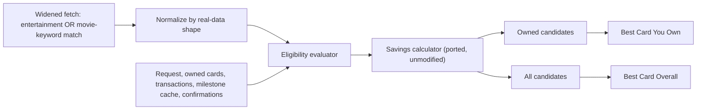

# Movie Deals — Design Spec

**Date:** 2026-08-02
**Status:** Design approved with blocking prerequisites (§3.1) unresolved. **The companion implementation plan (`docs/superpowers/plans/2026-08-02-movie-deals.md`) is NOT synchronized with this design's §1.2 corrections and must not be executed as-is** — see §14 for the specific tasks that need rewriting before implementation starts.
**Branch:** `feature/landing-v2` (worktree: `cardcompass-landing-v2`)

---

## 1. Background and root-cause context

An earlier movie-deals rule engine (`lib/features/movie_rule_engine/` in the main `cardcompass` repo, branch `feature/ai-evals-dashboard`) was investigated via root-cause analysis before this design began. Findings:

1. **Normalizer field-name mismatch.** The old normalizer only read `offer_type`, `discount_percent`, `rate`+`unit`, `discount_amount`. Real `benefits.value_config` rows use different field names (`discount_type`, `reward_value`, `currency_unit`, `annual_cap`, `max_discount_per_transaction`, `max_usage_per_month`, `threshold_amount`) that the old normalizer never read — causing real, valuable benefits (BOGO offers, SBI ELITE's ₹6,000/year allowance) to be silently rejected as "no unambiguous offer type."
2. **Platform/cinema empty-set-as-wildcard bug.** `_matches()` treated an empty `platforms`/`cinemas` set as "matches everything," so any accepted rule with no recorded platform became eligible for every search regardless of relevance — producing unrelated cards in results.
3. **Presentation never adopted the dual-panel design.** The original design called for independent "Best Card You Own" / "Best Card Overall" panels. The service method the UI actually calls (`optimizeMovieTicketPurchase`) only ever returned `bestOverall`. A separate UI section (`_buildCardBenefitTile`) read map keys (`platform`, `bank`, `card_network`, `benefit_description`) that the actual data source never populated.
4. **Category miscoverage.** The repository queried only `benefit_category = 'entertainment'`. A full scan of `supabase/migrations/20260711043900_restore_reference_data.sql` found 31 real rows that mention movies/cinema but are tagged `lifestyle`, `dining`, `rewards`, or `offers` instead — including 5 duplicate "Free Movie Tickets" (₹6,000/year) rows and ~15 "10X Reward Points on Dining, Movies, Grocery" rows. These are invisible to the old engine entirely.

The evaluator's ranking algorithm itself (BOGO math, independent owned/overall sort, no ownership bonus, savings clamping) was verified correct and is **not** being replaced — it is ported into this design largely unchanged.

This design fixes all four root causes with a fresh implementation native to the `cardcompass-landing-v2` worktree, built against real seed data (not assumed field shapes).

### 1.1 Post-approval corrections (applied after initial approval, before implementation)

- **Per-transaction cap vs. cycle amount cap were conflated.** An earlier draft of this spec mapped both `max_discount_per_transaction` (bogo) and `monthly_cap` (fixedDiscount) onto a single `maximumDiscount` field, applied per-evaluation. These are different things: a bogo redemption's cap applies once per booking, while `monthly_cap` is a **total ceiling across every booking in the month**. §4.2/§4.4 now split these into `perTransactionCap` and `cycleAmountCap`.
- **BOGO's usage-limit label was wrong.** `max_usage_per_month: 2` caps redemptions/transactions, not tickets. The field itself (`cycleTransactionLimit`, renamed `cycleRedemptionLimit`) was always correctly named; only the user-facing label text was fixed.
- **Platform data was being read from the wrong field.** `value_config.platform` is present on only 3 of the real entertainment rows — `benefits.partners` (a structured JSONB column) is the actual, reliable source, and was ignored entirely in the first draft. §4.3 is new; it documents the real `partners` data (Zomato, BookMyShow, Uber, cult.fit Live, TataCliQ, etc.) and replaces the singular `platform: String?` model field with `partners: Set<String>`.
- **Cinema-chain matching was found to be non-functional in the old engine too, for the same root cause.** While correcting the above, a check of the real seed data found **zero rows** carry any cinema-chain data (PVR/INOX/Cinepolis) in either `value_config` or `partners` — confirmed by checking the old engine's own `_cinemas` list in `movie_analyzer_tab.dart`, which is a hardcoded static UI list never derived from a query, and by confirming the old normalizer's `cinema`/`cinemas` field reads never matched any real row. The old evaluator's cinema eligibility check therefore always passed via the same empty-set-as-wildcard bug as platform matching — it was never actually filtering on cinema against real data, just silently and invisibly permissive. This design keeps the Cinema dropdown (§8, matches the ported UI) but every rule is cinema-agnostic until real cinema-chain data exists in the schema — documented here as a known, deliberate gap, not a working filter.

### 1.2 Readiness-gap review (2026-08-02) — every finding independently verified

A separate readiness-gap review (`docs/superpowers/specs/2026-08-02-movie-deals-readiness-gaps.md`) raised nine items against the plan after §1.1's corrections landed. Each was independently re-verified against primary sources (the actual migration files, not the review document's word) before being accepted here — none were taken on faith, and none survive as invalid. Two are corrected without qualification below because they are unambiguous data-integrity defects, not judgment calls:

- **P0 — `card_benefit_mapping` ends up empty on a clean database.** `supabase/migrations/20260713180753_normalize_card_benefit_mappings.sql:5` deletes every row from `card_benefit_mapping`. Read the full migration file (66 lines) end to end: the rest of it is entirely `benefits.dedupe_key` construction and `card_benefits`/`card_benefits_staging` column changes — it never reinserts a single mapping row. Every migration after it was checked (`grep -l card_benefit_mapping supabase/migrations/*.sql` — only `20260714010000_mapping_category_codes.sql` touches the table, and that migration only adds a `category_codes` column via an `UPDATE`, a no-op against zero rows). **A fresh `supabase db reset` produces a database where `benefits` has rows but `card_benefit_mapping` has none** — the repository's join chain (`benefits` → `card_benefit_mapping` → `card_catalog`) therefore returns zero candidates regardless of how correct the normalizer or evaluator are. This blocks the feature entirely on any environment provisioned from migrations alone (not a copy of an already-populated production database).
- **P0 — the `partners`/`exclusions`/`regions` column type is inconsistent between the migration a clean database actually runs and the schema this design was written against.** `supabase/migrations/20260711043541_initial_schema.sql:73-75` defines these columns as `TEXT[]`. `schema.sql:73-75` defines them as `JSONB`, with an explicit inline comment on each line: `-- JSONB, not TEXT[] - matches production data shape`, meaning this divergence was already known before this design began. The seed data's actual `COPY` payload for `partners` (e.g. `["Zomato"]` at `supabase/migrations/20260711043900_restore_reference_data.sql:299`) is JSON-array literal syntax, not PostgreSQL `TEXT[]` literal syntax (`{Zomato}`) — these are not interchangeable in `COPY ... FROM stdin` text format. No later migration alters the column type. **§4.3's entire `partners`-sourcing design assumes JSONB parsing (`value is List` in the repository's `_partners()` helper) — on a database built strictly from the migration chain with the column actually typed `TEXT[]`, this parsing path may not apply the way this design assumes, and the seed load itself may not succeed as authored.** This must be resolved (by a corrective migration establishing the intended JSONB type before the seed data loads) before the feature can be verified end-to-end against a reproducible database.

The remaining seven items are accepted as real, but are hardening and correctness improvements to sequence around the two P0s above, not independent blockers of comparable severity — each is addressed in the sections below, with the specific design change:

- **Commercial-validity of mappings (was P0 in the review; downgraded here to "must front-load, not a data-model gap").** `card_benefit_mapping` row at `restore_reference_data.sql:1450` maps benefit `5cbd7e94-...` ("SBI Card ELITE Free Movie Tickets," sourced from an ELITE-specific URL) to `card_catalog` id `de17a2a5-...`, which resolves to **SBI Card Simplyclick** (line 80 of the same file) — an entry-level card, not ELITE. This is a genuine, present, verified data-quality defect in the seed set, not a speculative risk. It is not, however, a gap in this *design* — the design already treats `card_benefit_mapping` as the sole source of card association and never claims to independently verify commercial accuracy of a mapping's content. The correct fix is curating/correcting the seed data (or gating on an approval/provenance column that already exists in `card_benefits_staging` per the schema) before this feature reads from it, not a change to the rule model. Reframed as a data-quality prerequisite in §3, not a code-level fix in §4-§9.
- **Eligibility fields promised in §7 prose but absent from the rule model.** Confirmed: `MovieDealRule` (§4.2) has no `validityStart`/`validityEnd`/exclusions/weekday/minimum-transaction fields, and the real seed data does carry some of these inside `exclusions`/`value_config` for other benefit categories (unconfirmed whether any real *movie* row uses them — not found in the 10 rows this design's vocabulary was built from). §7 is corrected below to only claim checks the model actually performs; validity-window and exclusion fields are added to §4.2 as optional, since the entertainment rows scanned so far don't populate them, but a future row might.
- **Cycle/annual/prior-month usage cannot be verified from the planned transaction query.** Confirmed: the repository's `loadTransactions` query selects `user_card_id, merchant_name, metadata` only — no `transaction_date`. Without a date column, "this cycle" and "prior month" cannot be bounded from the fetched rows at all, regardless of what `metadata` contains. §7/§8 corrected to require `transaction_date` in the query and to state plainly that cycle/annual verification remains `unverified` (never `verified`) until it's added.
- **Unverified savings can outrank verified savings.** Confirmed: `_compareCandidates` sorts by raw `savings` before `usageConfidence`. An `annualAllowance` candidate's `savings` is set to the *full* `annualCap` regardless of confidence (§7 step 6), so an unverified ₹6,000 allowance beats a verified ₹500 discount on the primary sort key. §5/§7 corrected: guaranteed (verified) savings must rank strictly ahead of any unverified or informational figure, not merely tie-broken by confidence after savings.
- **Confirmation state leaks across benefits on the same card.** Confirmed: `MovieDealContext` is keyed only by `catalogCardId`; the repository unions `confirmedPlatformsByBenefit` values across every source sharing that card into one context. A confirmation on benefit A promotes benefit B's `platformConfidence` on the same card. §5/§8 corrected: platform confirmations must be looked up per `(catalogCardId, benefitId)`, not per card alone.
- **The widened fetch query doesn't implement the JSONB predicate §4.1 promises.** Confirmed: the actual `.or(...)` filter only checks `benefit_category`, `title`, `description` — never `value_config->>'category'` or `value_config->>'discount_type'`. A benefit whose only movie signal lives inside `value_config` with generic title/description text would be invisible to the query. §4.1 corrected to either implement the JSONB predicate or explicitly narrow the promised coverage to what the query actually checks.
- **The platform dropdown doesn't include real partner values.** Confirmed: the form's hardcoded list is `['BookMyShow', 'PVR', 'INOX', 'Cinepolis', 'Moviemax']` — it has no "Zomato" or "District," even though "Twin ticket treats" (a real, correctly-normalizing BOGO offer per §4.4) is keyed to exactly that partner. A user cannot select the one platform that offer is actually eligible under. §8 corrected to source dropdown options from the real partner vocabulary observed in the data, with an alias for "District by Zomato" → "Zomato."
- **Confirmation table lacks a uniqueness constraint and exposes reporter identity.** Confirmed: no `UNIQUE` constraint on `(user_id, benefit_id, platform)`, no non-blank check on `platform`, and the `select` RLS policy grants unrestricted row access (including raw `user_id`) to any authenticated reader. §6 corrected to add the constraint, a non-blank check, and to read aggregated counts through a view/RPC rather than direct table access.

**On sequencing:** the review's own recommended order (repair mappings → provenance/quarantine → align rule model → usage tracking → confirmation scoping → widened query/fixtures → platform vocabulary) is followed here with one adjustment — the two genuine P0s (empty mapping table, column-type mismatch) are infrastructure/data-reproducibility problems that block *verifying* the feature at all, so they gate Task 7 (the crowd-source migration, since it's the first task in the implementation plan that touches the database) rather than being scheduled as their own separate phase before any code is written. The remaining seven are folded into the existing task boundaries below (§4.1, §4.2, §5, §6, §7, §8) rather than treated as a distinct sixth phase, since each maps cleanly onto a section this design already owns.

---

## 2. Goal

Give a user, from a dedicated "Movie Deals" screen, a trustworthy recommendation for the best card they own and the best card overall for buying movie tickets — reusing the existing `benefits`, `card_benefit_mapping`, `user_cards`, `transactions`, and `statement_milestone_cache` tables, without alterations to `benefits` itself.

**§1.2 note:** "trustworthy" is conditional on §3.1's prerequisites being satisfied first — reproducible mappings, a resolved column-type disagreement, and commercially-verified mapping provenance. Absent those, this design's guaranteed/potential ranking split (§5) and honest confidence labeling still prevent the feature from *overstating* certainty it doesn't have, but a feature with zero mapped candidates (the current state of a freshly-migrated database) or one confidently recommending a card for a benefit it doesn't actually carry (the SimplyClick/ELITE mapping) is not trustworthy regardless of how correct the code downstream of that data is.

## 3. Scope and constraints

- Reuse existing schema; the only new table is an additive crowd-sourcing table (§6) — no changes to `benefits`, `card_benefit_mapping`, `user_cards`, or `transactions`.
- Read movie-relevant benefit terms from `benefits.value_config`, with card association from `card_benefit_mapping`.
- Do not create synthetic transactions or mark a benefit as redeemed merely because a user sees a recommendation.
- Port `lib/features/movie_rule_engine/domain/movie_deal_evaluator.dart`'s savings/ranking logic from the main repo largely as-is; rewrite the normalizer, platform-matching, repository, and UI fresh.

### 3.1 Prerequisites (§1.2) — must be true before this feature can be verified end-to-end

- **A corrective migration must insert curated, commercially-approved `card_benefit_mapping` rows — never a mechanical restoration of the original deleted set.** `supabase/migrations/20260713180753_normalize_card_benefit_mappings.sql:5` deletes every row and no later migration repopulates the table; a database built strictly from the migration chain has `benefits` populated but zero card associations. This alone would justify simply reinserting what was deleted — but the entertainment-category mapping set that migration deleted is exactly where the SimplyClick/ELITE defect (below) lives, and it is not isolated: cross-referencing every entertainment `card_benefit_mapping` row against its benefit's own source URL found the "SBI Card ELITE Free Movie Tickets" title alone mapped to at least 15 distinct, mostly-unrelated cards (Uco Bank Elite, Miles, Mayura, Simplyclick, Krisflyer Apex, Paytm, Doctors, Air India, Karnataka Bank Prime, South Indian Bank Prime, and others) — a mechanical restore would put the exact commercial-accuracy problem this prerequisite exists to solve right back in place, just with a non-empty table instead of an empty one. The corrective migration must insert only rows that have been reviewed against each card's actual terms (or are gated behind an approval column, extending `card_benefits_staging`'s existing review workflow to `card_benefit_mapping`) — not a `SELECT` replaying the original deleted data.
- **A corrective migration must resolve the `partners`/`exclusions`/`regions` column-type disagreement — and it must run BEFORE the seed data loads, not merely be added afterward.** `supabase/migrations/20260711043541_initial_schema.sql:73-75` types these `TEXT[]`; `schema.sql:73-75` documents them as `JSONB` (with an inline comment already noting this mismatch). The seed data's `partners` payload is JSON-array literal syntax, which `COPY` cannot load into a genuine `TEXT[]` column. `20260711043900_restore_reference_data.sql` (the seed COPY) is timestamped only 359 seconds after `20260711043541_initial_schema.sql` — if a corrective migration is simply appended at the end of the chain (e.g. timestamped after `20260713180753`, as a naive read of this prerequisite might suggest), the migration run still fails or produces corrupted data at the seed-load step, long before the chain ever reaches the later correction. The corrective migration must be timestamped between `20260711043541` and `20260711043900` — genuinely reordering the chain, not just adding a fix at the tail — or the seed data itself must be rewritten to valid `TEXT[]` literal syntax as an alternative to changing the column type. Either way, this must be proven by actually running `supabase db reset` end-to-end, not inferred from reading the migration files.
- **`card_benefit_mapping` rows this feature reads must have verified commercial provenance.** `restore_reference_data.sql:1450` maps an SBI Card ELITE-sourced benefit to the SBI Card Simplyclick catalog entry (confirmed: `card_catalog` id `de17a2a5-...` at line 80 resolves to "Simplyclick," not "ELITE") — a real, present data-quality defect, not a hypothetical risk. This design does not add commercial-accuracy verification to the rule model (that's a property of the mapping data, not something derivable from `value_config` alone) — it is a data-curation prerequisite: mappings this feature surfaces must be reviewed/corrected (or gated on an approval column, e.g. extending `card_benefits_staging`'s existing review workflow to `card_benefit_mapping`) before being trusted as a recommendation source.

## 4. Real-data-grounded offer vocabulary

Every offer type below is derived from an actual row observed in `supabase/migrations/20260711043900_restore_reference_data.sql` — not inferred from the old engine's (incorrect) assumptions.

### 4.1 Fetch query — widened beyond `benefit_category = 'entertainment'`

The repository fetches a row as a movie-deal candidate source if **any** of:
- `benefit_category = 'entertainment'`, OR
- `value_config->>'category'` ilike `%movie%`, OR `value_config->>'discount_type'` ilike `%movie%` (a JSONB text-extraction predicate — PostgREST's `.filter('value_config->>category', 'ilike', '%movie%')`, not a plain column filter; this is a real query, not prose that the implementation may substitute a cheaper approximation for), OR
- `title` or `description` contains a movie/cinema keyword (`movie`, `cinema`, `bookmyshow`, `pvr`, `inox`, `cinepolis`).

**§1.2 correction:** the initial implementation only checked the third bullet plus `benefit_category`, silently dropping the JSONB predicate. Every bullet above is required; a benefit whose only movie signal is inside `value_config` with generic title/description text (a plausible real shape — none of the 10 rows this vocabulary was built from happen to need it, but nothing guarantees a future row won't) must still be fetched.

**§1.2 correction (this pass) — how the three bullets combine matters as much as what they check.** Naming the individual `.filter()` call for the JSONB predicate (above) isn't enough — chaining separate PostgREST calls like `.eq(...)`, `.filter(...)`, `.or(...)` on the same query builder combines them as **AND** by default, not OR. If an implementer writes `.eq('benefit_category', 'entertainment').filter('value_config->>category', 'ilike', '%movie%').or('title.ilike.%movie%,...')`, the resulting query requires all three conditions simultaneously — the opposite of "matches any," and narrower than even the un-widened original query. All three bullets must be assembled into one single `.or(...)` expression string: `.or("benefit_category.eq.entertainment,value_config->>category.ilike.%movie%,value_config->>discount_type.ilike.%movie%,title.ilike.%movie%,description.ilike.%movie%,...")` (repeated for every keyword in the keyword list) — a single combined OR clause, not three chained calls. Task 8 of the implementation plan must include: (a) a test fixture whose row matches ONLY via the JSONB predicate (no movie keyword in title/description, `benefit_category` not `entertainment`) to prove that bullet is load-bearing, and (b) a query-builder/integration test (not only a fake-`MovieDealsDataSource` unit test) that exercises the actual assembled `.or(...)` string against a real or realistic PostgREST-compatible query, since a fake data source can't catch an AND/OR assembly mistake that only manifests in the real query syntax.

The normalizer (not the category tag) is the source of truth for classification after fetch.

### 4.2 Canonical rule shape

```text
MovieDealRule
- benefitId, catalogCardId, title, sourceUrl, cardName, displayPriority
- offerType: percentDiscount | fixedDiscount | bogo | annualAllowance | milestone | rewardMultiplier
- partners: Set<String>          // sourced from benefits.partners (structured column) merged with
                                  // value_config.platform when present; empty means "not recorded"
- validityStart, validityEnd: DateTime?   // sourced from benefits.valid_from/valid_until (real DB columns)
- discountPercent, fixedAmount
- perTransactionCap               // caps a SINGLE booking's discount (e.g. bogo's per-pair cap)
- cycleAmountCap                  // caps TOTAL discount across the whole cycle (e.g. fixedDiscount's monthly_cap)
- buyCount, freeCount             // bogo only; buyCount=1, freeCount=1 in all real rows
- cycleRedemptionLimit            // "N redemptions/uses per cycle" — NOT a ticket count
- annualCap                       // annualAllowance only
- milestoneThreshold, milestoneReward, milestoneCycle: monthly
- rewardMultiplierRate, rewardMultiplierUnit  // rewardMultiplier only ("points per ₹150" or "percent")
- qualifyingCategories: Set<String>            // rewardMultiplier only, e.g. {dining, movies, grocery}
- excludedCategories: Set<String>              // rewardMultiplier only, e.g. {wallet_loads, rent_payments}
```

**§1.2 correction (this pass) — `excludedCategories`, scoped to `rewardMultiplier` only.** §4.2's original claim that "every real entertainment row's `exclusions` column is the same empty-shell template" was true only for the narrow `benefit_category = 'entertainment'` subset — it doesn't hold for the full population the widened fetch (§4.1) actually evaluates. Checking every row matching the widened query found 4 with real, non-trivial `exclusions.categories`: "10X CashPoints on Favorite Merchants" (`wallet_loads, fuel, EMI`), "10X Reward Points on Dining, Movies, Departmental Stores and Grocery" (`wallet_loads, rent_payments, fuel, insurance`), "10X Reward Points on Dining" (same), and "3% Cashpoints on Paytm Purchases" (`wallet_loads, rent_payments, government_payments`) — **every one of these is a `rewardMultiplier`-shaped row**, never a movie-exclusive discount type. No `percentDiscount`/`fixedDiscount`/`bogo`/`annualAllowance`/`milestone` row in the widened candidate set carries real exclusion data. `excludedCategories` is added scoped exactly to where the real data needs it — parsed from `exclusions.categories` in the normalizer's `_normalizeRewardMultiplier` path — rather than added to the whole rule speculatively.

**§1.2 correction:** `validityStart`/`validityEnd` are new here. `benefits.valid_from`/`valid_until` are real columns (`schema.sql:78-79`), but **zero of the 10 real entertainment rows this design's vocabulary was built from populate them** — every one is `\N`. These fields exist so the evaluator can honestly perform the validity check §7 already claims in prose (a null value simply never disqualifies a candidate, matching "missing means unknown, not invented"), but no current fixture exercises a non-null case — this is forward-compatible plumbing, not evidence the check is presently exercised against real data.

**§1.2 correction (superseded by this pass's §4.2 note above):** weekday, minimum-transaction, and MCC/merchant exclusion fields were considered and deliberately **not** added — no row in the widened candidate set (checked again in this pass, not just the narrow `entertainment`-only 10 rows) carries real data in any of those specific shapes, so adding fields for them would still be speculative plumbing. Category-based exclusions are the one real exception found on this pass (`excludedCategories`, scoped to `rewardMultiplier` only, per the note above) — this correction is narrower than the original blanket "no exclusion fields at all" claim, not a reversal of it.

`perTransactionCap` and `cycleAmountCap` are deliberately separate fields — conflating them was an earlier design error. A single booking's savings can never exceed `perTransactionCap`; the sum of savings across a cycle can never exceed `cycleAmountCap`. A rule may have either, both, or neither.

### 4.3 Platforms come from `benefits.partners`, not `value_config.platform`

`benefits.partners` (JSONB array, see `schema.sql`) is the **structured, reliable** signal for which platforms/merchants a benefit applies to — `value_config.platform` is the exception (present on only 3 of the real entertainment rows), not the rule. Real examples:

| Row | `value_config.platform` | `partners` | What this means |
|---|---|---|---|
| Twin ticket treats | *(absent)* | `["Zomato"]` | Redeemed via Zomato's District app — a real, specific platform the old design missed entirely by only reading `value_config.platform` |
| BookMyShow Discount | `"BookMyShow"` | `["BookMyShow"]` | Redundant here — both sources agree |
| Monthly Vouchers on Spends | *(absent)* | `["Uber", "cult.fit Live", "BookMyShow", "TataCliQ"]` | A milestone reward redeemable at any of 4 partners — genuinely multi-platform |
| 10X CashPoints on Favorite Merchants | *(absent)* | `["Big Basket", "BookMyShow", "OYO", "Swiggy", "Uber"]` | The reward multiplier's actual qualifying merchant list |

`MovieDealRule.partners` is built as `partners` (the structured column, comma/array-parsed) **unioned with** `value_config.platform` when present — never one to the exclusion of the other. An empty `partners` set means the row genuinely has no partner data recorded (still possible — some rows have `partners: []`), which platform confidence (§5) already has a defined behavior for.

### 4.4 Field-alias table (built from every real row observed)

| Offer type | Real shape observed | Field mapping |
|---|---|---|
| `percentDiscount` | `{"discount_type": "percent", "discount_percent": 25.0}` | `discountPercent` ← `discount_percent` |
| `percentDiscount` (partner-specific) | `value_config: {"platform": "BookMyShow", "discount_type": "percent", "discount_percent": 10.0}`, `partners: ["BookMyShow"]` | same, plus `partners` ← `partners` ∪ `{value_config.platform}` |
| `fixedDiscount` | `value_config: {"platform": "BookMyShow", "monthly_cap": 1500.0, "discount_amount": 1500.0, "is_recurring": true}`, `partners: ["BookMyShow"]` | `fixedAmount` ← `discount_amount`; `cycleAmountCap` ← `monthly_cap` (this is a **total-for-the-month** cap, never a per-transaction one — a user could book 3 times in a month and the combined discount across all 3 still can't exceed ₹1,500) |
| `bogo` | `value_config: {"discount_type": "BOGO", "max_usage_per_month": 2, "max_discount_per_transaction": 500.0}`, `partners: ["Zomato"]` | `buyCount=1, freeCount=1`; `perTransactionCap` ← `max_discount_per_transaction` (caps a single redemption's discount); `cycleRedemptionLimit` ← `max_usage_per_month` (this is **2 redemptions/transactions per month, not 2 tickets** — each redemption discounts exactly one ticket, so 2 redemptions = at most 2 discounted tickets, but the field itself counts uses, not tickets). Displayed as "BOGO — up to ₹{perTransactionCap} off, {cycleRedemptionLimit} redemptions/month." |
| `annualAllowance` (new type) | `{"unit": "fixed", "annual_cap": 6000.0, "reward_value": 6000.0}` OR `{"unit": "fixed", "currency_unit": 6000.0}` | `annualCap` ← `annual_cap` OR `reward_value` OR `currency_unit` (only when `unit == "fixed"` and no percent/rate field is present — `currency_unit` means something different, e.g. a points-per-rupee denominator, in `rewardMultiplier` rows, so this alias is gated strictly on the fixed-no-percent condition) |
| `milestone` | `value_config: {"reward_value": 500.0, "milestone_type": "monthly", "threshold_amount": 80000.0}`, `partners: ["Uber", "cult.fit Live", "BookMyShow", "TataCliQ"]` | `milestoneReward` ← `reward_value`; `milestoneThreshold` ← `threshold_amount`; cycle = monthly; `partners` ← `partners` (the redeemable-at list — this is the row type where `partners` matters most, since the reward is genuinely usable at any of several merchants, not just movies). Eligibility gated on **prior month's** confirmed spend from `statement_milestone_cache`, never a forward-looking "spend more to qualify" projection. |
| `rewardMultiplier` (new type) | `value_config: {"unit": "points per Rs.150", "category": "dining,movies,grocery", "multiplier": 10.0}`, `partners: ["Big Basket", "BookMyShow", "OYO", "Swiggy", "Uber"]`, `exclusions: {"categories": ["wallet_loads", "rent_payments", "government_payments"]}` | `rewardMultiplierRate` ← `multiplier` or `base_rate`; `rewardMultiplierUnit` ← `unit`; `qualifyingCategories` ← parsed `category` (comma-split); `partners` ← `partners`; `excludedCategories` ← parsed `exclusions.categories` (§4.2's correction — this is real data on this offer type, not speculative). Only accepted when `movies`/`movie` appears in the category list. |

Anything not matching one of these shapes is rejected with a diagnostic reason (never silently dropped, never given invented defaults) — same "never invent commercial terms" principle as the original design.

## 5. Platform confidence (fixes root cause 2)

An empty `partners` set no longer means "matches everything." `platformConfidence` is computed per evaluation — it depends on both the rule's `partners` set (§4.3) and the specific platform the user searched for, not a static property stored on the rule. It parallels the existing `usageConfidence` pattern:

- **`explicit`** — the rule's `partners` set is non-empty and contains the user's searched platform (case-insensitive).
- **`communityConfirmed`** — the rule's `partners` set is empty, but ≥1 confirmed user report exists for this exact `(benefitId, searchedPlatform)` pair (§6).
- **`unconfirmed`** — the rule's `partners` set is empty, no confirmations exist for this pair.

If the user searches with no platform selected ("Any Platform"), every rule matches at `explicit` confidence regardless of its own `partners` set — there is nothing to be unconfirmed against.

A rule with an empty `partners` set still surfaces as a candidate (it may be a genuine platform-agnostic discount, or simply unrecorded) but is never presented as an unqualified match — the UI shows a caveat chip ("Platform not confirmed for this offer") for anything below `explicit`.

**§1.2 correction — confirmation scoping.** Confirmations must be looked up per `(catalogCardId, benefitId)`, keyed to the specific benefit that was actually confirmed — never aggregated to the card level. The initial implementation grouped confirmed platforms into one `MovieDealContext` per `catalogCardId`, unioning every source's confirmations for that card into a single set; a card with two movie benefits would leak a confirmation from benefit A onto benefit B's `platformConfidence`, which is wrong regardless of whether the two benefits happen to share a platform in reality. The repository must build `confirmedPlatformsByBenefit` (keyed by `benefitId`) and the evaluator must look up confidence per-rule against its own `benefitId`'s confirmations only, not a card-wide union.

**§1.2 correction — guaranteed savings must rank strictly ahead of any unverified figure, not merely tie-broken after it.** The original tie-break order below sorted by raw `savings` first, before usage confidence — meaning an `annualAllowance` candidate (whose `savings` is set to the *full* `annualCap` regardless of whether any of it has actually been verified as still available) could outrank a `verified` percentDiscount with a lower raw number. This directly contradicts "trustworthy recommendation" (§2): a ₹6,000 figure nobody has confirmed is still available is not a better recommendation than a confirmed ₹500 discount. The ranking is corrected to a two-tier structure:

1. **Guaranteed tier** — candidates satisfying **both**: (a) `usageConfidence == verified` (or the offer type has no usage cap to verify at all — `percentDiscount`/`bogo` without a `cycleRedemptionLimit`, `milestone` with confirmed prior-month spend), **and** (b) `platformConfidence == explicit`. A `communityConfirmed` platform candidate does not qualify for the guaranteed tier — it is corroborated by other users, not by the benefit's own structured data, and is treated as potential regardless of how strong its usage confidence is (a self-correction: an earlier revision of this tier definition only gated on usage confidence, silently allowing an `unconfirmed`- or `communityConfirmed`-platform candidate with verified usage to rank as a confirmed winner even though the system doesn't actually know the offer applies to the searched platform). Sorted by savings → final amount → display priority → stable IDs (platform confidence is no longer a tie-break input within this tier, since every member already has `explicit` confidence by definition).
2. **Potential tier** — every other candidate: `unverified`/`unavailable` usage confidence, OR `platformConfidence` below `explicit` (including `communityConfirmed`), OR both — this includes every `annualAllowance` candidate until year-to-date usage tracking exists (§7 correction below). Sorted by savings → final amount → platform confidence (`communityConfirmed` > `unconfirmed`) → display priority → stable IDs, but this tier can never place ahead of a non-empty guaranteed tier. The UI (§8) renders these as a visually distinct "Potential — not yet confirmed available" section, never mixed into the primary ranked list.

**§1.2 correction (this pass) — `bestOwned`/`bestOverall` as single untyped fields let a potential-tier result silently masquerade as a guaranteed one.** The earlier revision computed `bestOwned`/`bestOverall` as "the top guaranteed-tier candidate if non-empty, otherwise the top potential-tier candidate" — with the guaranteed/potential distinction enforced only by a comment telling the UI to check and label accordingly. Nothing in the type itself prevents a future call site from reading `bestOverall` and treating it as confirmed without checking. `MovieDealsRecommendation` is corrected to four explicit fields instead of two:

```text
MovieDealsRecommendation
- bestGuaranteedOwned: MovieDealCandidate?
- bestGuaranteedOverall: MovieDealCandidate?
- bestPotentialOwned: MovieDealCandidate?
- bestPotentialOverall: MovieDealCandidate?
```

A potential result can never be assigned to a `bestGuaranteed*` field — the type itself makes the guaranteed/potential distinction impossible to lose or bypass. The UI (§8) renders "Best Card You Own"/"Best Card Overall" from the `bestGuaranteed*` fields when non-null, falling back to the corresponding `bestPotential*` field (labeled as potential, never as a confirmed winner) only when its guaranteed counterpart is null.

## 6. Crowd-sourced platform confirmation

A new, additive table (does not alter `benefits`):

```sql
create table benefit_platform_confirmations (
  id            uuid primary key default gen_random_uuid(),
  benefit_id    uuid not null references benefits(benefit_id),
  platform      text not null check (trim(platform) <> ''),
  platform_key  text generated always as (lower(trim(platform))) stored,
  user_id       uuid not null references auth.users(id),
  confirmed_at  timestamptz not null default now(),
  unique (user_id, benefit_id, platform_key)
);
```

**§1.2 corrections:**
- **A non-blank check on `platform`** — the original table had no constraint preventing an empty-string report from silently counting toward confidence.
- **A generated `platform_key` (lowercased, trimmed) plus a `unique(user_id, benefit_id, platform_key)` constraint** — without this, one user could insert the same confirmation repeatedly (or with inconsistent casing/whitespace, e.g. `"BookMyShow"` vs `"bookmyshow "`), artificially inflating the confirmation count for a signal that's supposed to represent independent corroboration, not one user's repeated clicks.
- **Reads happen through an aggregate, not direct table access.** The original RLS granted every authenticated user unrestricted `select` on the raw table — including `user_id`, exposing exactly which user reported which platform for which benefit. This is corrected to: no direct client `select` grant on the base table; a view or RPC exposes only `(benefit_id, platform_key, confirmation_count)`, never `user_id` or `confirmed_at` per-row.

```sql
create or replace view benefit_platform_confirmation_counts as
  select benefit_id, platform_key, count(distinct user_id) as confirmation_count
  from benefit_platform_confirmations
  group by benefit_id, platform_key;
```

After a user acts on a flagged (`unconfirmed` or `communityConfirmed`) recommendation, the UI shows a lightweight yes/no prompt: "Did this work at {platform}?" A "yes" performs `INSERT ... ON CONFLICT (user_id, benefit_id, platform_key) DO NOTHING`, not a plain `insert`. **§1.2 correction (this pass) — a plain `insert` against a `unique` constraint raises `23505` unique_violation on a repeat click; it does not silently no-op.** The earlier revision claimed idempotency as a stated consequence of the constraint alone, which is backwards — the constraint is what makes a repeat click *detectable* as a duplicate, but something has to actually handle that detection without surfacing an error to the user. `ON CONFLICT DO NOTHING` (or, client-side, catching SQLSTATE `23505` and treating it identically to a successful insert) is the mechanism that makes a repeat click a harmless no-op rather than a visible error. The repository reads `confirmation_count` from the view, scoped to the specific `benefit_id` being evaluated (§5's per-benefit scoping correction) — ≥1 distinct confirming user for the searched platform promotes that specific rule to `communityConfirmed`.

RLS: authenticated users can insert their own confirmation; no update/delete from the client (confirmations are immutable reports); no direct `select` on the base table — only the aggregate view above.

## 7. Evaluation flow



Per-candidate evaluation order:
1. Rule is active, complete, and within validity dates (`validityStart`/`validityEnd`, §4.2 — currently always null on real movie rows, so this never disqualifies a candidate today; the check exists so a future row with real dates is honored correctly, not to claim present coverage).
2. Requested platform eligibility against `rule.partners`, using the new confidence tiers (§5) rather than binary match/no-match. Cinema selection is accepted from the user but does not filter or affect confidence — no real row carries cinema-chain data (§1.1); every rule is currently cinema-agnostic.
3. **§1.2 correction:** the prior version of this step claimed weekday and minimum-transaction checks. `MovieDealRule` never carried fields for these, and no row in the widened candidate set populates that specific data (§4.2) — this was prose describing a check that didn't exist. Weekday/minimum-transaction checks remain removed until a real row needs them. **Category-exclusion checking is added back (this pass), scoped to `rewardMultiplier` only:** since every Movie Deals request is inherently a movie-ticket purchase, `excludedCategories` (§4.2/§4.4) practically never disqualifies a request in this feature today — none of the observed exclusions (`wallet_loads`, `rent_payments`, `fuel`, `EMI`, `insurance`, `government_payments`) overlap with what a movie-ticket transaction could be. The check exists so the field isn't dead weight modeled but never consulted, and so the evaluator is correct if a future exclusion category ever does overlap with movie-adjacent spend — but its presence in this design doesn't currently change any real evaluation outcome, and that should be stated plainly rather than implied as active protection it isn't yet providing.
4. `perTransactionCap` clamps a single booking's discount. **§1.2 correction — `transaction_date` is required in the transaction query.** The original repository's `loadTransactions` selected `user_card_id, merchant_name, metadata` only, with no date column — cycle-window and prior-month checks (this step and step 5) cannot be bounded without one. The query must select `transaction_date` and the repository must filter/group matching transactions to the current cycle (calendar month for `cycleAmountCap`/`cycleRedemptionLimit`) before counting them as verified usage.
5. Milestone rules require `statement_milestone_cache` to show the **prior month's** spend already met the threshold. **§1.2 correction (this pass) — the milestone query must select and filter on the cache's own cycle-boundary columns, not infer a cycle from recency.** `statement_milestone_cache` (`schema.sql:192-203`) has authoritative `statement_start_date`/`statement_end_date` columns for exactly this purpose. The initial repository query selected only `card_id, total_spending, last_updated`, ordered by `last_updated` descending, and took the first row per card — but `last_updated` reflects when the cache row was last written, not which statement cycle it represents; a row can be updated mid-cycle as new transactions post, so "most recently updated" can be a still-accumulating current cycle, not a genuinely completed prior one. Statement cycles also don't necessarily align to calendar months. The query must select `statement_start_date`, `statement_end_date` alongside `total_spending`, and the repository must select the row whose `statement_end_date` is the most recent one strictly before the evaluation date (i.e., the most recently *completed* cycle), not merely the most recently *touched* row — with a test asserting this distinction against a fixture where the newest `last_updated` row is a partial current cycle and an older row is the genuinely completed prior one.
6. Calculate savings by offer type (ported formulas). **§1.2 correction — `annualAllowance` savings are always potential-tier, never guaranteed.** The original design computed `annualCap` as the full savings figure regardless of confidence, which the §5 ranking correction now explicitly prevents from outranking a verified discount — but the underlying reason is that year-to-date usage against an annual allowance cannot currently be verified at all (the same `transaction_date` gap as step 4, extended across a full calendar year rather than one cycle). `annualAllowance` candidates remain in the potential tier until year-to-date usage tracking exists; this is a data-availability limit, not a ranking-formula tweak. `rewardMultiplier` candidates do **not** get a computed ₹ savings figure — there is no points-to-rupee exchange rate in the data, and inventing one would violate the "never invent commercial terms" principle. They display their raw rate (e.g. "10 points per ₹150 spent") and are shown in a separate section entirely, never ranked against either savings tier.
7. Clamp to `[0, eligibleTransactionAmount]` and any declared cap.

## 8. UI — reusing the main branch's visual design

The RCA found the main repo's `MovieAnalyzerTab` (`lib/features/movie_rule_engine/presentation/movie_analyzer_tab.dart`) has a well-formed input form and card layout — the defects were entirely in data wiring (fixed by §4–§7) and the missing dual-panel structure (this section), never the visual/interaction design itself. This design reuses that pattern rather than redesigning the presentation layer from scratch. Confirmed against the actual rendered screen (not just the source), which shows:

- A film-strip icon + "MOVIE TICKET OPTIMIZER" header, subtitle copy, and an "AI RULE OPTIMIZATION ENGINE" pill badge.
- A "TICKET SPECIFICATIONS" card containing: `Tickets` and `Price (₹)` input fields (both marked `Required` with red-outline validation state when empty); quick-select chip rows below each (2/3/4/6 tickets; ₹200/250/300/400); `Platform` and `Cinema` dropdowns defaulting to "ANY PLATFORM"/"ANY CINEMA"; a "TOTAL BASE AMOUNT: ₹0" live total bar; and a hint line ("BOGO and 50% movie offers are commonly optimized with even ticket counts.").
- A full-width "OPTIMIZE DEALS" primary action button, disabled until the form validates.

**Input form (ported pattern, same interaction model, same visual reference above):**
- Ticket-count and price-per-ticket fields with digit-only input formatters and quick-select `ChoiceChip` rows for common values (2/3/4/6 tickets; ₹200/250/300/400) — matches `_buildQuickChips()`.
- Platform and cinema `DropdownButtonFormField`s with an explicit "ANY PLATFORM"/"ANY CINEMA" null option — matches the existing dropdown items.
- Live running total ("TOTAL BASE AMOUNT: ₹X") — matches `_buildTotalAmount()`.
- Same dark card container styling (`Color(0xFF0C152B)` background, `AppColors.neonCyan` accents, Space Grotesk/Inter typography — **§1.2 correction (this pass):** the prior wording still named `AppTheme.primaryColor` and "Plus Jakarta Sans," both leftover from the main repo's `MovieAnalyzerTab` and never actually present in this worktree's `lib/core/theme/app_theme.dart`, which bases body text on `GoogleFonts.interTextTheme` and reserves Space Grotesk for display/headline styles only) already established in the app's theme.

**§1.2 correction — platform dropdown vocabulary.** The initial hardcoded list (`BookMyShow, PVR, INOX, Cinepolis, Moviemax`) contains zero real `partners` values observed in the seed data (§4.3) — "Twin ticket treats," a real, correctly-normalizing BOGO offer, is keyed to `Zomato`, which a user cannot select from this list at all.

**Further correction (this pass):** the naive fix — "source the dropdown from every distinct `partners` value across fetched benefits" — is itself wrong. `partners` is a general benefit-partner list, not a movie-booking-platform list: the milestone row "Monthly Vouchers on Spends" carries `["Uber", "cult.fit Live", "BookMyShow", "TataCliQ"]` because the ₹500 reward can be redeemed at *any* of those four, only one of which is movie-related; showing "Uber" as a selectable *movie platform* would be a real category error, and treating that milestone as eligible under an "Uber" search would incorrectly imply Uber rides qualify for a movie-specific discount they were never offered on. The dropdown is instead built from a curated `moviePlatforms` projection — a canonical, movie-booking-specific vocabulary (BookMyShow, Zomato/District, Paytm-if-used-for-movie-bookings, etc.) derived by cross-referencing each benefit's `offerType`/`category` (movie-specific offer types only: `percentDiscount`, `fixedDiscount`, `bogo` tied to a movie category, and the movie-relevant partner within a `milestone`'s redemption list) against its `partners`, not by taking every partner on every fetched row at face value. A multi-partner `milestone`/`rewardMultiplier` row's non-movie partners (Uber, cult.fit Live, Big Basket, OYO, Swiggy) never populate this dropdown and never grant `explicit` platform confidence for a movie search under those partner names — they remain visible only in that benefit's own detail text ("redeemable at Uber, cult.fit Live, BookMyShow, or TataCliQ"), not as a movie-platform search filter. Includes the documented alias: "District by Zomato" displayed to the user, mapped to `Zomato` for matching.

**Results — three sections (new; the dual-panel and tiering are the actual gaps), styled consistently with the ported card pattern:**

```
┌─ BEST CARD YOU OWN ──────────────┐
│ [Card A]                          │
│ BOGO — up to ₹500 off, 2/month   │
│ ₹1,200 → ₹700 · Save ₹500         │
│ [OWNED INTEGRATION] [Route →]    │
└───────────────────────────────────┘

┌─ BEST CARD OVERALL (not in your wallet) ─┐
│ [Card B]                                  │
│ Instant 10% off · BookMyShow              │
│ ₹1,200 → ₹1,080 · Save ₹120               │
│ [CATALOG RECOMMENDATION] [Learn more →]   │
└────────────────────────────────────────────┘

┌─ POTENTIAL — NOT YET CONFIRMED AVAILABLE ─┐
│ [Card C]                                   │
│ Up to ₹6,000/year in free tickets          │
│ Remaining balance not verified              │
└─────────────────────────────────────────────┘
```

- **§1.2 correction (this pass):** the previous revision of this mockup named specific real cards ("HDFC Diners Club Black/Millennia," "SBI Card Simplyclick") — the second one is the exact card the §3.1 mapping-provenance prerequisite calls out as commercially wrong. Checking further: querying every real `card_benefit_mapping` row for entertainment benefits shows this isn't an isolated defect — the "SBI Card ELITE Free Movie Tickets" title alone is mapped to at least 15 distinct cards (Uco Bank Elite, Miles, Mayura, Simplyclick, Krisflyer Apex, Paytm, Doctors, Air India, Karnataka Bank Prime, South Indian Bank Prime, and others), almost none of which are actually SBI Card ELITE. Only 2 of the 24 real entertainment-category mappings have a card name that's internally consistent with the benefit's own source URL, and even those haven't been checked against the card issuer's actual published terms — this repo has no way to verify that from the database alone. No real card name is safe to cite in this spec until §3.1's mapping-provenance work is done; placeholders (`[Card A]`/`[Card B]`/`[Card C]`) are used instead, matching the gaps review's own recommendation. The mockup's structural point stands: a guaranteed-tier candidate (a verified/explicit-platform percent discount) wins "Best Card Overall," with the annual-allowance candidate demoted to its own labeled potential section — the placeholders make clear this is illustrating ranking behavior, not endorsing specific card claims.
- Reuses the existing owned/not-owned badge treatment (`OWNED INTEGRATION` vs `CATALOG RECOMMENDATION`, primary vs secondary accent color) and the two dialog flows already built (`_showCardUsageDialog` for owned cards, `_showCardAcquisitionDialog` for cards to acquire) — these are sound UI already, just need to render against the corrected dual-result data instead of the single `bestOverall`-only recommendation.
- If the same card wins both pools, show one panel with an "Also best overall" label — never duplicate, indistinguishable cards.
- The **Potential** section (§5) renders any non-empty potential-tier candidates the guaranteed tier didn't already surface — visually distinct (muted styling, no "winner" framing), never presented as a ranked competitor to the guaranteed tier above it.
- `rewardMultiplier` candidates show their raw point/percent rate (never a computed ₹ estimate) in their own section entirely, separate from both the guaranteed and potential tiers, since there is nothing numeric to compare them against.
- `unconfirmed`-platform candidates are visually distinguished (caveat chip / lower visual weight) from `explicit`-platform candidates, even when nominally ranked adjacent by raw savings number.
- The crowd-source confirmation prompt (§6) appears as a follow-up dialog after `_showCardUsageDialog`'s "Got It!" action, for any candidate below `explicit` platform confidence.
- A no-deal state when no eligible rule exists in any section; an explicit unavailable state (not an empty no-deal state) on repository/data errors.

## 9. Navigation

New 5th persistent bottom tab, "Movie Deals," alongside Dashboard, Cards, Transactions, Settings. Requires updating in `lib/core/router/app_router.dart`:
- `_kTabPaths` — add the new tab's path.
- `_tabIndexFor` — add index resolution for the new path.
- `_AppShell._bodies` — add the new screen widget.
- `_SideRail` and `_BottomNav` item lists — add the new nav entry to both (kept in sync today for desktop/mobile).

## 10. File structure

```
lib/features/benefits/movie_deals/
  domain/
    models/
      movie_deal_rule.dart        — MovieDealRule, offer-type enum, platform/usage confidence enums
      movie_deal_candidate.dart   — candidate + dual-result types (ported shape)
    movie_deal_rule_normalizer.dart  — rewritten, full real-data field coverage (§4.3)
    movie_deal_evaluator.dart       — ported from main repo, extended for annualAllowance/rewardMultiplier savings math, per-benefit platform confidence, and the guaranteed/potential ranking tier split (§5)
  data/
    movie_deals_repository.dart     — widened fetch query (§4.1), confirmation-count aggregation
  providers/
    movie_deals_provider.dart       — Riverpod wiring, matching v2's existing provider patterns
  presentation/
    movie_deals_screen.dart         — form and card layout adapted from the main repo's MovieAnalyzerTab (input form, quick-select chips, owned/not-owned badges, action dialogs — §8), restructured for two independent result panels bound to fresh providers

supabase/migrations/
  <timestamp>_benefit_platform_confirmations.sql   — new additive table (§6)
```

## 11. Error handling

- A malformed or unrecognized rule is rejected independently with a diagnostic reason; it cannot fail the full analysis.
- Repository/database errors produce an explicit unavailable state, never an empty no-deal result.
- All calculations are non-negative, capped by eligible purchase value and any declared cap, deterministic for equal inputs.

## 12. Verification strategy

- Normalizer tests cover every real-data shape found in §4.3 as fixtures — not synthetic/guessed shapes.
- **§1.2 correction:** a dedicated fixture test must evaluate **every row** in `supabase/migrations/20260711043900_restore_reference_data.sql` that matches the widened fetch query (§4.1), asserting each is either accepted with a specific offer type or rejected with a non-empty diagnostic. The earlier implementation of this task hardcoded a representative sample of ~10-11 rows chosen by the shapes this design's vocabulary was built from — that is a spot-check, not the exhaustive regression guard §12 originally claimed. A new seed row (or one with a shape this design didn't anticipate) could silently bypass every hardcoded fixture without failing any test. The fixture must be generated from the actual migration data (parsed at test-authoring time, not at test-runtime — the original constraint against runtime SQL parsing still holds) so every matching row is covered, including ones added after this spec was written.
- Evaluator tests cover BOGO (per-transaction cap semantics), percent, fixed, annualAllowance, milestone (prior-month gating), and rewardMultiplier savings math, plus platform-confidence tie-breaking and the guaranteed/potential ranking tier split (§5).
- Repository tests cover the widened fetch query (§4.1, including a fixture that matches only via the JSONB predicate) and confirmation-count aggregation scoped per-benefit (§5/§6), not per-card.
- Widget/provider tests submit a request and assert all three result sections (§8) render independently: "Best Card You Own," "Best Card Overall," and the "Potential" section, including the shared-winner ("Also best overall") case and a case where the only available candidate is potential-tier.
- A clean-database integration check (§3.1) confirms `supabase db reset` followed by this feature's queries returns at least one mapped movie-deal candidate — this is the regression guard against the P0 empty-mapping-table and column-type prerequisites silently regressing after they're fixed.

## 13. Out of scope (this iteration)

- Recategorizing the 31 miscategorized `benefit_category` rows in the database (handled by widening the query instead, per user decision).
- Automatic redemption writes before a matching transaction exists.
- Changes to any other benefit-category evaluator (dining, travel, etc.).
- UI for browsing/moderating crowd-sourced confirmations (e.g. an admin view) — confirmations are written and aggregated, not exposed for review in this iteration.

## 14. Plan/design drift — confirmed by reading the actual plan file, not assumed

A second readiness-gap pass (after this design's first §1.2 correction round) found that `docs/superpowers/plans/2026-08-02-movie-deals.md` was never updated to match several of the corrections above. Each item below was directly confirmed by reading the plan's current code, not inferred from this design alone:

- **Confirmation context is still card-scoped, not benefit-scoped, despite the repository's own lookup being benefit-keyed.** The plan's repository correctly builds `confirmedPlatformsByBenefit` keyed by `benefitId` (plan line ~2123), but then unions every source sharing a card into one `confirmedPlatforms` set stored per `catalogCardId` (plan lines ~2192-2204: `entry.value.map((source) => confirmedPlatformsByBenefit[source.benefitId] ?? {}).expand((set) => set).toSet()`, assigned to `contexts[entry.key]` where `entry.key` is the card ID) — the exact same-card confirmation leak §5 corrects in prose is still live in the actual evaluator input construction. Task 8 (repository) and Task 6 (evaluator, `MovieDealContext`) need `MovieDealContext` keyed by `(catalogCardId, benefitId)`, not `catalogCardId` alone.
- **The guaranteed/potential ranking tier split does not exist in the plan at all.** Zero occurrences of "guaranteed" or "potential" anywhere in the plan file; `_compareCandidates` (Task 6) still sorts by raw `savings` first, and `MovieDealsRecommendation` (Task 5) still exposes only `bestOwned`/`bestOverall`, not the four `bestGuaranteed*`/`bestPotential*` fields §5 now specifies. Tasks 5, 6, and 11 need rewriting for the tiered model.
- **The confirmation migration (Task 7) has none of §6's integrity corrections.** No `platform_key` generated column, no non-blank check, no `unique` constraint, no aggregate view — the plan's migration is still the original, uncorrected table definition. Task 7 needs rewriting to match §6 exactly, including the `ON CONFLICT DO NOTHING` insert pattern.
- **The milestone query (Task 8) still selects `card_id, total_spending, last_updated` and orders by `last_updated`**, not `statement_start_date`/`statement_end_date` — the imprecise-cycle-selection problem §7 step 5 now corrects is unaddressed in the actual query code.
- **`excludedCategories` does not exist on `MovieDealRule`** (Task 1) or the `rewardMultiplier` normalizer branch (Task 3) — §4.2/§4.4's addition from this pass is design-only until the plan's model and normalizer are updated.
- **Checked directly: Task 11's widget test already uses fabricated generic card IDs** (`_candidate(cardId: 'owned', ...)`, `cardName: 'Card $cardId'`), not real card names — this item does NOT need correction, unlike the earlier §14 draft assumed before checking. The only real-benefit-title references in the plan (`grep` confirms exactly two: Task 3's `_normalizeAnnualAllowance` test and Task 4's fixture regression map, both citing "SBI Card ELITE Free Movie Tickets" as a benefit **title** in a normalizer test) are legitimate — normalizer tests need the real title text to prove the normalizer parses it, and citing a benefit's title in a unit test is not the same claim as citing a specific card's mapping accuracy in a user-facing mockup.
- **The widened-fetch query in Task 8 combines predicates as separate calls**, not one assembled `.or(...)` string — verify the actual PostgREST call against §4.1's correction before treating that task as complete.

**None of the implementation plan's 14 tasks should be executed until they are individually checked against this section and rewritten where drifted.** This is not a suggestion to regenerate the whole plan from scratch — most of Tasks 1-4, 9, 10, 12, 13, 14 (normalizer field coverage, provider wiring, screen form, navigation) were verified accurate in an earlier pass and don't need to change — but Tasks 5, 6, 7, 8, and 11 specifically do, per the items above.
