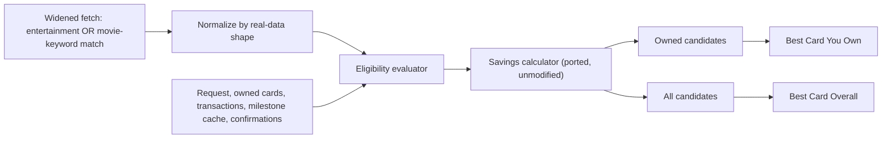

# Movie Deals — Design Spec

**Date:** 2026-08-02
**Status:** Approved
**Branch:** `feature/landing-v2` (worktree: `cardcompass-landing-v2`)

---

## 1. Background and root-cause context

An earlier movie-deals rule engine (`lib/features/movie_rule_engine/` in the main `cardcompass` repo, branch `feature/ai-evals-dashboard`) was investigated via root-cause analysis before this design began. Findings:

1. **Normalizer field-name mismatch.** The old normalizer only read `offer_type`, `discount_percent`, `rate`+`unit`, `discount_amount`. Real `benefits.value_config` rows use different field names (`discount_type`, `reward_value`, `currency_unit`, `annual_cap`, `max_discount_per_transaction`, `max_usage_per_month`, `threshold_amount`) that the old normalizer never read — causing real, valuable benefits (BOGO offers, SBI ELITE's ₹6,000/year allowance) to be silently rejected as "no unambiguous offer type."
2. **Platform/cinema empty-set-as-wildcard bug.** `_matches()` treated an empty `platforms`/`cinemas` set as "matches everything," so any accepted rule with no recorded platform became eligible for every search regardless of relevance — producing unrelated cards in results.
3. **Presentation never adopted the dual-panel design.** The original design called for independent "Best Card You Own" / "Best Card Overall" panels. The service method the UI actually calls (`optimizeMovieTicketPurchase`) only ever returned `bestOverall`. A separate UI section (`_buildCardBenefitTile`) read map keys (`platform`, `bank`, `card_network`, `benefit_description`) that the actual data source never populated.
4. **Category miscoverage.** The repository queried only `benefit_category = 'entertainment'`. A full scan of `supabase/migrations/20260711043900_restore_reference_data.sql` found 31 real rows that mention movies/cinema but are tagged `lifestyle`, `dining`, `rewards`, or `offers` instead — including 5 duplicate "Free Movie Tickets" (₹6,000/year) rows and ~15 "10X Reward Points on Dining, Movies, Grocery" rows. These are invisible to the old engine entirely.

The evaluator's ranking algorithm itself (BOGO math, independent owned/overall sort, no ownership bonus, savings clamping) was verified correct and is **not** being replaced — it is ported into this design largely unchanged.

This design fixes all four root causes with a fresh implementation native to the `cardcompass-landing-v2` worktree, built against real seed data (not assumed field shapes).

### 1.1 Post-approval corrections (applied after initial approval, before implementation)

- **Per-transaction cap vs. cycle amount cap were conflated.** An earlier draft of this spec mapped both `max_discount_per_transaction` (bogo) and `monthly_cap` (fixedDiscount) onto a single `maximumDiscount` field, applied per-evaluation. These are different things: a bogo redemption's cap applies once per booking, while `monthly_cap` is a **total ceiling across every booking in the month**. §4.2/§4.4 now split these into `perTransactionCap` and `cycleAmountCap`.
- **BOGO's usage-limit label was wrong.** `max_usage_per_month: 2` caps redemptions/transactions, not tickets. The field itself (`cycleTransactionLimit`, renamed `cycleRedemptionLimit`) was always correctly named; only the user-facing label text was fixed.
- **Platform data was being read from the wrong field.** `value_config.platform` is present on only 3 of the real entertainment rows — `benefits.partners` (a structured JSONB column) is the actual, reliable source, and was ignored entirely in the first draft. §4.3 is new; it documents the real `partners` data (Zomato, BookMyShow, Uber, cult.fit Live, TataCliQ, etc.) and replaces the singular `platform: String?` model field with `partners: Set<String>`.
- **Cinema-chain matching was found to be non-functional in the old engine too, for the same root cause.** While correcting the above, a check of the real seed data found **zero rows** carry any cinema-chain data (PVR/INOX/Cinepolis) in either `value_config` or `partners` — confirmed by checking the old engine's own `_cinemas` list in `movie_analyzer_tab.dart`, which is a hardcoded static UI list never derived from a query, and by confirming the old normalizer's `cinema`/`cinemas` field reads never matched any real row. The old evaluator's cinema eligibility check therefore always passed via the same empty-set-as-wildcard bug as platform matching — it was never actually filtering on cinema against real data, just silently and invisibly permissive. This design keeps the Cinema dropdown (§8, matches the ported UI) but every rule is cinema-agnostic until real cinema-chain data exists in the schema — documented here as a known, deliberate gap, not a working filter.

---

## 2. Goal

Give a user, from a dedicated "Movie Deals" screen, a trustworthy recommendation for the best card they own and the best card overall for buying movie tickets — reusing the existing `benefits`, `card_benefit_mapping`, `user_cards`, `transactions`, and `statement_milestone_cache` tables, without alterations to `benefits` itself.

## 3. Scope and constraints

- Reuse existing schema; the only new table is an additive crowd-sourcing table (§6) — no changes to `benefits`, `card_benefit_mapping`, `user_cards`, or `transactions`.
- Read movie-relevant benefit terms from `benefits.value_config`, with card association from `card_benefit_mapping`.
- Do not create synthetic transactions or mark a benefit as redeemed merely because a user sees a recommendation.
- Port `lib/features/movie_rule_engine/domain/movie_deal_evaluator.dart`'s savings/ranking logic from the main repo largely as-is; rewrite the normalizer, platform-matching, repository, and UI fresh.

## 4. Real-data-grounded offer vocabulary

Every offer type below is derived from an actual row observed in `supabase/migrations/20260711043900_restore_reference_data.sql` — not inferred from the old engine's (incorrect) assumptions.

### 4.1 Fetch query — widened beyond `benefit_category = 'entertainment'`

The repository fetches a row as a movie-deal candidate source if **any** of:
- `benefit_category = 'entertainment'`, OR
- `value_config->>'category'` (or `->>'discount_type'`) contains `movie` (case-insensitive), OR
- `title` or `description` contains a movie/cinema keyword (`movie`, `cinema`, `bookmyshow`, `pvr`, `inox`, `cinepolis`).

The normalizer (not the category tag) is the source of truth for classification after fetch.

### 4.2 Canonical rule shape

```text
MovieDealRule
- benefitId, catalogCardId, title, sourceUrl, cardName, displayPriority
- offerType: percentDiscount | fixedDiscount | bogo | annualAllowance | milestone | rewardMultiplier
- partners: Set<String>          // sourced from benefits.partners (structured column) merged with
                                  // value_config.platform when present; empty means "not recorded"
- discountPercent, fixedAmount
- perTransactionCap               // caps a SINGLE booking's discount (e.g. bogo's per-pair cap)
- cycleAmountCap                  // caps TOTAL discount across the whole cycle (e.g. fixedDiscount's monthly_cap)
- buyCount, freeCount             // bogo only; buyCount=1, freeCount=1 in all real rows
- cycleRedemptionLimit            // "N redemptions/uses per cycle" — NOT a ticket count
- annualCap                       // annualAllowance only
- milestoneThreshold, milestoneReward, milestoneCycle: monthly
- rewardMultiplierRate, rewardMultiplierUnit  // rewardMultiplier only ("points per ₹150" or "percent")
- qualifyingCategories: Set<String>            // rewardMultiplier only, e.g. {dining, movies, grocery}
```

`perTransactionCap` and `cycleAmountCap` are deliberately separate fields — conflating them was an earlier design error. A single booking's savings can never exceed `perTransactionCap`; the sum of savings across a cycle can never exceed `cycleAmountCap`. A rule may have either, both, or neither.

### 4.3 Platforms come from `benefits.partners`, not `value_config.platform`

`benefits.partners` (JSONB array, see `schema.sql`) is the **structured, reliable** signal for which platforms/merchants a benefit applies to — `value_config.platform` is the exception (present on only 3 of the real entertainment rows), not the rule. Real examples:

| Row | `value_config.platform` | `partners` | What this means |
|---|---|---|---|
| Twin ticket treats | *(absent)* | `["Zomato"]` | Redeemed via Zomato's District app — a real, specific platform the old design missed entirely by only reading `value_config.platform` |
| BookMyShow Discount | `"BookMyShow"` | `["BookMyShow"]` | Redundant here — both sources agree |
| Monthly Vouchers on Spends | *(absent)* | `["Uber", "cult.fit Live", "BookMyShow", "TataCliQ"]` | A milestone reward redeemable at any of 4 partners — genuinely multi-platform |
| 10X CashPoints on Favorite Merchants | *(absent)* | `["Big Basket", "BookMyShow", "OYO", "Swiggy", "Uber"]` | The reward multiplier's actual qualifying merchant list |

`MovieDealRule.partners` is built as `partners` (the structured column, comma/array-parsed) **unioned with** `value_config.platform` when present — never one to the exclusion of the other. An empty `partners` set means the row genuinely has no partner data recorded (still possible — some rows have `partners: []`), which platform confidence (§5) already has a defined behavior for.

### 4.4 Field-alias table (built from every real row observed)

| Offer type | Real shape observed | Field mapping |
|---|---|---|
| `percentDiscount` | `{"discount_type": "percent", "discount_percent": 25.0}` | `discountPercent` ← `discount_percent` |
| `percentDiscount` (partner-specific) | `value_config: {"platform": "BookMyShow", "discount_type": "percent", "discount_percent": 10.0}`, `partners: ["BookMyShow"]` | same, plus `partners` ← `partners` ∪ `{value_config.platform}` |
| `fixedDiscount` | `value_config: {"platform": "BookMyShow", "monthly_cap": 1500.0, "discount_amount": 1500.0, "is_recurring": true}`, `partners: ["BookMyShow"]` | `fixedAmount` ← `discount_amount`; `cycleAmountCap` ← `monthly_cap` (this is a **total-for-the-month** cap, never a per-transaction one — a user could book 3 times in a month and the combined discount across all 3 still can't exceed ₹1,500) |
| `bogo` | `value_config: {"discount_type": "BOGO", "max_usage_per_month": 2, "max_discount_per_transaction": 500.0}`, `partners: ["Zomato"]` | `buyCount=1, freeCount=1`; `perTransactionCap` ← `max_discount_per_transaction` (caps a single redemption's discount); `cycleRedemptionLimit` ← `max_usage_per_month` (this is **2 redemptions/transactions per month, not 2 tickets** — each redemption discounts exactly one ticket, so 2 redemptions = at most 2 discounted tickets, but the field itself counts uses, not tickets). Displayed as "BOGO — up to ₹{perTransactionCap} off, {cycleRedemptionLimit} redemptions/month." |
| `annualAllowance` (new type) | `{"unit": "fixed", "annual_cap": 6000.0, "reward_value": 6000.0}` OR `{"unit": "fixed", "currency_unit": 6000.0}` | `annualCap` ← `annual_cap` OR `reward_value` OR `currency_unit` (only when `unit == "fixed"` and no percent/rate field is present — `currency_unit` means something different, e.g. a points-per-rupee denominator, in `rewardMultiplier` rows, so this alias is gated strictly on the fixed-no-percent condition) |
| `milestone` | `value_config: {"reward_value": 500.0, "milestone_type": "monthly", "threshold_amount": 80000.0}`, `partners: ["Uber", "cult.fit Live", "BookMyShow", "TataCliQ"]` | `milestoneReward` ← `reward_value`; `milestoneThreshold` ← `threshold_amount`; cycle = monthly; `partners` ← `partners` (the redeemable-at list — this is the row type where `partners` matters most, since the reward is genuinely usable at any of several merchants, not just movies). Eligibility gated on **prior month's** confirmed spend from `statement_milestone_cache`, never a forward-looking "spend more to qualify" projection. |
| `rewardMultiplier` (new type) | `value_config: {"unit": "points per Rs.150", "category": "dining,movies,grocery", "multiplier": 10.0}`, `partners: ["Big Basket", "BookMyShow", "OYO", "Swiggy", "Uber"]` | `rewardMultiplierRate` ← `multiplier` or `base_rate`; `rewardMultiplierUnit` ← `unit`; `qualifyingCategories` ← parsed `category` (comma-split); `partners` ← `partners`. Only accepted when `movies`/`movie` appears in the category list. |

Anything not matching one of these shapes is rejected with a diagnostic reason (never silently dropped, never given invented defaults) — same "never invent commercial terms" principle as the original design.

## 5. Platform confidence (fixes root cause 2)

An empty `partners` set no longer means "matches everything." `platformConfidence` is computed per evaluation — it depends on both the rule's `partners` set (§4.3) and the specific platform the user searched for, not a static property stored on the rule. It parallels the existing `usageConfidence` pattern:

- **`explicit`** — the rule's `partners` set is non-empty and contains the user's searched platform (case-insensitive).
- **`communityConfirmed`** — the rule's `partners` set is empty, but ≥1 confirmed user report exists for this `(benefitId, searchedPlatform)` pair (§6).
- **`unconfirmed`** — the rule's `partners` set is empty, no confirmations exist for this pair.

If the user searches with no platform selected ("Any Platform"), every rule matches at `explicit` confidence regardless of its own `partners` set — there is nothing to be unconfirmed against.

A rule with an empty `partners` set still surfaces as a candidate (it may be a genuine platform-agnostic discount, or simply unrecorded) but is never presented as an unqualified match — the UI shows a caveat chip ("Platform not confirmed for this offer") for anything below `explicit`.

**Ranking tie-break order** (extends the original, un-modified BOGO/savings math): guaranteed savings → lower final amount → platform confidence (`explicit` > `communityConfirmed` > `unconfirmed`) → usage confidence (`verified` > `unverified` > `unavailable`) → display priority → stable card/benefit IDs.

## 6. Crowd-sourced platform confirmation

A new, additive table (does not alter `benefits`):

```sql
create table benefit_platform_confirmations (
  id           uuid primary key default gen_random_uuid(),
  benefit_id   uuid not null references benefits(benefit_id),
  platform     text not null,
  user_id      uuid not null references auth.users(id),
  confirmed_at timestamptz not null default now()
);
```

After a user acts on a flagged (`unconfirmed` or `communityConfirmed`) recommendation, the UI shows a lightweight yes/no prompt: "Did this work at {platform}?" A "yes" inserts a row. The repository reads aggregated confirmation counts per `(benefit_id, platform)`; ≥1 confirmation for the searched platform promotes that rule to `communityConfirmed` for future evaluations.

RLS: authenticated users can insert their own confirmation; no update/delete from the client (confirmations are immutable reports).

## 7. Evaluation flow



Per-candidate evaluation order (unchanged from the original, sound design):
1. Rule is active, complete, and within validity dates.
2. Requested platform eligibility against `rule.partners`, using the new confidence tiers (§5) rather than binary match/no-match. Cinema selection is accepted from the user but does not filter or affect confidence — no real row carries cinema-chain data (§1.1); every rule is currently cinema-agnostic.
3. Weekday, exclusions, minimum transaction pass.
4. `perTransactionCap` clamps a single booking's discount; `cycleAmountCap` and `cycleRedemptionLimit` are checked against confirmed cycle-to-date usage (verified via `transactions.metadata`, same as before).
5. Milestone rules require `statement_milestone_cache` to show the **prior month's** spend already met the threshold.
6. Calculate savings by offer type (ported formulas, plus new `annualAllowance` — remaining allowance = `annualCap` minus confirmed year-to-date usage where verifiable, else full `annualCap` shown as `unverified`). `rewardMultiplier` candidates do **not** get a computed ₹ savings figure — there is no points-to-rupee exchange rate in the data, and inventing one would violate the "never invent commercial terms" principle. They display their raw rate (e.g. "10 points per ₹150 spent") and rank behind every offer type that has a real ₹ savings figure, regardless of nominal point count.
7. Clamp to `[0, eligibleTransactionAmount]` and any declared cap.

## 8. UI — reusing the main branch's visual design

The RCA found the main repo's `MovieAnalyzerTab` (`lib/features/movie_rule_engine/presentation/movie_analyzer_tab.dart`) has a well-formed input form and card layout — the defects were entirely in data wiring (fixed by §4–§7) and the missing dual-panel structure (this section), never the visual/interaction design itself. This design reuses that pattern rather than redesigning the presentation layer from scratch. Confirmed against the actual rendered screen (not just the source), which shows:

- A film-strip icon + "MOVIE TICKET OPTIMIZER" header, subtitle copy, and an "AI RULE OPTIMIZATION ENGINE" pill badge.
- A "TICKET SPECIFICATIONS" card containing: `Tickets` and `Price (₹)` input fields (both marked `Required` with red-outline validation state when empty); quick-select chip rows below each (2/3/4/6 tickets; ₹200/250/300/400); `Platform` and `Cinema` dropdowns defaulting to "ANY PLATFORM"/"ANY CINEMA"; a "TOTAL BASE AMOUNT: ₹0" live total bar; and a hint line ("BOGO and 50% movie offers are commonly optimized with even ticket counts.").
- A full-width "OPTIMIZE DEALS" primary action button, disabled until the form validates.

**Input form (ported pattern, same interaction model, same visual reference above):**
- Ticket-count and price-per-ticket fields with digit-only input formatters and quick-select `ChoiceChip` rows for common values (2/3/4/6 tickets; ₹200/250/300/400) — matches `_buildQuickChips()`.
- Platform and cinema `DropdownButtonFormField`s with an explicit "ANY PLATFORM"/"ANY CINEMA" null option — matches the existing dropdown items.
- Live running total ("TOTAL BASE AMOUNT: ₹X") — matches `_buildTotalAmount()`.
- Same dark card container styling (`Color(0xFF0C152B)` background, `AppTheme.primaryColor` accents, Space Grotesk/Plus Jakarta Sans typography) already established in the app's theme.

**Results — two independent panels (new; this is the actual gap), styled consistently with the ported card pattern:**

```
┌─ BEST CARD YOU OWN ──────────────┐
│ HDFC Diners Club Black            │
│ BOGO — up to ₹500 off, 2/month   │
│ ₹1,200 → ₹700 · Save ₹500         │
│ [OWNED INTEGRATION] [Route →]    │
└───────────────────────────────────┘

┌─ BEST CARD OVERALL (not in your wallet) ─┐
│ SBI Card ELITE                            │
│ Up to ₹6,000/year in free tickets         │
│ [CATALOG RECOMMENDATION] [Learn more →]   │
└────────────────────────────────────────────┘
```

- Reuses the existing owned/not-owned badge treatment (`OWNED INTEGRATION` vs `CATALOG RECOMMENDATION`, primary vs secondary accent color) and the two dialog flows already built (`_showCardUsageDialog` for owned cards, `_showCardAcquisitionDialog` for cards to acquire) — these are sound UI already, just need to render against the corrected dual-result data instead of the single `bestOverall`-only recommendation.
- If the same card wins both pools, show one panel with an "Also best overall" label — never duplicate, indistinguishable cards.
- `rewardMultiplier` candidates show their raw point/percent rate (never a computed ₹ estimate) and are visually and positionally separated below all candidates with a real ₹ savings figure — they are never ranked by savings against direct-discount types, since there is nothing numeric to compare.
- `unconfirmed`-platform candidates are visually distinguished (caveat chip / lower visual weight) from `explicit`-platform candidates, even when nominally ranked adjacent by raw savings number.
- The crowd-source confirmation prompt (§6) appears as a follow-up dialog after `_showCardUsageDialog`'s "Got It!" action, for any candidate below `explicit` platform confidence.
- A no-deal state when no eligible rule exists; an explicit unavailable state (not an empty no-deal state) on repository/data errors.

## 9. Navigation

New 5th persistent bottom tab, "Movie Deals," alongside Dashboard, Cards, Transactions, Settings. Requires updating in `lib/core/router/app_router.dart`:
- `_kTabPaths` — add the new tab's path.
- `_tabIndexFor` — add index resolution for the new path.
- `_AppShell._bodies` — add the new screen widget.
- `_SideRail` and `_BottomNav` item lists — add the new nav entry to both (kept in sync today for desktop/mobile).

## 10. File structure

```
lib/features/benefits/movie_deals/
  domain/
    models/
      movie_deal_rule.dart        — MovieDealRule, offer-type enum, platform/usage confidence enums
      movie_deal_candidate.dart   — candidate + dual-result types (ported shape)
    movie_deal_rule_normalizer.dart  — rewritten, full real-data field coverage (§4.3)
    movie_deal_evaluator.dart       — ported from main repo, extended for annualAllowance/rewardMultiplier savings math and platform-confidence tie-break
  data/
    movie_deals_repository.dart     — widened fetch query (§4.1), confirmation-count aggregation
  providers/
    movie_deals_provider.dart       — Riverpod wiring, matching v2's existing provider patterns
  presentation/
    movie_deals_screen.dart         — form and card layout adapted from the main repo's MovieAnalyzerTab (input form, quick-select chips, owned/not-owned badges, action dialogs — §8), restructured for two independent result panels bound to fresh providers

supabase/migrations/
  <timestamp>_benefit_platform_confirmations.sql   — new additive table (§6)
```

## 11. Error handling

- A malformed or unrecognized rule is rejected independently with a diagnostic reason; it cannot fail the full analysis.
- Repository/database errors produce an explicit unavailable state, never an empty no-deal result.
- All calculations are non-negative, capped by eligible purchase value and any declared cap, deterministic for equal inputs.

## 12. Verification strategy

- Normalizer tests cover every real-data shape found in §4.3 as fixtures — not synthetic/guessed shapes.
- A dedicated fixture test evaluates every row currently in `supabase/migrations/20260711043900_restore_reference_data.sql` that matches the widened fetch query (§4.1) and asserts each is either accepted with a specific offer type or rejected with a non-empty diagnostic — this is the regression guard against repeating root causes 1 and 4.
- Evaluator tests cover BOGO (per-transaction cap semantics), percent, fixed, annualAllowance, milestone (prior-month gating), and rewardMultiplier savings math, plus platform-confidence tie-breaking.
- Repository tests cover the widened fetch query and confirmation-count aggregation.
- Widget/provider tests submit a request and assert both "Best Card You Own" and "Best Card Overall" panels render independently, including the shared-winner ("Also best overall") case.

## 13. Out of scope (this iteration)

- Recategorizing the 31 miscategorized `benefit_category` rows in the database (handled by widening the query instead, per user decision).
- Automatic redemption writes before a matching transaction exists.
- Changes to any other benefit-category evaluator (dining, travel, etc.).
- UI for browsing/moderating crowd-sourced confirmations (e.g. an admin view) — confirmations are written and aggregated, not exposed for review in this iteration.
