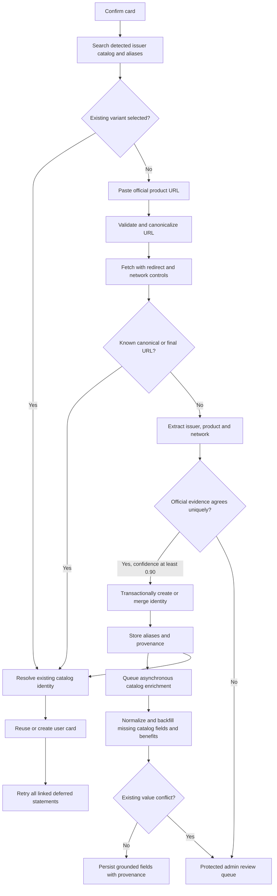

# User Card Variant Resolution Design

## Summary

CardCompass will let a user resolve an unidentified statement in either of two ways:

1. Search the existing card catalog and aliases within the detected issuer.
2. Paste the official issuer product-page URL when the variant is missing.

Both routes converge on the existing card-discovery pipeline. Resolution is idempotent: CardCompass reuses an existing catalog identity, provenance URL, user card, and discovery job whenever possible. A pasted URL cannot override the statement's detected issuer.

## Scope

This change extends the existing **Confirm card** dialog, catalog search, `card-discovery` Edge Function, catalog aliases and provenance, discovery jobs, and deferred-statement retry flow.

It does not:

- Accept comparison, affiliate, blog, or other secondary-source URLs.
- Permit arbitrary web scraping.
- Treat a generic issuer home page as product evidence.
- Store PDF bytes, full PDF text, full card numbers, or customer financial data in discovery records.
- Block Gmail sync while a submitted URL is being processed.

## User Experience

The existing **Confirm card** dialog remains the entry point. It displays the detected issuer, product hints, and masked last four when available.

### Existing catalog search

- Search is restricted to the detected issuer.
- Results include canonical card names and catalog aliases.
- Results show card name, network when known, and whether the card is already in the user's wallet.
- Selecting a result assigns the statement to that catalog identity, reuses or creates the corresponding user card, and retries linked deferred statements.

### Official URL fallback

When search does not find the variant, the user can expand **Can't find it? Paste official card page** and submit an HTTPS product URL.

The UI sends the URL and the existing safe identity-evidence bundle to the Edge Function. It does not fetch or scrape the URL directly. The dialog then shows one of these outcomes:

- **Existing card found:** the statement is assigned immediately.
- **Verified new card:** the catalog identity is created or merged, then assigned.
- **Review required:** the submission is queued and Gmail sync continues.
- **Invalid URL:** the URL is not an approved issuer product page.
- **Issuer conflict:** the URL belongs to a different issuer from the statement.

The user may close the dialog while discovery is queued. Resolution resumes through the existing discovery-job polling and next-session recovery flow.

## Architecture and Data Flow



### Client components

The dashboard resolution dialog owns presentation state only:

- Bank-scoped catalog and alias search.
- Existing-card selection.
- URL input, validation feedback, submission progress, and discovery outcome.
- Refreshing dashboard data after successful assignment.

`CardDiscoveryService` will add a URL-resolution operation. The client receives only safe status fields, a resolved catalog ID when available, a safe reason code, and retry timing.

### Edge Function

The existing authenticated `card-discovery` Edge Function will add this action:

```text
resolve_url(evidence, source_url)
```

It will:

1. Sanitize the safe identity-evidence bundle.
2. Parse and validate the URL.
3. Resolve the detected issuer to an approved official-domain allowlist.
4. Canonicalize the submitted URL.
5. Check existing URL provenance before fetching.
6. Fetch official content using existing scraper controls.
7. Revalidate every redirect and canonicalize the final URL.
8. Check provenance again using both submitted and final canonical URLs.
9. Extract and normalize issuer, product, and payment network.
10. Compare official-page identity with the independent statement signals.
11. Resolve an existing card, create a verified catalog identity, or create/reuse an admin-review item.

The operation reuses the existing discovery job keyed by user, issuer, and normalized statement evidence. Repeated URL submissions update that job without creating parallel work.

Identity resolution and statement assignment do not wait for complete catalog enrichment. Once the card ID is known, the Edge Function creates or reuses an asynchronous catalog-enrichment job for that card and official URL.

### Catalog enrichment

The enrichment worker reuses the validated official response and existing scraping infrastructure. It extracts and normalizes only fields explicitly supported by the issuer page, including canonical name, issuer, payment network, card type, joining fee, annual fee, APR, eligibility, rewards and other benefits represented by the existing catalog and benefit schemas.

Missing catalog values may be backfilled automatically when field-level confidence meets the validation threshold. An existing non-null value is never overwritten automatically when the official extraction disagrees; the conflicting field and both values enter admin review. Repeated enrichment requests deduplicate by card ID, canonical final URL, and content hash.

Benefits are processed as a second asynchronous phase after identity resolution. Grounded benefit records retain their official URL, retrieved timestamp, content hash, sanitized supporting evidence, and field-level confidence. Ambiguous benefit language or conflicts with active benefits enter the existing staging/review path instead of being published automatically.

### Database operations

Add a canonical URL identity to catalog provenance, including:

- Original source URL.
- Canonical submitted URL.
- Canonical final URL after redirects.
- Stable hash for canonical lookup.
- Retrieval timestamp and content hash.
- Validation result and official-domain identity.

Add persistent catalog-enrichment jobs containing the resolved card ID, canonical URL hashes, content hash, status, attempt count, retry timing, extracted normalized fields, and safe validation warnings. The jobs are service-role-only and unique for one card, final URL hash, and content hash.

Unique indexes will prevent duplicate canonical and final URL identities. A service-role-only transactional database function will resolve or create a catalog identity while locking the relevant normalized issuer/product and URL identities. Its result is always one catalog card ID.

Catalog identity deduplication uses:

1. Known canonical/final URL.
2. Existing catalog card within the same normalized issuer.
3. Exact canonical name.
4. Exact alias.
5. Unique all-token or most-specific product match.

User-card resolution reuses an existing card for the same user and catalog card. If a placeholder user card already represents the same issuer, product, and last four, it is merged instead of duplicated.

## URL Canonicalization and Security

Only HTTPS URLs on the approved official domains for the detected issuer are accepted.

Canonicalization will:

- Lowercase the host and apply IDNA-safe host parsing.
- Remove fragments.
- Remove known tracking parameters.
- Sort remaining query parameters deterministically.
- Normalize default ports, repeated slashes, and trailing slashes.
- Preserve product-identifying paths and functional parameters.

Every fetch and redirect will enforce:

- Approved issuer domains only.
- DNS and destination checks rejecting loopback, private, link-local, and reserved addresses.
- Redirect-count, response-time, and response-size limits.
- HTML and PDF content-type allowlists.
- No client-provided request headers, credentials, or cookies.
- No script execution.

The final URL and any page-declared canonical URL are trusted only after the same issuer-domain and network checks.

## Matching and Automatic Addition Gate

A submitted page may resolve automatically only when:

- It is an approved official issuer source.
- The page identifies the same issuer as the statement.
- The normalized page product agrees with at least one independent subject, filename, or bounded PDF-header signal.
- The comparison produces one unique catalog identity or one unique new identity.
- Confidence is at least `0.90`.
- No URL, product, network, or existing-card conflict remains.

A generic issuer page, page with no product identity, issuer mismatch, conflicting product evidence, equal-scoring catalog candidates, or incomplete scrape enters review or returns a safe validation error. A pasted URL never lowers the existing automatic-add gate.

## Admin Review

URL-originated review items use the existing protected admin queue and include:

- Submitted, canonical, and final URLs.
- Official-domain validation result.
- Extracted issuer, variant, and network.
- Subject, filename, and PDF-header product signals.
- Existing catalog candidates.
- URL and identity conflicts.
- Sanitized excerpts, confidence, scrape history, and linked-statement count.

Existing approve, edit-and-approve, merge, retry, and reject actions apply. Approval or merge resolves every linked discovery job and lets the client retry deferred statements.

Catalog and benefit conflicts created during asynchronous enrichment appear in the same protected workflow with the resolved card ID and field-level before/after values. Admin approval can apply selected missing or corrected fields without duplicating the card.

## Error Handling

Errors use stable reason codes with safe user-facing messages:

- `invalid_url`
- `unapproved_domain`
- `issuer_mismatch`
- `not_product_page`
- `unsafe_redirect`
- `fetch_timeout`
- `unsupported_content`
- `identity_conflict`
- `review_required`

Network and scrape failures remain retryable with bounded backoff. Validation and issuer-conflict failures require the user to change the URL. No scraped body or cross-user review data is returned to the client.

## Testing

### Client

- Bank search includes canonical names and aliases but excludes other issuers.
- Empty results reveal the official-URL fallback.
- Invalid and cross-issuer URLs show actionable errors.
- Existing, newly verified, queued, and retryable outcomes render correctly.
- Closing a queued dialog does not interrupt sync.
- Successful resolution refreshes cards and statements.

### URL identity

- Tracking parameters, fragments, default ports, and trailing slashes deduplicate.
- Redirect aliases deduplicate against their final URL.
- Simultaneous submissions create one URL identity and one catalog card.
- Distinct product URLs remain distinct.

### Security

- HTTP, credentials-in-URL, unknown domains, deceptive subdomains, loopback/private destinations, DNS rebinding, excessive redirects, oversized bodies, and invalid content types fail safely.
- Redirects from an approved issuer to an unapproved destination are rejected.
- Non-authenticated users cannot submit URLs.
- Users cannot read another user's discovery job.

### Resolution

- Known URL resolves the existing catalog card without scraping.
- Known alias resolves the existing catalog card.
- Official page plus agreeing statement evidence passes the automatic gate.
- Official page alone enters review.
- Issuer or network conflict enters review or fails validation.
- Existing user cards and all linked deferred statements are reused and retried.
- Verified identity resolution queues one asynchronous enrichment job.
- Missing fees, network and other grounded catalog fields are backfilled.
- Existing conflicting non-null catalog fields are not overwritten automatically.
- Repeated enrichment for the same card, final URL and content hash is idempotent.
- Officially grounded benefits are normalized with provenance; ambiguous benefits enter review.

## Acceptance Criteria

- A user can search all active variants and aliases for the detected bank.
- A user can paste an official product URL when the variant is absent.
- Equivalent submitted and redirected URLs never create duplicate catalog cards.
- Cross-bank and unsafe URLs cannot resolve a statement.
- Verified resolution assigns and retries all related statements without restarting Gmail sync.
- Ambiguous submissions appear in the existing protected admin queue.
- Identity resolution does not wait for catalog or benefit enrichment.
- A new official URL queues normalized catalog and benefit backfill using the existing scraping infrastructure.
- Missing catalog values are populated from official evidence while conflicting existing values require review.
- No new sensitive statement or customer data is retained.
