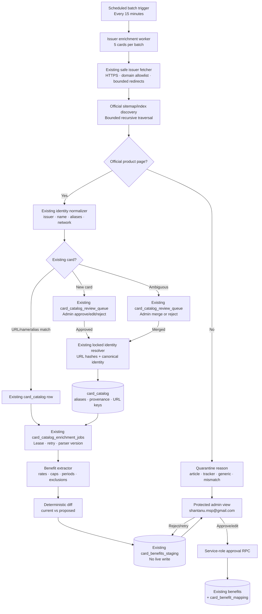
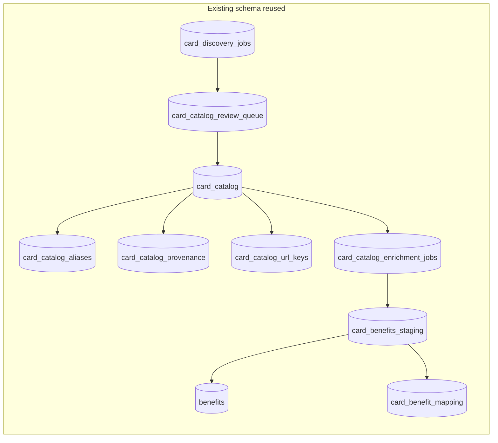

# Automated Credit-Card Benefit Enrichment

## Purpose

CardCompass will revisit official issuer credit-card pages, discover newly launched cards, extract current benefits with source evidence, and place every proposed catalog or benefit change into a protected admin review queue. The work must proceed unattended in small, resumable batches without overwriting live benefits or mistaking articles, utilities, and generic issuer pages for card products.

The first production run will use five cards as a pilot. If all five reach a terminal state without an unsafe write, the scheduler may continue through the remaining eligible catalog entries in batches of five.

## Scope

The initial inventory contains 185 catalog rows, of which 182 have a URL. Eligibility is narrower than URL presence. A row is eligible only when:

- it is a credit-card catalog entry;
- it is not marked discontinued, unless explicitly included by an admin;
- its URL is HTTPS and belongs to the approved domain for the normalized issuer;
- the page uniquely identifies the same issuer and card variant; and
- the page is a product page rather than an article, tracking utility, protection-information page, application form, comparison page, or generic issuer page.

Examples to quarantine include Axis `Card Protection`, HDFC `Track Your`, Kotak `Understanding The Annual Percentage Rate In`, and any generic PNB row that does not identify one unique product.

Only first-party issuer pages may support a card or benefit proposal. The crawler may follow same-domain links to issuer terms, fees, and product PDFs, but it may not leave the issuer allowlist or use secondary sources to create or update the catalog.

## Existing discovery capabilities to reuse

The codebase already provides the core identity path and it must be extended rather than replaced:

- `card-discovery` fetches approved official domains, validates redirects, reads conventional issuer sitemaps, ranks product URLs, extracts an official page identity, and creates review items when the automatic identity gate fails;
- `canonicalOfficialUrl` and `allowedOfficialUrl` normalize and restrict issuer URLs;
- `normalizedProduct`, catalog aliases, and issuer aliases normalize product identity;
- `card_catalog_url_keys` and catalog provenance deduplicate submitted and final URLs by SHA-256 hash;
- `resolve_card_catalog_identity` uses transaction advisory locks and deduplicates by URL, canonical issuer/name, and aliases before inserting a catalog row; and
- `review_card_catalog_discovery` already supports approve, edit-and-approve, merge, retry, and reject actions.

The current discovery entry point assumes a statement-derived product signal. That is correct for automatic insertion but insufficient for issuer-wide discovery. The new crawler lane will reuse the same identity and deduplication primitives while removing automatic insertion for crawler-only evidence.

## Architecture

### Persistent batch queue using the existing schema

Extend the service-role-only `card_catalog_enrichment_jobs` table rather than creating a parallel benefit-job table. Each row continues to represent one catalog card and official URL, with additive fields for parser version, lease expiry, linked staging row, run mode, and sanitized result summary. The existing status constraint will be extended to cover `staged` and `quarantined`; existing `completed`, `review_required`, and `failed` rows remain valid. Content hash may be populated after the worker fetches the queued URL, while a deterministic card/URL/parser key prevents duplicate pre-fetch jobs. It stores or derives:

- catalog card ID, normalized issuer, submitted URL, and canonical URL;
- status: `queued`, `processing`, `staged`, `quarantined`, `failed`, or `review_required`;
- attempt count, next retry time, lease expiry, and failure category;
- source content hash, retrieval timestamp, parser version, and run ID;
- linked `card_benefits_staging` row ID and sanitized result summary;
- timestamps and a deduplication key for card, URL, and parser version.

The queue uses leases so an interrupted invocation can be safely resumed. A worker claims at most five jobs per invocation. Jobs are ordered by issuer and card name, and only one issuer is processed concurrently.

### Scheduler

A short scheduled invocation runs every 15 minutes. It calls a service-role-only batch endpoint, which:

1. releases expired leases;
2. claims up to five eligible jobs;
3. processes them sequentially using the existing issuer fetcher;
4. records a terminal or retryable outcome for each job; and
5. returns counts without waiting for later batches.

The scheduler must not contain a service-role key in source control or browser code. Deployment will use a server-side secret. If the repository already has an approved scheduled runner, it will be reused; otherwise Supabase Cron will invoke the Edge Function through a dedicated secret stored outside exposed schemas.

### Existing issuer fetcher

The current official-page controls remain mandatory:

- HTTPS and issuer-domain allowlist;
- redirect revalidation;
- private and loopback address rejection;
- response timeout and size limits;
- HTML/PDF content-type allowlist;
- no script execution;
- sanitized evidence excerpts;
- retrieval timestamp and content hash.

Recursive discovery is bounded. The worker begins with the catalog URL and may follow at most eight same-product, same-domain links at depth two. Link scoring favors paths or labels containing the exact product tokens and terms such as `benefits`, `features`, `fees`, `rewards`, `terms`, or `mitc`. It excludes login, application, tracking, blog, story, support, and unrelated-card paths.

### Issuer-wide new-card discovery

Before benefit jobs are generated for an issuer, a discovery pass inventories that issuer's official credit-card collection. It reads conventional sitemaps and recursively follows sitemap indexes within strict limits. When a sitemap is absent or incomplete, it traverses only approved issuer credit-card index pages and their same-domain product links.

Discovery has separate limits from per-card enrichment:

- at most 200 sitemap or index URLs considered per issuer per run;
- at most 40 candidate product pages fetched per issuer per run;
- sitemap-index depth at most two;
- issuer requests are sequential with a delay and shared timeout budget; and
- previously seen canonical URL/content hashes are skipped.

Candidate classification uses URL path, link text, page title, headings, structured data, and issuer/product tokens. It rejects or quarantines blog articles, tracking/application utilities, generic card landing pages, protection pages, and terms documents that cannot identify one unique product.

For each credible card not already in the catalog, the crawler reuses `card_discovery_jobs` and creates a linked `card_catalog_review_queue` item with:

- proposed issuer, canonical card name, network when explicit, official URL, and aliases;
- sanitized official evidence and content hash;
- URL/name/alias candidates considered during deduplication;
- warning `crawler_discovered_without_statement_signal`; and
- confidence and identity conflicts.

Crawler-created discovery jobs are distinguished with an additive `discovery_source = issuer_crawl` value. Service-owned jobs have no user owner; existing user-created rows retain their current ownership and uniqueness behavior. Crawler-only evidence never passes the existing two-signal automatic-add gate because it has no independent statement signal. An admin must approve, edit, or merge it. On approval, the existing `resolve_card_catalog_identity` transaction is used to serialize insertion and bind submitted/final URL hashes. The approved card then receives a row in the existing `card_catalog_enrichment_jobs` queue automatically.

An already-known card found at a new official URL does not create a duplicate catalog row. A unique name/alias match adds reviewable provenance and URL identity; ambiguous matches enter review with merge candidates.

### Identity gate and quarantine

Before extracting benefits, the page must pass all of these checks:

- official issuer domain matches the catalog issuer;
- page heading, title, structured data, or official document identifies the card;
- normalized card tokens uniquely match the catalog card or a recorded alias;
- no competing catalog card matches equally well; and
- the page is classified as a product or product-support document.

Failures do not create staging data. They are quarantined with one of: `not_a_card`, `ambiguous_product`, `identity_mismatch`, `unapproved_domain`, `unsupported_content`, `unreachable`, or `insufficient_evidence`.

## Benefit model and extraction

Each extracted benefit remains independently attributable and includes:

- stable normalized key;
- title and plain-language description;
- category;
- value type and value where stated;
- earning or discount rate;
- cap, threshold, frequency, and period;
- merchant, channel, platform, or spend restrictions;
- exclusions and expiry/effective dates when stated;
- official source URL, sanitized excerpt, retrieval time, and content hash;
- field-level confidence and warnings.

The extractor must not infer missing amounts, caps, merchants, or eligibility. Marketing headings without a concrete benefit remain evidence context rather than benefits. Duplicate statements across the main page and terms documents merge only when their normalized keys and conditions agree. Conflicts remain separate and require review.

## Staging and live-data safety

Every successful extraction creates or updates one existing `card_benefits_staging` proposal with `request_type = official_benefit_enrichment`. The proposal contains a deterministic diff against current benefits:

- additions;
- modifications;
- possible removals;
- unchanged benefits; and
- conflicts or low-confidence fields.

No scheduled worker writes to `card_benefits` or benefit mappings. Possible removals are never applied automatically. Repeated crawls with the same content hash and parser version reuse the existing proposal rather than creating duplicates.

Approval executes through a new service-role-only RPC over the existing `benefits` and `card_benefit_mapping` tables. It upserts approved additions/modifications using the existing benefit dedupe key, preserves unrelated mappings, records decisions in `card_benefits_staging.benefit_decisions`, and marks replaced mappings without destructive benefit deletion. Rejection leaves live data unchanged. An edited approval records the admin-supplied values separately from extracted evidence.

## Admin authorization and review UI

Admin authorization is enforced inside the Edge Function against a verified Supabase user email and the server-side `CARD_CATALOG_ADMIN_EMAILS` allowlist. The initial allowlisted address is `shantanu.msp@gmail.com`. Routes alone do not grant access, and staging tables remain inaccessible to `anon` and `authenticated` roles.

Extend the existing catalog review area with two tabs:

- **Card identity**: the current missing-card review queue.
- **Benefit enrichment**: staged benefit proposals and quarantined jobs.

The card-identity tab will also distinguish `statement_discovered` and `issuer_crawl_discovered` proposals, so the admin can see that crawler-only cards lack a statement signal.

The benefit view displays:

- issuer, card, official URL, retrieval time, and parser version;
- job status, attempts, and failure/quarantine reason;
- current benefit alongside proposed diff;
- field-level evidence, confidence, and warnings;
- linked terms/product sources and content hashes;
- batch/run progress.

Admin actions are approve, edit and approve, reject with reason, retry, quarantine/unquarantine, and open official source. Bulk approval is deliberately excluded from the first release.

## Pilot and unattended rollout

The pilot selects five active cards with valid official URLs across at least three issuer implementations. It should include a straightforward page, a JavaScript-heavy or redirecting page, a terms-linked page, and one likely invalid catalog URL.

The pilot gate passes when:

- all five jobs reach `staged` or a justified quarantine state;
- zero live benefit rows change without admin approval;
- every staged field has official evidence;
- rerunning creates no duplicate jobs or proposals; and
- no raw page body or sensitive user data is stored.

After the gate passes, the scheduler continues automatically in five-card batches every 15 minutes. If the pilot gate fails, later jobs remain queued and the admin view shows the blocker. Individual network failures retry with exponential backoff at approximately 15 minutes, 1 hour, and 4 hours. A third failure moves the job to `review_required` without halting unrelated issuers.

## Observability

Each run records queued, claimed, staged, quarantined, failed, and retried counts. The admin view shows total coverage by issuer and last successful invocation. Logs contain job IDs and failure categories, never service keys, full page bodies, customer data, or raw authorization headers.

## Interfaces

Service-role batch operation:

- `benefit-enrichment-batch` processes the next leased batch and returns safe counts.

Authenticated admin operations extend the existing admin Edge Function:

- `benefit-list`
- `benefit-status`
- `benefit-approve`
- `benefit-edit-approve`
- `benefit-reject`
- `benefit-retry`
- `benefit-quarantine`
- `benefit-unquarantine`
- `benefit-start-pilot`
- `benefit-resume-rollout`
- `issuer-discovery-start`
- `issuer-discovery-status`

The browser receives sanitized evidence and diffs only. Raw fetched bodies remain transient.

## Testing

### Queue and scheduler

- claims no more than five jobs;
- processes one issuer sequentially;
- leases prevent duplicate workers;
- expired leases recover safely;
- retry times and terminal states are correct;
- pilot failure prevents rollout while unrelated retry state remains intact.

### Identity and crawling

- valid product pages pass;
- articles, trackers, generic pages, and cross-card pages quarantine;
- redirect and recursive links remain on approved domains;
- depth, page, timeout, and response-size bounds are enforced;
- duplicate URLs and content hashes are idempotent.
- nested sitemap indexes remain bounded and same-domain;
- newly discovered official cards enter review rather than being auto-added;
- existing URL hashes resolve to the same card;
- unique issuer/name or alias matches do not create duplicates;
- ambiguous matches expose merge candidates and create no catalog row; and
- admin approval uses the locked identity resolver before enqueueing benefits.

### Extraction and approval

- caps, thresholds, periods, merchants, and exclusions remain associated;
- missing values are not invented;
- conflicting evidence requires review;
- approval transaction updates only the selected card;
- rejection changes no live benefit;
- repeated approvals are idempotent;
- provenance survives edits.

### Security and UI

- unverified and non-allowlisted users receive 403;
- `shantanu.msp@gmail.com` receives admin access only when verified;
- browser roles cannot read or mutate queue/staging base tables;
- review UI shows safe errors and supports keyboard and large-text use;
- raw HTML, secrets, and cross-user data never enter client responses.

## Rollback

The scheduler can be disabled without deleting existing enrichment jobs. The batch endpoint may be deployed independently from the client UI. Because no live benefit changes occur without approval, stopping the rollout leaves production benefit data unchanged. Approved changes retain provenance and can be reversed by an explicit corrective migration rather than by deleting audit history.

## Assumptions

- Existing issuer-domain normalization and fetch safety controls are the foundation.
- Existing catalog, discovery, review, staging, alias, provenance, URL-key, benefit, mapping, and enrichment-job tables are reused; migrations are additive except for widening ownership/status constraints needed by service-created jobs.
- Official issuer evidence is mandatory.
- All enrichment results require admin review.
- Newly crawled cards require admin review even at high confidence because crawler evidence is not independent from the official page identity.
- `shantanu.msp@gmail.com` will be added to the server-side admin allowlist.
- The rollout is allowed to continue unattended after a successful five-card pilot.
- Batch size is five and cadence is 15 minutes for the first release.
