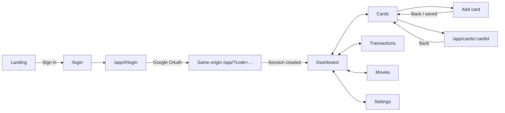

# CardCompass UI/UX QA — 16 Aug 2026

## Verdict

| Surface | Score | Release read |
|---|---:|---|
| Local remediation branch | **8.6/10** | Coherent, accessible product system; authenticated empty-account acceptance and local OAuth are complete. |
| Current production | **6.8/10** | Visually strong but login is release-blocked by OAuth continuity and a repeatable layout exception. |

> Scope: live production login/public routes; local rendered public routes; and successful local Google OAuth sessions covering both a new account and a populated 14-card account. Dashboard, Cards, card detail, Add Card, Transactions, Movies, Settings, sign-out, refresh, and Back were exercised live.

## Before → after scorecard

| Area | Before | After (branch) | Change |
|---|---:|---:|---|
| Brand distinctiveness | 8/10 | **9/10** | One editorial fintech identity across landing, login, navigation, and work surfaces |
| Visual consistency | 6/10 | **8.5/10** | Shared semantic tokens, fonts, surfaces, metrics, state views, and responsive frames |
| Information hierarchy | 6/10 | **8.5/10** | Primary decisions lead; supporting metrics, evidence, filters, and concepts recede |
| Interaction clarity | 5/10 | **8/10** | Dead actions removed/wired; async feedback and recovery standardised; production OAuth still undeployed |
| Accessibility | 4/10 | **8.5/10** | Text scaling restored, 12px type floor, 44px targets, semantics, focus, and reduced motion covered |
| Responsive behavior | 6/10 | **8.5/10** | 390/768/1280 fixtures, 1440 full-width data mode, responsive rows/sheets and public overflow checks |
| Overall | **6/10** | **8.6/10** | Local branch is cohesive and authenticated acceptance passed; production remains 6.8/10 until deployment |

## Visual before → after

| Before | After on branch | Status |
|---|---|:---:|
| Text zoom forced to 100%; 8–11px trust copy | OS/browser scaling restored; 12px non-decorative floor; 14px action copy | ✅ Verified |
| Named fonts silently fell back | Manrope, Fraunces, and IBM Plex Mono bundled with defined roles | ✅ Verified |
| Dark theme semantics leaked onto Paper work surfaces | Explicit marketing and work themes use semantic Ink/Paper roles | ✅ Verified |
| Dashboard metrics and cards had equal visual weight | One primary action/metric with responsive supporting evidence | ✅ Fixture |
| Settings and Dashboard contained dead-looking actions | Enabled rows navigate; unsupported Notifications is explicitly unavailable | ✅ Fixture |
| Add Card had no progress and fragile async Back behavior | Search/Confirm progress, inline validation, usable Back, exactly-once save reconciliation | ✅ Verified |
| Card detail was dense and anonymous in browser history | Summary-first detail plus named `/app/cards/:cardId` route and Back restoration | ✅ Verified |
| Ledger mixed KPIs, filters, rows, raw errors, and inconsistent naming | Spend-first Transactions page, responsive filter sheet, stable disclosure and redacted retry states | ✅ Verified |
| Movie flow used technical language and equal-weight results | Plain questions, winner-first recommendation, explicit caps/uncertainty, expandable evidence | ✅ Fixture |
| Landing had a long multi-band narrative and no returning-user path | Five-section journey plus visible header/footer Sign in links | ✅ Automated browser |
| OAuth crossed `www` → apex and callback failure silently returned to login | Same-origin callback plus recovery; exact allow-listed `127.0.0.1:54321` returns to Dashboard | ✅ Local live; 🚫 production undeployed |
| App tab/detail URLs were not refresh-safe | Real `/app/...` GoRouter locations; Add Card refresh and browser Back retain the correct screen | ✅ Local live |
| Public pages used long preambles/small legal copy | Task-first utilities; readable legal measure, contents disclosure, and 44px links | ✅ Verified |

## Remaining change map

| Now | → | Required target |
|---|:---:|---|
| Same-origin OAuth fix exists only on branch | → | Deploy `1dececd` and verify a fresh login |
| New Sign in/navigation changes pass locally | → | Deploy and repeat the production smoke |
| Production login logs layout failures | → | Zero Flutter layout exceptions at 390, 768, 1024, and 1440 widths |
| Populated desktop account QA complete | → | Add mobile/200% text and forced slow/error-state browser passes |

## Navigation model

## Priority findings

| Priority | Finding | Evidence | Change / acceptance criterion |
|---|---|---|---|
| **P0** | Production OAuth returns to login with a one-time code still present | Live: `https://www.cardcompass.in/app/?code=…#/login`; branch previously changed `www` to apex | Deploy `1dececd`; allow both exact `/app/` callbacks in Supabase; fresh Google login lands on Dashboard and removes/neutralises callback state. |
| **P0** | Production login emits layout exceptions | Two repeatable `RenderBox was not laid out` errors after reload; local branch logs none | Deploy current build; assert zero console/layout exceptions at target breakpoints and 100/200% text. |
| **Resolved locally** | Returning users could not discover Sign in | Header/footer previously had no app entry | Header and footer now link to `/login`; Waitlist remains the primary acquisition CTA. |
| **Resolved locally** | Card detail was not deep-linkable | Cards previously used anonymous `MaterialPageRoute` | Named `/app/cards/:cardId` route passes URL + system-Back restoration coverage. |
| **Resolved locally** | Transaction vocabulary changed by surface | App nav said “Transactions”; page said “Ledger” | User-facing title and recovery copy now use “Transactions” consistently. |
| **Resolved locally** | Auth callback recovery was generic | Failed callback previously returned to a generic login state | Dedicated message now offers **Start sign-in again** and **Back to landing**, without raw auth details. |
| **P2** | Mobile/extreme-state authenticated acceptance remains | Populated desktop data and navigation pass; slow/error states and 200% text remain fixture-tested | Run the populated account at mobile widths/200% text and force slow/error states. |

## Page-by-page QA

| Page | Status | What works now | Remaining change |
|---|:---:|---|---|
| Landing | 🟢 | Strong three-line promise, inspectable receipt, concise five-section journey, trust/waitlist hierarchy, header/footer Sign in | Production smoke after deployment only. |
| Best-card calculator | 🟢 | Task-first form, clear arithmetic, assumptions and attributed conversion path | Production smoke after deployment only. |
| Milestone tracker | 🟢 | Inputs precede methodology; projected gap and pace are explicit | Production smoke after deployment only. |
| Movie-offer calculator | 🟢 | Effective saving/payable result, caps and remaining-use semantics are understandable | Production smoke after deployment only. |
| Privacy | 🟢 | Readable measure, contents disclosure, explicit data boundaries | Legal-owner review remains external. |
| Data & Security | 🟢 | Good trust structure; long identifiers and tables reflow safely | Verify claims against the deployed database before acquisition. |
| Terms | 🟢 | Consistent legal template and navigation | Legal-owner review remains external. |
| Recommendation disclaimer | 🟢 | Separates estimates from issuer-authoritative terms | No UI change. |
| 404 | 🟢 | Branded recovery with Home and Sign in exits | No UI change. |
| Login | 🟡 | Excellent editorial split-screen, dominant Google action, permission explanation, selectable copy, reduced-motion support, callback-specific recovery | Deploy OAuth fix and eliminate the production layout exception. |
| Splash / callback | 🟡 | Staged “Securing session / Loading wallet”, timeout recovery, and safe failed-callback actions exist locally | Deploy and prove a successful production callback reaches Dashboard. |
| App shell | 🟢 | Five labelled destinations, adaptive navigation, stable real URLs, refresh-safe tabs, and 44px+ targets | Seeded-data acceptance only. |
| Dashboard | 🟢* | Live populated summary renders ₹1.03L spend, 85 points, ₹43.9L credit and 14 cards with usable recent activity | Slow/loading/sync/dialog variants remain fixture-tested. |
| Cards | 🟢* | Live 14-card portfolio is readable; identities, masked last-four, status and limit hierarchy remain scannable | Mobile populated acceptance remains. |
| Add card | 🟢 | Search/Confirm flow, refresh-safe URL, and browser Back were verified live | Populated save acceptance remains. |
| Card detail | 🟢* | Live named URL, reload and in-app Back pass; summary and unavailable-rule caveats are clear | Populated bill/history and error variants remain fixture-tested. |
| Transactions | 🟢* | Live populated spend, 85-point metric, active-filter summary, trend and transaction disclosures render without errors | Mobile dense-data QA remains. |
| Movie optimizer/results | 🟢 | Live recommendation flow returned a winner with saving/payable values and no errors | Seed additional edge outcomes. |
| Settings | 🟢 | Legal/About/Notifications actions and confirmed sign-out return were verified live | No UI blocker. |

`*` The primary populated or empty state was verified live; loading/error/extreme text variants remain fixture-tested.

## Back and state QA

| Journey | Status | Expected behavior | Evidence / gap |
|---|:---:|---|---|
| Top-level tab switch | 🟢 | Uses stable locations and preserves tab state | Real GoRouter paths, live refresh, and rendered tab tests pass. |
| Add card → Back | 🟢 | Returns immediately to Cards; no duplicate save; eventual success refreshes once | App-bar Back and system Back race regressions pass. |
| Add card → Save | 🟢 | Returns to Cards and shows the saved card exactly once | Provider-scope coordinator and route integration tests pass. |
| Card detail → Back | 🟢 | Returns to Cards with a stable detail URL | Live populated detail URL, reload and in-app Back passed; automated route tests also pass. |
| Filter sheet/dialog → Back/Escape | 🟢 | Dismisses overlay without leaving Transactions or losing applied state | Native sheet/dialog structure and fixture coverage. |
| Assignment dialog → Cancel/Back | 🟢 | Dismisses safely; completed work still reconciles; retries do not duplicate | Async dismissal/race tests pass. |
| OAuth callback → Dashboard | 🟡 | Creates session and returns to the initiating origin | ✅ `127.0.0.1:54321` live; 🔴 current production undeployed. |
| Sign out → Login | 🟢 | Confirmation, sign-out, then one clear return to login | Verified in the local authenticated session. |

## Design-language QA

| System | Status | Read |
|---|:---:|---|
| Brand | 🟢 | Ink/Paper/Reward/Signal palette and compass identity are distinctive and consistently tokenised. |
| Typography | 🟢 | Manrope + Fraunces + IBM Plex Mono establish clear editorial/data roles; local fonts and 12px floor are enforced. |
| Hierarchy | 🟢 | Marketing is editorial; work surfaces are calmer and data-first; one primary action per screen is mostly preserved. |
| Components | 🟢 | Shared surfaces, headers, metrics, state views, responsive rows, nav and content frames reduce one-off styling. |
| Motion | 🟢 | Scenario rotation pauses for reduced motion; feedback does not depend on animation. |
| Accessibility | 🟢* | Text scaling, semantic nav actions, 44px targets, visible focus and redacted recovery states have automated coverage. |
| Responsive layout | 🟢* | 390/768/1280 fixture coverage and 1440 full-width data mode are present; live authenticated landscape remains unverified. |

## Recommended implementation order

| Wave | Scope | Exit criterion |
|---|---|---|
| **A — Release blockers** | Deploy `1dececd`; configure exact Supabase callbacks; eliminate production login layout exception; add callback recovery | Fresh Google sign-in reaches Dashboard on `www` and apex; zero console/layout errors. |
| **B — Navigation clarity** | Landing Sign in, deep-link card detail, Transactions naming, and failed-callback recovery are implemented locally | ✅ Local automated acceptance complete; production deployment remains. |
| **C — Live acceptance** | New-account and populated desktop acceptance passed; repeat populated data at 390/768, 200% text and forced error states | Evidence captured for every remaining `*` variant. |

## Evidence and limitations

| Evidence | Result |
|---|---|
| Live production login | OAuth callback remains on login; production emits repeatable layout errors. |
| Local login/public build | Login renders with no console errors; public keyboard/reduced-motion/overflow suite passes. |
| Local authenticated browser | Two Google OAuth sessions on `127.0.0.1:54321` returned to `/app/#/app`; the populated account exposed 14 cards/7 transactions. Dashboard, Cards/detail, Add Card, Transactions, Movies, Settings, legal actions, sign-out, reload and Back passed without console errors. |
| Changed-file analysis | No issues found across router, auth, Cards, Dashboard, Transactions, and their changed tests. |
| Public landing suite | 90/90 passed, including rendered overflow, keyboard, reduced-motion, routing, and Sign in coverage. |
| Non-Supabase Flutter UI suite | 327/327 passed in the current branch verification. |
| Release build / local routes | Web release build passed (including Wasm dry run); `/` and `/app/` return 200 and `/login` redirects to `/app/#/login`. |
| Limitation | Populated desktop data was verified; mobile/200% text plus forced loading/error variants remain fixture evidence marked `*`. Production is unchanged until deployment. |
