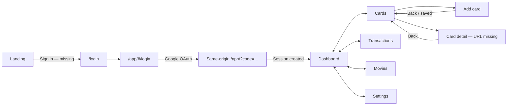

# CardCompass UI/UX QA — 16 Aug 2026

## Verdict

| Surface | Score | Release read |
|---|---:|---|
| Local remediation branch | **8.4/10** | Coherent, accessible product system; ready for authenticated acceptance after the items below. |
| Current production | **6.8/10** | Visually strong but login is release-blocked by OAuth continuity and a repeatable layout exception. |

> Scope: live production login and public routes; local rendered login/public routes; authenticated screens through code, routes, deterministic widget states, and navigation-race tests. A populated live account could not be audited because production OAuth does not complete.

## Visual change map

| Now | → | Required target |
|---|:---:|---|
| `www` sign-in crosses to apex during PKCE | → | Callback stays on the exact trusted origin; deploy `1dececd` and verify a fresh login |
| Landing prioritises only Product + Waitlist | → | Add a visible **Sign in** route for returning users |
| Nav says **Transactions**, page says **Ledger** | → | Use **Transactions** everywhere; keep “ledger” as supporting copy only |
| Card detail is an anonymous `MaterialPageRoute` | → | Named/deep-linkable `/app/cards/:id` with refresh-safe Back behavior |
| Production login logs layout failures | → | Zero Flutter layout exceptions at 390, 768, 1024, and 1440 widths |
| Fixture-heavy authenticated QA | → | One seeded-account browser pass covering real data, errors, 200% text, and Back |

## Navigation model

## Priority findings

| Priority | Finding | Evidence | Change / acceptance criterion |
|---|---|---|---|
| **P0** | Production OAuth returns to login with a one-time code still present | Live: `https://www.cardcompass.in/app/?code=…#/login`; branch previously changed `www` to apex | Deploy `1dececd`; allow both exact `/app/` callbacks in Supabase; fresh Google login lands on Dashboard and removes/neutralises callback state. |
| **P0** | Production login emits layout exceptions | Two repeatable `RenderBox was not laid out` errors after reload; local branch logs none | Deploy current build; assert zero console/layout exceptions at target breakpoints and 100/200% text. |
| **P1** | Returning users cannot discover Sign in from the landing page | Primary nav contains Product + Join waitlist; footer has no app entry | Add `Sign in` in header and footer, linking to `/login`; preserve Waitlist as primary acquisition CTA. |
| **P1** | Card detail is not deep-linkable | Cards use anonymous `MaterialPageRoute`; URL does not identify the card | Add `/app/cards/:id`; browser/system Back returns to the same Cards list state and refresh resolves the same detail. |
| **P1** | Transaction vocabulary changes by surface | App nav: “Transactions”; screen title/errors: “Ledger” | Rename title and recovery copy to “Transactions”; use one IA label globally. |
| **P2** | Auth failure recovery is too generic | Callback failure silently returns to login; generic “try again” copy cannot distinguish expired callback/config/network | Show a dedicated callback error with **Start sign-in again** and **Back to landing**; never expose raw auth details. |
| **P2** | Authenticated experience lacks live visual acceptance | Widget coverage is broad, but no populated browser session exists | Run seeded desktop/mobile acceptance with long card names, multiple statements, empty/error states, 200% text, keyboard, reduced motion, refresh, browser Back, and system Back. |

## Page-by-page QA

| Page | Status | What works now | Remaining change |
|---|:---:|---|---|
| Landing | 🟡 | Strong three-line promise, inspectable receipt, concise five-section journey, trust and waitlist hierarchy | Add Sign in entry; retain current 1440 shell and readable hero measure. |
| Best-card calculator | 🟢 | Task-first form, clear arithmetic, assumptions and attributed conversion path | Production smoke after deployment only. |
| Milestone tracker | 🟢 | Inputs precede methodology; projected gap and pace are explicit | Production smoke after deployment only. |
| Movie-offer calculator | 🟢 | Effective saving/payable result, caps and remaining-use semantics are understandable | Production smoke after deployment only. |
| Privacy | 🟢 | Readable measure, contents disclosure, explicit data boundaries | Legal-owner review remains external. |
| Data & Security | 🟢 | Good trust structure; long identifiers and tables reflow safely | Verify claims against the deployed database before acquisition. |
| Terms | 🟢 | Consistent legal template and navigation | Legal-owner review remains external. |
| Recommendation disclaimer | 🟢 | Separates estimates from issuer-authoritative terms | No UI change. |
| 404 | 🟢 | Branded recovery with Home and Sign in exits | No UI change. |
| Login | 🔴 | Excellent editorial split-screen, dominant Google action, permission explanation, selectable copy, reduced-motion support | Deploy OAuth fix; eliminate production layout exception; add callback-specific recovery. |
| Splash / callback | 🔴 | Staged “Securing session / Loading wallet” and timeout recovery exist | Successful callback must reach Dashboard; failure must explain the next safe action. |
| App shell | 🟢 | Five labelled destinations, active state, adaptive rail/bottom nav, preserved `IndexedStack` state, 44px+ targets | Keep top-level tab changes out of the Back stack; verify browser Back exits predictably after live login. |
| Dashboard | 🟢* | One primary action, supporting metrics recede, full-width data mode, wired Cards/Transactions actions, redacted retry states | Live populated/loading/sync/dialog review required. |
| Cards | 🟡* | Clear identities, active state, empty/loading/error recovery, pull-to-refresh, full-width option | Make detail a named URL route. |
| Add card | 🟢* | Search/Confirm progress, inline validation, usable Back during save, exactly-once persistence and refresh | Live keyboard and browser/system Back acceptance. |
| Card detail | 🟡* | Summary, best-use/milestone caveats, loading/not-found/error states, accessible long-name behavior | Deep-link route; preserve Cards scroll/filter state on Back. |
| Transactions | 🟡* | Spend-first hierarchy, responsive filters, points labelled correctly, stable disclosure state, retry/empty states | Rename “Ledger” to “Transactions”; live dense-data QA. |
| Movie optimizer/results | 🟢* | Plain-language questions, responsive pairs, winner-first result, evidence disclosure, uncertainty separated | Live eligible/potential/no-deal acceptance. |
| Settings | 🟢* | Every enabled row works; Notifications is explicitly unavailable; sign-out is separated and confirmed | Verify external legal links and sign-out return path in live session. |

`*` Authenticated page evaluated through deterministic fixtures and source/navigation inspection, not a live populated browser account.

## Back and state QA

| Journey | Status | Expected behavior | Evidence / gap |
|---|:---:|---|---|
| Top-level tab switch | 🟢 | Changes active destination without stacking five “pages”; preserves each tab state | `IndexedStack` + fragment replacement; rendered tab semantics tests pass. |
| Add card → Back | 🟢 | Returns immediately to Cards; no duplicate save; eventual success refreshes once | App-bar Back and system Back race regressions pass. |
| Add card → Save | 🟢 | Returns to Cards and shows the saved card exactly once | Provider-scope coordinator and route integration tests pass. |
| Card detail → Back | 🟡 | Returns to the same Cards position/state | Visual Back works; anonymous route prevents reliable deep-link/refresh acceptance. |
| Filter sheet/dialog → Back/Escape | 🟢 | Dismisses overlay without leaving Transactions or losing applied state | Native sheet/dialog structure and fixture coverage. |
| Assignment dialog → Cancel/Back | 🟢 | Dismisses safely; completed work still reconciles; retries do not duplicate | Async dismissal/race tests pass. |
| OAuth callback → Dashboard | 🔴 | Creates session and replaces login state | Fails on current production; fixed contract is committed but undeployed. |
| Sign out → Login | 🟡 | Confirmation, sign-out, then one clear return to login | Code path is correct; live acceptance blocked by auth. |

## Design-language QA

| System | Status | Read |
|---|:---:|---|
| Brand | 🟢 | Ink/Paper/Reward/Signal palette and compass identity are distinctive and consistently tokenised. |
| Typography | 🟢 | Manrope + Fraunces + IBM Plex Mono establish clear editorial/data roles; local fonts and 12px floor are enforced. |
| Hierarchy | 🟢 | Marketing is editorial; work surfaces are calmer and data-first; one primary action per screen is mostly preserved. |
| Components | 🟢 | Shared surfaces, headers, metrics, state views, responsive rows, nav and content frames reduce one-off styling. |
| Motion | 🟢 | Scenario rotation pauses for reduced motion; feedback does not depend on animation. |
| Accessibility | 🟢* | Text scaling, semantic nav actions, 44px targets, visible focus and redacted recovery states have automated coverage. |
| Responsive layout | 🟢* | 390/768/1280 fixture coverage and 1440 full-width data mode are present; live authenticated landscape remains unverified. |

## Recommended implementation order

| Wave | Scope | Exit criterion |
|---|---|---|
| **A — Release blockers** | Deploy `1dececd`; configure exact Supabase callbacks; eliminate production login layout exception; add callback recovery | Fresh Google sign-in reaches Dashboard on `www` and apex; zero console/layout errors. |
| **B — Navigation clarity** | Add landing Sign in, deep-link card detail, rename Ledger → Transactions | Every key page has a stable URL/label and predictable browser/system Back behavior. |
| **C — Live acceptance** | Seeded account across 390/768/1440, landscape, 200% text, keyboard, reduced motion, slow/error states | Evidence captured for every `*` page; no overflow, hidden focus, raw errors, stale state, or dead controls. |

## Evidence and limitations

| Evidence | Result |
|---|---|
| Live production login | OAuth callback remains on login; production emits repeatable layout errors. |
| Local login/public build | Login renders with no console errors; public keyboard/reduced-motion/overflow suite passes. |
| Auth/router focused suite | 30/30 passed after same-origin OAuth correction. |
| Public landing suite | 89/89 passed. |
| Non-Supabase Flutter UI suite | 322/322 passed in final branch verification. |
| Limitation | No live populated authenticated account until OAuth fix is deployed; fixture evidence is explicitly marked `*`. |
